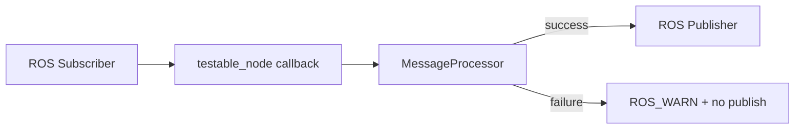
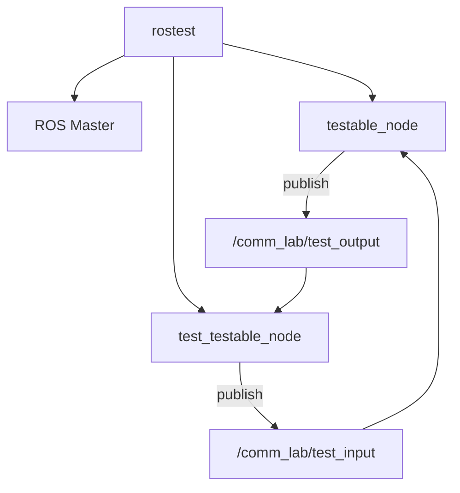
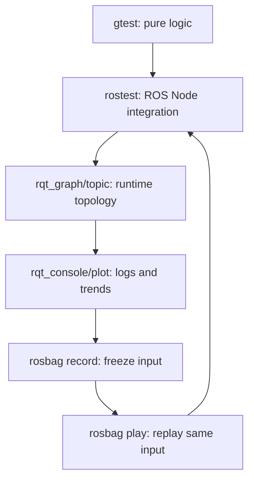

<meta name="referrer" content="no-referrer" />

# ROS教程10：从 gtest 到 rostest——Unit Test、Node 集成测试、rosbag 与 rqt 验证闭环

> 摘要：把阶段 06～09 的运行机制转成可重复验证证据：拆分纯 C++ 逻辑与 ROS 包装层，用 gtest、rostest、rqt 和 rosbag 建立最小回归闭环。


@[toc]

第 09 章已经把 callback 执行链追到了用户函数：消息进入 `SubscriptionQueue`、再进入 `CallbackQueue`，最终由 Spinner worker 调用用户 callback。到这里，我们已经能解释“程序为什么这样运行”，但还没有回答另一个工程问题：

> **当代码修改以后，怎样证明原有行为没有被破坏；当 Node 看起来能运行时，又怎样把“我看到了正常日志”升级成可重复、可自动执行的测试证据？**

第 10 章不把 gtest、rostest、rqt、rosbag 分别写成四份工具说明，而是围绕一条测试主线展开：

```text
纯 C++ 逻辑
    ↓
gtest
    ↓
ROS Node 包装层
    ↓
rostest / Topic 集成测试
    ↓
rqt 外部观察
    ↓
rosbag 固定输入
    ↓
故障注入
    ↓
形成可重复回归证据
```

本章继续使用阶段 09 已经建立的：

```text
ros_ws/src/ros1_comm_lab
```

不再创建新的 package。

---

## 1. 先建立测试分层：不同证据能证明什么

对 ROS 驱动 Node 来说，“测试通过”必须先说明是哪一层测试。

本章先使用三层模型：

| 层次 | 本章工具 | 主要证明什么 | 不能证明什么 |
| --- | --- | --- | --- |
| 纯逻辑单测 | gtest | 算法、边界、错误输入、状态保持 | ROS Topic、参数、Master、callback 是否正确 |
| Node 集成测试 | rostest + gtest | roscore、Node、Topic、参数、callback 的组合行为 | 真实 CAN/UART 设备时序、硬件恢复 |
| 运行观察/回放 | rqt + rosbag | 拓扑、频率、日志、数据趋势、固定输入回放 | 自动断言是否完整、硬件行为是否真实 |

因此：

```text
gtest 通过
    ≠
ROS Node 整体正确
```

同样：

```text
rqt_graph 看起来正常
    ≠
已经有自动回归测试
```

测试工具不是互相替代，而是提供不同层面的证据。

### 本章与后续阶段 18 的边界

阶段 10 只建立最小测试闭环：

```text
纯逻辑
ROS Node
Topic
参数
rosbag 输入
基本故障注入
```

后续阶段 18 才会系统进入：

```text
fake CAN
fake serial
mock transport
协议解析回归
设备 offline/reconnect
HIL
```

本章不提前把完整 Driver 测试体系全部塞进来。

**本节小结：** 先明确证据层次，再选工具；单测、Node 集成测试、运行观察和硬件验证分别回答不同问题。

---

## 2. 本章代码结构：第一次把“可测试逻辑”和“ROS 包装层”拆开

阶段 09 的 `ros1_comm_lab` 主要是运行机制实验。阶段 10 在同一个 package 中增加：

```text
ros1_comm_lab/
├── CMakeLists.txt
├── package.xml
├── README.md
├── include/
│   └── ros1_comm_lab/
│       └── message_processor.h
├── src/
│   ├── custom_queue_lab.cpp
│   ├── message_processor.cpp
│   ├── spinner_lab.cpp
│   └── testable_node.cpp
├── launch/
│   ├── custom_queue_lab.launch
│   ├── spinner_lab.launch
│   └── testable_node.launch
└── test/
    ├── test_message_processor.cpp
    ├── test_testable_node.cpp
    └── testable_node.test
```

新的实验链路非常简单：

```text
/comm_lab/test_input
        ↓ std_msgs/UInt32
   testable_node
        ↓
 MessageProcessor
        ↓
/comm_lab/test_output
```

默认处理规则：

```text
output = input * multiplier + bias
```

默认参数：

```text
multiplier = 2
bias       = 3
max_input  = 100
```

因此：

```text
input = 7
output = 7 * 2 + 3 = 17
```

如果：

```text
input > max_input
```

或者计算结果超出：

```text
uint32_t
```

范围，则处理失败，Node 不发布输出。

这个逻辑本身并不复杂。这里故意保持简单，因为本章重点是测试边界，而不是算法。

**本节小结：** `MessageProcessor` 只承载可脱离 ROS 测试的业务规则；`testable_node` 只负责 ROS 参数、Topic 和日志。

---

## 3. Docker 环境为什么要补测试与 rqt 工具

现有 Dockerfile 已经有：

```text
ros-noetic-rqt-graph
ros-noetic-rqt-console
```

阶段 10 继续补充：

```text
libgtest-dev
ros-noetic-rostest
ros-noetic-rqt-plot
ros-noetic-rqt-topic
ros-noetic-rosbag
```

对应职责：

| package | 本章用途 |
| --- | --- |
| `libgtest-dev` | 给 catkin 提供 GoogleTest header/source/library 环境 |
| `ros-noetic-rostest` | ROS launch 级集成测试 |
| `ros-noetic-rqt-topic` | GUI 查看 Topic、消息和频率 |
| `ros-noetic-rqt-plot` | 画数值 Topic 随时间变化 |
| `ros-noetic-rosbag` | 录制和回放 Topic |

Dockerfile 修改以后，需要重新构建镜像：

```bash
cd /home/wdfk/share/ros1-docker

docker compose build ros1-dev
docker compose up -d --force-recreate ros1-dev
```

进入 Container：

```bash
docker compose exec ros1-dev bash
```

确认：

```bash
which rostest
which rosbag
which rqt_plot
which rqt_topic
```

这里不要只确认命令存在。真正的验收仍然是后面的测试能执行。

**本节小结：** 测试工具属于开发镜像的一部分，应该写入 Dockerfile，而不是每次进入 Container 后临时安装。

---

## 4. `MessageProcessor`：为什么纯逻辑层不应该依赖 ROS

公开头文件：

```text
include/ros1_comm_lab/message_processor.h
```

核心接口：

```cpp
class MessageProcessor
{
public:
    MessageProcessor(uint32_t multiplier,
                     uint32_t bias,
                     uint32_t max_input);

    bool process(uint32_t input, uint32_t& output) const;
};
```

这里没有：

```text
ros::NodeHandle
ros::Publisher
ros::Subscriber
ros::Time
std_msgs
```

这意味着测试 `MessageProcessor` 时不需要：

```text
roscore
Master
TCPROS
CallbackQueue
Spinner
```

实现：

```cpp
bool MessageProcessor::process(uint32_t input, uint32_t& output) const
{
    if (input > max_input_)
    {
        return false;
    }

    const uint64_t value =
        static_cast<uint64_t>(input) * multiplier_ + bias_;

    if (value > std::numeric_limits<uint32_t>::max())
    {
        return false;
    }

    output = static_cast<uint32_t>(value);
    return true;
}
```

这里有两个明确的失败契约：

```text
输入越界
结果 uint32_t 溢出
```

并且失败时：

```text
output 不修改
```

这一点会直接进入单元测试断言。

### 为什么中间计算使用 `uint64_t`

如果直接：

```cpp
uint32_t value = input * multiplier_ + bias_;
```

溢出可能先在 `uint32_t` 中发生，之后已经无法判断原始数学结果是否超过范围。

因此先扩大到：

```cpp
uint64_t
```

再比较：

```cpp
std::numeric_limits<uint32_t>::max()
```

这是普通 C++ 行为测试，不需要 ROS runtime。

**本节小结：** 能从 ROS wrapper 中拆出的业务逻辑，应尽量保持普通 C++ 接口，使最重要的边界条件可以快速、稳定地单测。

---

## 5. `testable_node`：ROS 层只负责参数、Topic 和错误传播

Node：

```text
src/testable_node.cpp
```

启动时读取：

```text
~multiplier
~bias
~max_input
~input_topic
~output_topic
```

默认 Topic：

```text
/comm_lab/test_input
/comm_lab/test_output
```

正常 callback 主干只有：

```cpp
void inputCallback(const std_msgs::UInt32::ConstPtr& msg)
{
    uint32_t output = 0;
    if (!processor_->process(msg->data, output))
    {
        ROS_WARN_STREAM(
            "drop input=" << msg->data
            << " because it violates processor constraints");
        return;
    }

    std_msgs::UInt32 output_msg;
    output_msg.data = output;
    publisher_.publish(output_msg);
}
```

它不重新实现：

```text
范围判断
乘法
加法
溢出检查
```

而只是调用 `MessageProcessor`。

这形成第一次比较明确的结构：



以后进入真正 Driver，可以把同一个思想扩大成：

```text
ROS Interface
    ↓
Driver Core / Protocol
    ↓
Transport
```

本章只是先用一个极小例子建立这种测试思维。

---

## 6. `catkin_add_gtest()` 到底做了什么

CMake 中：

```cmake
if(CATKIN_ENABLE_TESTING)
  find_package(rostest REQUIRED)

  catkin_add_gtest(test_message_processor
    test/test_message_processor.cpp
  )

  ...
endif()
```

这里先看：

```text
CATKIN_ENABLE_TESTING
```

测试 target 只在 catkin 测试启用时建立，不应该把测试 executable 当成正常运行时 Node target。

Noetic `catkin` 的 `gtest.cmake` 中，`catkin_add_gtest()` 会创建一个测试 executable，并把它加入 catkin 的 test target；运行时会给 GTest 指定 XML 输出路径。

所以：

```cmake
catkin_add_gtest(...)
```

不是：

```text
立即执行测试
```

而是：

```text
声明测试 target
    ↓
加入 run_tests 体系
    ↓
后续由 catkin test target 构建/执行
```

当前单测还链接：

```cmake
target_link_libraries(test_message_processor
  ros1_comm_lab_core
)
```

它直接测试我们自己的 pure C++ library。

### `package.xml` 为什么只有 `test_depend`

新增：

```xml
<test_depend>rostest</test_depend>
```

因为 `rostest` 只属于测试期依赖，不是 Node 正常运行所需的 runtime dependency。

**本节小结：** `catkin_add_gtest()` 把 C++ 单测注册进 catkin 测试体系；测试 target 与正常运行时 executable 应分开理解。

---

## 7. 第一组自动测试：纯逻辑 gtest

文件：

```text
test/test_message_processor.cpp
```

本章没有只测一条 happy path，而是覆盖四类行为。

### 7.1 正常输入

```cpp
TEST(MessageProcessorTest, ProcessesNominalInput)
{
    const ros1_comm_lab::MessageProcessor processor(2, 3, 100);

    uint32_t output = 0;
    ASSERT_TRUE(processor.process(7, output));
    EXPECT_EQ(17u, output);
}
```

验证：

```text
7 * 2 + 3 = 17
```

### 7.2 边界值

```cpp
processor.process(100, output)
```

`100` 正好等于：

```text
max_input
```

应该被接受，输出：

```text
203
```

这里明确测试“最大合法值”，而不是只测中间值。

### 7.3 非法输入

```text
input = 101
max_input = 100
```

期望：

```text
process() == false
output 保持旧值
```

也就是说测试不仅检查失败，还检查失败后的状态保持。

### 7.4 算术溢出

构造：

```text
multiplier = 2
bias       = 1
input      = UINT32_MAX
```

数学结果明显超过：

```text
uint32_t
```

范围。

期望同样是：

```text
返回 false
output 不改变
```

### 为什么这组测试比“Node 跑起来了”更有价值

因为它精确证明：

```text
正常行为
边界行为
非法输入行为
失败后的状态保持
溢出保护
```

这些行为不需要等待 ROS 网络和 callback 才能验证。

**本节小结：** 单测应该围绕行为契约写断言，不是为了增加测试文件数量，也不是为了追求一条“PASS”日志。

---

## 8. `add_rostest_gtest()`：为什么 Node 集成测试需要另一个层次

同一个 CMake 测试块中还有：

```cmake
add_rostest_gtest(test_testable_node
  test/testable_node.test
  test/test_testable_node.cpp
)
```

Noetic 的 `rostest-extras.cmake.em` 中，`add_rostest_gtest()` 会：

```text
创建 GTest executable
    +
注册对应 .test launch 文件
    +
让 rostest 启动 ROS 测试环境后执行该 GTest
```

这与纯：

```cmake
catkin_add_gtest(...)
```

最大的区别不是“换了一个宏”，而是测试环境中真正出现了 ROS graph。

当前 `.test` 文件：

```xml
<launch>
  <node pkg="ros1_comm_lab"
        type="testable_node"
        name="testable_node"
        output="screen">
    <param name="multiplier" value="2"/>
    <param name="bias" value="3"/>
    <param name="max_input" value="100"/>
  </node>

  <test test-name="test_testable_node"
        pkg="ros1_comm_lab"
        type="test_testable_node"
        time-limit="20.0"/>
</launch>
```

也就是说测试启动关系已经变成：



现在测试的已经不是单独一个函数，而是：

```text
Node 是否启动
参数是否生效
Subscriber 是否建立
callback 是否执行
Publisher 是否产生正确输出
非法输入是否被抑制
```

这就是 Node 集成测试。

---

## 9. 集成测试为什么先等连接，而不是 publish 完马上断言

`test_testable_node.cpp` 中，`SetUp()` 会创建：

```text
测试 Publisher -> /comm_lab/test_input
测试 Subscriber <- /comm_lab/test_output
```

随后等待：

```cpp
publisher_.getNumSubscribers() > 0
subscriber_.getNumPublishers() > 0
```

最长：

```text
2 s
```

为什么不能一创建 Publisher 就立刻：

```cpp
publisher_.publish(msg);
```

然后断言？

因为阶段 07 已经学过：

```text
Publisher / Subscriber
    ↓
Master 注册发现
    ↓
requestTopic
    ↓
TCPROS 建链
```

ROS Topic 连接建立不是“构造对象后同步瞬间全部完成”。

如果测试不先确认连接，就可能得到：

```text
测试进程发送太早
    ↓
Subscriber 尚未连接
    ↓
消息丢失
    ↓
测试偶发失败
```

那不是业务逻辑失败，而是测试本身存在竞态。

所以集成测试首先建立：

```text
测试前置条件已成立
```

再开始发送数据。

### 为什么测试进程使用 `AsyncSpinner(1)`

测试进程自己也有 Subscriber callback：

```text
/comm_lab/test_output
```

如果没有 Spinner，输出消息即使已经进入测试进程，也不会自动执行测试 callback。

所以每个测试 fixture 在 `SetUp()` 中启动自己的：

```cpp
ros::AsyncSpinner spinner_{1};
spinner_.start();
```

并在 `TearDown()` 中先 `stop()`，再 shutdown Publisher/Subscriber。这样 callback worker 不会跨越 fixture 生命周期继续访问已经销毁的测试对象。

这正好把阶段 09 的 Spinner 与 callback 生命周期知识用于测试代码本身。

**本节小结：** ROS 集成测试同样必须尊重注册发现、TCPROS 建链和 callback 调度边界，否则测试代码本身就会制造竞态。

---

## 10. 集成测试具体证明什么

第一组：

```cpp
TEST_F(TestableNodeIntegrationTest,
       PublishesTransformedNominalAndBoundaryValues)
```

验证：

```text
input = 7
    -> output = 17

input = 100
    -> output = 203
```

这里同时验证：

```text
Topic 名
参数
Node callback
MessageProcessor 调用
Publisher
Subscriber
```

第二组：

```cpp
TEST_F(TestableNodeIntegrationTest,
       DoesNotPublishForOutOfRangeInput)
```

发送：

```text
101
```

因为：

```text
max_input = 100
```

期望在短时间窗口内：

```text
没有新的 /comm_lab/test_output
```

这里的“等待 0.5 s 未收到消息”是一个明确的负向行为断言。

但必须知道它的边界：

> 这是当前本地 Node 集成测试中的超时窗口，不是实时系统时序保证，也不能证明目标机器人在所有负载下都满足 500 ms 的某种实时要求。

不要把测试等待窗口误写成产品 timing contract。

---

## 11. 在 `ros1-dev` 中运行测试

Docker 镜像重新构建后：

```bash
docker compose exec ros1-dev bash
```

进入 workspace：

```bash
cd /workspace/ros_ws
```

先构建 package：

```bash
catkin build ros1_comm_lab
```

然后运行 package 测试：

```bash
catkin run_tests ros1_comm_lab
```

最后汇总：

```bash
catkin_test_results
```

这里应该把两个层次分开看：

```text
test_message_processor
    -> pure C++ gtest

test_testable_node
    -> rostest + ROS graph + gtest
```

### 不要只看命令退出码

继续看测试结果目录：

```bash
find /workspace/ros_ws/build/ros1_comm_lab/test_results \
    -maxdepth 3 -type f -print
```

XML 中会记录：

```text
test case
failure
error
execution time
```

这样以后 CI 也能读取相同格式的结果。

### 当前已经取得的真实运行证据

本章代码随后已经在实际 `ros1-dev` Noetic Container 中完成构建与测试。`catkin build ros1_comm_lab` 返回：

```text
[build] Summary: All 1 packages succeeded!
[build]   Warnings:  None.
[build]   Failed:    None.
```

第一次保持正确实现运行：

```bash
catkin run_tests ros1_comm_lab
catkin_test_results
```

纯逻辑层实际执行了 4 个 GTest：

```text
ProcessesNominalInput
AcceptsMaximumConfiguredInput
RejectsInputAboveConfiguredLimitWithoutChangingOutput
RejectsArithmeticOverflowWithoutChangingOutput
```

4 个测试全部通过。随后 `rostest` 启动 `/testable_node`，两组 Node 集成测试也通过：

```text
PublishesTransformedNominalAndBoundaryValues
DoesNotPublishForOutOfRangeInput
```

最终汇总证据为：

```text
Summary: 13 tests, 0 errors, 0 failures, 0 skipped
```

测试结果文件实际生成在：

```text
/workspace/ros_ws/build/ros1_comm_lab/test_results/ros1_comm_lab/
├── gtest-test_message_processor.xml
├── rostest-test_testable_node.xml
└── rosunit-test_testable_node.xml
```

因此当前证据边界已经更新为：

```text
pure C++ core self-check       已执行
ROS CMake/catkin build         已执行并通过
GTest runtime                  已执行并通过
rostest runtime                已执行并通过
故意失败验证                   已执行并成功触发失败
rqt GUI                        已执行并取得图形证据
rosbag runtime                 尚待本章后续实验完成
```

这里仍然要保持证据边界：`catkin`、GTest、rostest 和 rqt 已经有真实运行结果，但它们仍不能证明真实 CAN/UART 设备时序、硬件恢复能力或 HIL 行为。

---

## 12. 怎样证明测试真的能发现问题：做一次可恢复的故意失败

一个测试长期只有绿色，不能自动证明它真的能捕获行为错误。

最简单的练习是在本地临时把单测：

```cpp
EXPECT_EQ(17u, output);
```

改成错误期望：

```cpp
EXPECT_EQ(18u, output);
```

然后：

```bash
catkin run_tests ros1_comm_lab
catkin_test_results
```

这时 `ProcessesNominalInput` 应失败，并明确显示：

```text
actual:   17
expected: 18
```

验证完成后立刻恢复：

```cpp
EXPECT_EQ(17u, output);
```

重新运行，确认回到 PASS。

这一步的目的不是制造一个永久失败测试，而是确认：

> **当前断言确实约束了我们想保护的行为。**

同理，也可以临时把 `.test` 中：

```xml
<param name="multiplier" value="2"/>
```

改成：

```xml
<param name="multiplier" value="3"/>
```

而不修改测试期望。集成测试应该失败。

实际故障注入也已经执行过：把断言临时改成 `EXPECT_EQ(18u, output)` 后，测试报告实际值 `17`、期望值 `18`；随后把 `multiplier` 改成 `7` 时，Node 实际输出变成 `52` 和 `703`，而测试仍期待 `17` 和 `203`，因此 `rostest` 正确失败。这证明当前测试不是“无论代码怎样都绿”的空壳测试。

完成故障注入后应把断言和参数恢复为正确值，再运行一次完整测试确认回到全绿。

---

## 13. `rqt_graph`：验证测试 Node 的 ROS graph 是否符合预期

手工启动：

```bash
roslaunch ros1_comm_lab testable_node.launch
```

另一个终端：

```bash
rqt_graph
```

然后持续发送：

```bash
rostopic pub -r 1 \
    /comm_lab/test_input \
    std_msgs/UInt32 \
    "data: 7"
```

图中应该能看到：

```text
rostopic publisher
    ↓ /comm_lab/test_input
/testable_node
    ↓ /comm_lab/test_output
rostopic/rqt subscriber
```

`rqt_graph` 回答的是：

```text
谁连接了谁？
```

实际运行时已经能够看到 `rostopic` Publisher 经 `/comm_lab/test_input` 连接到 `/testable_node`。同一轮观察中还同时打开了 `rqt_topic`、`rqt_console` 和 `rqt_plot`：


这张图提供的是运行时外部观察证据：ROS graph 已建立、Topic 能被工具发现、数值 Topic 可以进入 plot。它仍然不替代 GTest/rostest 的自动断言。

### Docker 中怎样避免每次手动执行 `xhost`

当 `rqt_graph` 在 Container 中通过 X11 显示到 Ubuntu Host 时，如果每次登录后都要手工执行：

```bash
xhost +SI:localuser:$USER
```

可以把这条授权做成 GNOME 登录后的自动启动项。该方式仍然只授权当前本地用户，不使用权限范围过大的 `xhost +`。

在 Ubuntu Host 图形桌面终端执行一次：

```bash
mkdir -p ~/.config/autostart

cat > ~/.config/autostart/ros-docker-x11.desktop <<'EOF'
[Desktop Entry]
Type=Application
Name=Allow ROS Docker X11
Exec=/bin/sh -c '/usr/bin/xhost +SI:localuser:$(id -un) >/dev/null 2>&1'
X-GNOME-Autostart-enabled=true
NoDisplay=true
EOF
```

之后重新登录 GNOME 图形桌面，授权会在图形 Session 启动时自动执行。由于 Host 用户和 Container 中的 `dev` 使用相同 UID，这一授权能够覆盖当前项目通过 `/tmp/.X11-unix` 访问 X Server 的场景。

该自动启动项只解决 X11 访问授权，不负责修正 `DISPLAY`。`compose.yaml` 仍应把 Host 实际的 `DISPLAY` 传入 Container，并继续挂载：

```text
/tmp/.X11-unix:/tmp/.X11-unix
```

如果图形 Session 的 `DISPLAY` 不是 `:0`，应以 Ubuntu 图形桌面终端中的实际 `echo "$DISPLAY"` 为准。

它不回答：

```text
7 是否一定变成 17？
```

后者属于测试断言或数据观察。

---

## 14. `rqt_topic`：看 Topic 当前状态，不只用 `rostopic list`

执行：

```bash
rqt_topic
```

重点观察：

```text
/comm_lab/test_input
/comm_lab/test_output
```

可以查看：

```text
message type
publisher/subscriber
rate
bandwidth
当前值
```

如果 `/comm_lab/test_input` 有数据，而 `/comm_lab/test_output` 始终没有数据，可以继续组合：

```text
rqt_console
rostopic echo
rosnode info
```

缩小问题范围。

这里开始形成真正的运行排查思路：

```text
Node 在不在？
    ↓
Topic 在不在？
    ↓
连接在不在？
    ↓
输入有没有？
    ↓
callback 是否执行？
    ↓
输出有没有？
```

---

## 15. `rqt_plot`：把输入/输出关系画出来

启动：

```bash
rqt_plot
```

添加：

```text
/comm_lab/test_input/data
/comm_lab/test_output/data
```

然后发送不同输入：

```bash
rostopic pub -r 1 \
    /comm_lab/test_input \
    std_msgs/UInt32 \
    "data: 10"
```

也可以分别手工发送：

```text
1
5
10
20
```

默认参数下输出对应：

```text
5
13
23
43
```

因为：

```text
output = input * 2 + 3
```

`rqt_plot` 很适合以后观察：

```text
encoder
velocity
temperature
current
odom
IMU
```

这类连续数值。

但图形“看起来正确”仍然不是自动断言。

---

## 16. `rqt_console`：故障注入时观察日志证据

正常启动：

```bash
roslaunch ros1_comm_lab testable_node.launch
```

打开：

```bash
rqt_console
```

发送合法值：

```bash
rostopic pub -1 \
    /comm_lab/test_input \
    std_msgs/UInt32 \
    "data: 7"
```

再发送越界值：

```bash
rostopic pub -1 \
    /comm_lab/test_input \
    std_msgs/UInt32 \
    "data: 101"
```

Node 会进入：

```cpp
ROS_WARN_STREAM(...)
```

所以 `rqt_console` 应出现 warning。

与此同时：

```bash
rostopic echo /comm_lab/test_output
```

不应该因为 `101` 产生一条新输出。

这里第一次把：

```text
自动测试中的“invalid input 不 publish”
```

和：

```text
运行时日志中的 warning
```

对照起来。

---

## 17. rosbag：把一次 Topic 输入变成可重复输入

手工 `rostopic pub` 每次都要重新输入。

rosbag 可以把一段输入保存下来：

```text
一次输入序列
    ↓
record
    ↓
.bag
    ↓
反复 play
    ↓
每次代码修改后重放同一输入
```

### 17.1 只录输入，不先录输出

启动 Node：

```bash
roslaunch ros1_comm_lab testable_node.launch
```

另一个终端：

```bash
rosbag record \
    -O /tmp/comm_lab_input.bag \
    /comm_lab/test_input
```

再发送几组数据：

```bash
rostopic pub -1 /comm_lab/test_input std_msgs/UInt32 "data: 1"
rostopic pub -1 /comm_lab/test_input std_msgs/UInt32 "data: 7"
rostopic pub -1 /comm_lab/test_input std_msgs/UInt32 "data: 100"
rostopic pub -1 /comm_lab/test_input std_msgs/UInt32 "data: 101"
```

Ctrl+C 停止录制。

查看：

```bash
rosbag info /tmp/comm_lab_input.bag
```

### 17.2 重放同一输入

重新启动或修改 Node 后：

```bash
rosbag play /tmp/comm_lab_input.bag
```

同时：

```bash
rostopic echo /comm_lab/test_output
```

默认规则下：

```text
1   -> 5
7   -> 17
100 -> 203
101 -> no output
```

现在输入序列已经固定，不再依赖每次手工输入是否一致。

### rosbag 在这里能证明什么

它证明：

```text
测试输入可以重复
```

但如果只是人工 `echo` 输出，它仍然没有自动断言。

以后阶段 18 可以继续把：

```text
固定 bag 输入
    +
自动比较期望输出
```

做成更完整的回归测试。

**本节小结：** rosbag 的工程价值不只是“录数据”，而是把现场或实验输入冻结成后续可以重复重放的测试材料。

---

## 18. 本章的三种最小故障注入

故障注入的重点不是“把程序搞崩”，而是明确：

```text
给系统一个已知异常
    ↓
观察它是否按契约失败
```

### 18.1 输入越界

默认：

```text
max_input = 100
```

发送：

```bash
rostopic pub -1 /comm_lab/test_input std_msgs/UInt32 "data: 101"
```

期望：

```text
warning
no output
Node 继续存活
```

### 18.2 改小 `max_input`

启动：

```bash
roslaunch ros1_comm_lab testable_node.launch max_input:=5
```

再发送：

```text
7
```

此时以前合法的 `7` 变成非法输入。

这能验证：

```text
launch arg
    ↓
private parameter
    ↓
Node 构造
    ↓
MessageProcessor contract
```

整条参数链是否生效。

### 18.3 非法负参数

启动：

```bash
roslaunch ros1_comm_lab testable_node.launch multiplier:=-1
```

`testable_node` 对非负参数做启动检查，应该：

```text
ROS_FATAL
不创建 Publisher / Subscriber
process return 2
```

这是一类“配置错误应在启动阶段失败”的实验。

不要为了让 Node 强行跑起来而把非法配置静默改成默认值。真实驱动中，默认值和回退策略必须来自明确契约。

---

## 19. fake / mock 为什么只在本章先建立概念

当前 `MessageProcessor` 不依赖硬件，因此不需要 fake device。

但进入真实 Driver 后，典型结构会变成：

```text
ROS Node
   ↓
Driver Core
   ↓
Transport Interface
   ↓
Serial / SocketCAN / TCP
```

如果 Driver Core 直接写死：

```cpp
::read(fd, ...)
::write(fd, ...)
```

测试很难模拟：

```text
timeout
short read
CRC error
device offline
reconnect
```

所以后续会引入：

```text
真实 Transport
Fake Transport
Mock Transport
```

本章只建立一个原则：

> **把可测试的业务/协议逻辑和 ROS、Linux I/O、真实设备边界分开。**

阶段 12～18 再把这个原则扩展成真正的 Driver 分层。

---

## 20. rqt、rosbag、gtest、rostest 应该怎样组合

现在可以把四类工具放进一个诊断/回归闭环：



一个比较实用的工作顺序是：

```text
代码修改
    ↓
先跑纯逻辑 gtest
    ↓
再跑 rostest
    ↓
需要人工定位时打开 rqt
    ↓
问题依赖一段输入时录 rosbag
    ↓
修复后重放同一 bag
```

而不是每次出现问题都直接：

```text
开十个终端
手工发消息
凭肉眼判断
```

---

## 21. 与真实 ROS 驱动开发的对应关系

本章虽然只处理一个整数，但测试思想可以直接映射到 Driver。

### 纯逻辑 gtest

以后可以测试：

```text
CAN frame -> protocol object
UART bytes -> packet
raw encoder -> velocity
CRC
sequence number
unit conversion
state transition
```

### rostest

可以测试：

```text
参数加载
Topic 名
消息类型
Node 生命周期
输入 Topic -> 输出 Topic
Service 行为
Action 行为
```

### rosbag

可以保存：

```text
IMU
LiDAR
encoder
odom
camera metadata
```

作为重复输入。

### rqt

适合快速判断：

```text
连接有没有建立
频率是不是异常
值有没有跳变
WARN/ERROR 是否出现
```

但真实驱动仍然需要：

```text
fake device
mock transport
目标板
HIL
```

阶段 10 不把 Host/ROS 测试写成硬件正确性的证明。

---

## 22. 本章最终模型

阶段 06～09 建立的是：

```text
ROS1 Node 为什么这样运行
```

阶段 10 开始建立：

```text
怎样证明它仍然按预期运行
```

最终测试链：

```text
MessageProcessor
    ↓
纯 C++ gtest
    ↓
testable_node
    ↓
rostest
    ↓
ROS graph / Topic / callback
    ↓
rqt 外部观察
    ↓
rosbag 固定输入与回放
    ↓
故障注入
```

对驱动工程师而言，最重要的不是记住：

```text
gtest 命令是什么
rostest 命令是什么
```

而是每次遇到问题先问：

```text
这个行为能不能脱离 ROS 测？
    ↓
如果不能，需要哪个 ROS 集成边界？
    ↓
输入能不能固定下来？
    ↓
异常能不能稳定注入？
    ↓
我现在拿到的是自动断言、运行观察，还是硬件证据？
```

下一章进入阶段 11：Service 与 Action。届时不只学习 API，还会继续沿源码和测试思维追踪同步请求/响应、Action goal/feedback/result/cancel 以及它们在驱动、导航和机械臂中的适用边界。

---

## 参考源码与官方资料

- catkin Noetic `gtest.cmake`：`https://github.com/ros/catkin/blob/noetic-devel/cmake/test/gtest.cmake`
- rostest Noetic `rostest-extras.cmake.em`：`https://github.com/ros/ros_comm/blob/noetic-devel/tools/rostest/cmake/rostest-extras.cmake.em`
- ROS Wiki `rostest`：`https://wiki.ros.org/rostest`
- ROS Wiki `rosbag`：`https://wiki.ros.org/rosbag`
- ROS Wiki `rqt_graph`：`https://wiki.ros.org/rqt_graph`
- ROS Wiki `rqt_console`：`https://wiki.ros.org/rqt_console`
- ROS Wiki `rqt_plot`：`https://wiki.ros.org/rqt_plot`
- ROS Wiki `rqt_topic`：`https://wiki.ros.org/rqt_topic`
- GoogleTest Primer：`https://google.github.io/googletest/primer.html`
