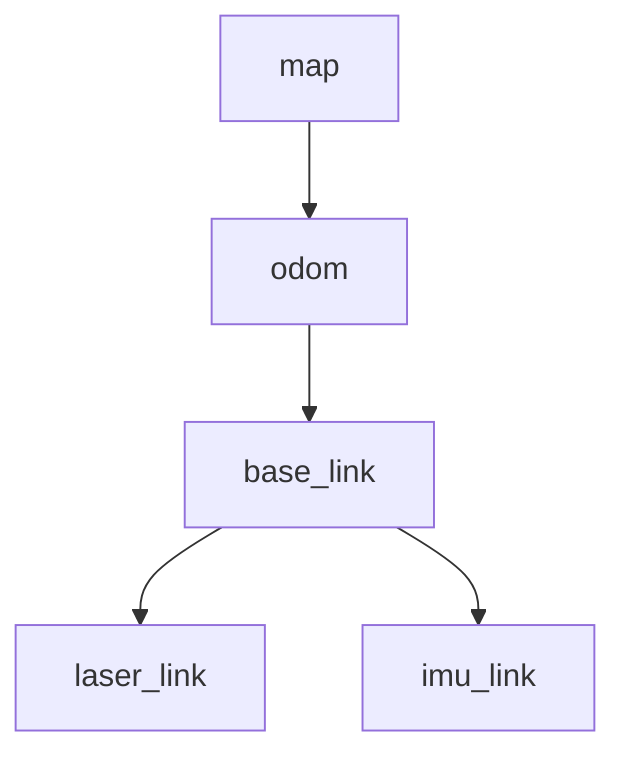
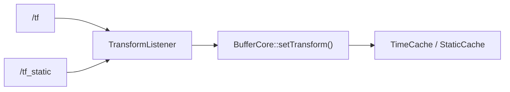
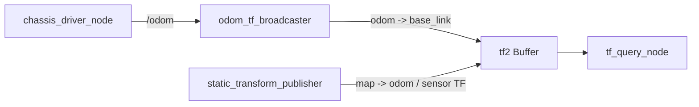

<meta name="referrer" content="no-referrer" />

# ROS教程13：TF / tf2 与移动机器人坐标系——从坐标变换原理到 BufferCore、时间缓存与 map→odom→base_link→sensor

> 摘要：从第 12 章的 Odometry 与 Imu 出发，解释 odom 含义、刚体变换数学、tf2 内部缓存与查询算法，并用实验建立移动机器人 TF tree。


@[toc]
第 12 章已经把差速底盘的数据整理成 ROS 能理解的标准消息：

```text
/cmd_vel
    -> Twist
    -> 左右轮目标速度

底层 ChassisData
    -> JointState
    -> Imu
    -> Odometry
    -> DiagnosticArray
```

其中已经出现过几个很重要的字符串：

```text
odom
base_link
imu_link
```

例如 `/odom` 中写了：

```text
header.frame_id = odom
child_frame_id  = base_link
```

`/imu/data_raw` 中写了：

```text
header.frame_id = imu_link
```

但到第 12 章结束为止，这些名字仍然只是消息里的 frame 标识。

**消息写了 `frame_id`，不代表系统中已经存在一条可以查询的 TF。**

阶段 C 从这里开始。

这一章不研究 SLAM、AMCL、costmap 和 planner，也不提前把 URDF、`robot_state_publisher` 塞进来。主线只有一条：

```text
为什么机器人需要 TF
    -> Transform 数学上到底是什么
    -> tf2 收到 TF 后内部怎样保存
    -> lookupTransform() 怎样查链、求逆和组合
    -> 时间缓存为什么会插值或 extrapolation
    -> 最后把第 12 章 /odom 真正接入 TF tree
```

最终建立后续 Navigation 都依赖的坐标链：

```text
map
 -> odom
 -> base_link
 -> sensor frames
```

本章工程继续使用：

```text
/workspace/ros_ws/src/ros1_driver_lab
/workspace/ros_ws/src/ros1_tf_lab
```

---

## 1. 先把本章最终要得到的 TF tree 看清楚

运行本章实验后，目标不是“看到几个 Topic”，而是建立这样一棵坐标树：



四类 frame 的职责不同：

```text
map
    全局参考

odom
    连续、短时间可靠，但允许长期漂移

base_link
    固连在机器人本体上的机体坐标系

laser_link / imu_link
    固连在具体传感器上的坐标系
```

这条树后面会被很多模块共同消费：

```text
robot_localization
SLAM
AMCL
costmap
move_base
rviz
sensor processing
```

如果树本身断了，或者某一条变换在消息对应的时间不存在，上层算法即使 Topic 正常也可能完全不能工作。

所以阶段 C 的第一件事不是研究 planner，而是把 TF 建立正确。

---

## 2. `odom` 到底是什么：先把 `/odom` Topic、`odom` frame 和 `odom -> base_link` 分开

`odom` 是 `odometry` 的缩写。

在 ROS 移动机器人语境里，常见中文可以写成：

```text
odometry
    里程计 / 里程推算

odom frame
    里程计坐标系
```

工程里经常口头说“odom TF”，但它不是一个严格定义的单独消息或算法名称。通常真正指的是：

```text
odom -> base_link
```

也就是：

> 里程计坐标系到机器人基座坐标系的坐标变换。

这里必须区分三个概念。

### 2.1 `/odom`：一个 Topic

第 12 章发布的是：

```text
/odom
```

消息类型：

```text
nav_msgs/Odometry
```

它携带：

```text
header.stamp
header.frame_id
child_frame_id
pose
pose covariance
twist
twist covariance
```

所以 `/odom` 是一条状态数据通路。

### 2.2 `odom`：一个 frame 名称

消息里：

```text
header.frame_id = odom
```

这里的 `odom` 是坐标系名称。

它不是 Topic，也不是 Node，更不是一个“里程计算法对象”。

### 2.3 `odom -> base_link`：一条坐标变换关系

当 TF tree 中存在：

```text
odom
  |
  v
base_link
```

它表达：

> 当前时刻，机器人机体坐标系 `base_link` 相对于里程计坐标系 `odom` 的位置和姿态。

如果机器人从启动位置沿 +x 方向前进 2 m，可以粗略理解为：

```text
odom 原点
   |
   | x = 2.0 m
   v
base_link
```

但这条 TF 不等于 `/odom` Topic。

本章后面会故意用两个 Node 把它们拆开：

```text
chassis_driver_node
    -> /odom

odom_tf_broadcaster
    -> odom -> base_link
```

就是为了避免把“状态消息”和“坐标树关系”混成同一个概念。

---

## 3. ROS 里为什么一定需要坐标系

假设激光雷达测到一个障碍物：

```text
x = 2.0 m
y = 0.3 m
```

这两个数字本身没有完整意义。

必须同时知道：

```text
相对于谁？
```

如果它是在 `laser_link` 中：

```text
障碍物位于雷达前方约 2 m、左侧约 0.3 m
```

但 costmap 最终可能要把这个点放到 `map` 或 `odom` 中。

于是必须存在：

```text
laser_link
    -> base_link
    -> odom
    -> map
```

也就是能够把：

```text
P_laser
```

转换成：

```text
P_map
```

这就是 TF 系统存在的核心原因。

TF 不是单独给“机器人姿态”服务的，它解决的是：

> 系统里所有带坐标语义的数据，如何在不同 frame 之间建立可查询、带时间的空间关系。

---

## 4. 先统一坐标轴：REP-103

ROS 移动机器人常见坐标约定来自 REP-103。

机体坐标系默认遵循右手系：

```text
+x  forward  前
+y  left     左
+z  up       上
```

因此二维移动机器人通常约定：

```text
+x：向前
+y：向左
+z：向上

绕 +z 的正角速度：逆时针
```

这和第 12 章使用的差速底盘约定保持一致。

例如：

```text
linear.x  > 0  -> 向前
angular.z > 0  -> 向左转 / 逆时针
```

这不是一个“代码风格”问题。

如果真实硬件采用不同轴向，却没有在 Driver 或 TF 层正确转换，后面会出现非常典型的现象：

```text
里程计向前走，RViz 中却向后
IMU 左转是正，底盘 odom 左转却是负
雷达障碍物显示在机器人另一侧
融合器把两个本来一致的传感器当成相互矛盾
```

官方规范：

- REP-103：<https://github.com/openrobotics/reps/blob/main/_posts/rep-0103.md>

本章只使用移动底盘最基本的：

```text
x forward
y left
z up
right-handed
```

相机 optical frame、地理坐标 ENU/NED 等特殊约定留到真正需要它们的章节。

---

## 5. `map`、`odom`、`base_link` 为什么不能混成一个 frame

REP-105 定义了移动机器人常见 frame 的语义。

官方规范：

- REP-105：<https://github.com/openrobotics/reps/blob/main/_posts/rep-0105.md>

### 4.1 `base_link`：跟着机器人本体走

`base_link` 固连在机器人底盘上。

可以把它理解成：

```text
机器人自己的坐标原点
```

对于二维 AGV，本章继续采用：

```text
+x 前
+y 左
+z 上
```

机器人无论开到地图哪里，在自己的 `base_link` 中仍然位于：

```text
x = 0
y = 0
z = 0
```

因为 frame 本身就跟着机器人移动。

---

### 4.2 `odom`：连续，但允许漂移

`odom` 是一个 world-fixed frame。

它最大的特征不是“绝对准确”，而是：

```text
连续
```

轮式里程计可能因为：

```text
轮径误差
轮距误差
打滑
地面不平
编码器量化
积分误差
```

逐渐漂移。

因此：

```text
odom -> base_link
```

通常会随着机器人运动连续变化，但长期可能越来越偏。

这也是为什么局部控制常喜欢连续的 `odom`：

```text
短时间运动平滑
不会因为全局定位突然修正而瞬移
```

---

### 4.3 `map`：全局一致性优先，可以发生离散修正

`map` 也是 world-fixed frame。

它关心的是：

```text
机器人在整个地图中的全局位置
```

SLAM 闭环、AMCL 重定位或其它全局定位来源可能修正机器人在地图中的位置。

因此：

```text
map -> odom
```

可以发生修正。

这条修正把：

```text
短期连续但会漂移的 odom
```

挂到：

```text
全局更一致的 map
```

下面这句话非常重要：

```text
odom 追求局部连续
map  追求全局一致
```

所以不能简单地问：

> map 和 odom 哪个“更准”？

它们解决的是不同问题。

---

### 4.4 为什么标准树是 `map -> odom -> base_link`

组合起来就是：

```text
map
  |
  | 全局定位修正
  v
odom
  |
  | 连续的局部运动
  v
base_link
```

于是机器人的全局位姿可以理解成两部分：

```text
全局校正
+
局部连续运动
```

后面学习 robot_localization、SLAM、AMCL 和 move_base 时，这个分层会反复出现。

---

## 6. TF 的数学本质：一个带时间戳的三维刚体变换

TF 本身不是定位算法，也不会凭空算出机器人在哪里。

从数学上看，一条 TF 的核心只有两部分：

```text
Translation
    平移

Rotation
    旋转
```

在 ROS 消息里通常对应：

```text
geometry_msgs/TransformStamped

transform.translation.x
transform.translation.y
transform.translation.z

transform.rotation.x
transform.rotation.y
transform.rotation.z
transform.rotation.w
```

旋转使用 Quaternion，也就是四元数。

因此可以先建立：

```text
Transform = Translation + Rotation
```

对于一般三维机器人，它属于三维刚体变换；对于二维 AGV，虽然实际主要运动自由度通常只有：

```text
x
y
yaw
```

ROS TF 仍然使用完整三维表达，只是常见情况下：

```text
z = 0
roll = 0
pitch = 0
```

### 6.1 `parent -> child` 到底表示什么

假设消息里：

```text
header.frame_id = odom
child_frame_id  = base_link
```

工程图通常画成：

```text
odom -> base_link
```

它描述的是：

> `base_link` 相对于 `odom` 的位姿。

同一份变换也可以拿来把 `base_link` 中的一个点转换到 `odom`：

```text
p_odom = R_odom_base * p_base + t_odom_base
```

其中：

```text
R_odom_base
    base_link 相对于 odom 的旋转

t_odom_base
    base_link 原点在 odom 中的位置
```

这条公式是后面所有 TF 链式组合的基础。

### 6.2 为什么 tf2 可以自动求反方向

系统只需要发布：

```text
odom -> base_link
```

不应该再让另一个 Node 同时发布：

```text
base_link -> odom
```

因为数学上反方向可以直接由逆变换得到：

```text
T_base_odom = inverse(T_odom_base)
```

对于刚体变换，旋转部分求逆就是：

```text
R^-1 = R^T
```

平移也要在逆旋转后重新计算，而不是简单把 x/y/z 改成负数。

### 6.3 为什么没有直接发布 `map -> laser_link` 也能查到

假设树里只有：

```text
map -> odom
odom -> base_link
base_link -> laser_link
```

那么：

```text
T_map_laser
    = T_map_odom
    * T_odom_base
    * T_base_laser
```

所以 TF 的核心能力不是“保存所有 frame 两两之间的结果”，而是：

> 保存最小的父子关系，再按查询要求做求逆和链式组合。

这也是为什么移动机器人只需要维护一棵语义清楚的 TF tree，而不是让每个模块都发布所有可能的 frame 组合。

---

## 7. TF 的作用边界：它负责坐标变换，不负责产生定位结果

这条边界必须明确。

TF 不负责回答：

```text
轮子转了多少？
机器人真实移动了多少？
IMU 应该怎么融合？
机器人在地图哪里？
SLAM 是否闭环？
AMCL 粒子权重是多少？
```

这些结果来自：

```text
Driver
Odometry
robot_localization
SLAM
AMCL
其它状态估计或定位模块
```

TF 负责的是：

```text
已有 frame 间变换
        |
        v
保存 parent / child / timestamp / transform
        |
        v
按 target / source / time 查询
        |
        v
查找 frame chain
        |
        v
必要时插值
        |
        v
求逆 + 组合
        |
        v
返回目标坐标变换
```

因此可以把 tf2 理解成：

> 一个“带时间历史的坐标变换管理和查询系统”。

例如雷达驱动只知道：

```text
LaserScan.header.frame_id = laser_link
```

定位模块只知道：

```text
map -> odom
```

底盘里程计只知道：

```text
odom -> base_link
```

整机几何模型只知道：

```text
base_link -> laser_link
```

tf2 把这些由不同模块负责的局部关系组织起来，让 costmap、SLAM、RViz 等消费者能够统一查询：

```text
map <- laser_link
```

这里的 `<-` 强调“把 `laser_link` 中的数据转换到 `map`”，不要与前面 TF tree 中表示 parent/child 的 `map -> odom -> ...` 箭头混为一谈。

这就是 TF 在整条 AGV 数据链中的位置。

---

## 8. tf2 内部第一步：TransformListener 怎样把 `/tf` 和 `/tf_static` 写进 Buffer

ROS1 Noetic 里，本章代码使用：

```text
tf2_ros::Buffer
tf2_ros::TransformListener
```

二者的职责并不一样。

```text
TransformListener
    负责接收 ROS Topic

Buffer / BufferCore
    负责保存和查询坐标变换
```

从 Noetic `transform_listener.cpp` 可以看到，Listener 会分别订阅：

```text
/tf
/tf_static
```

动态回调和静态回调最终都会进入：

```text
TransformListener::subscription_callback_impl(..., is_static)
```

然后逐条调用：

```cpp
buffer_.setTransform(msg_in.transforms[i], authority, is_static);
```

因此数据路径可以概括成：



这里有三个值得注意的内部信息。

### 8.1 `authority` 会被一起记录

`TransformListener` 会从消息事件中取得 publisher 名称作为 authority。

所以 TF 系统不仅知道：

```text
谁是 parent
谁是 child
变换是多少
时间是多少
```

还能够记录最近由哪个发布者提供这条 frame 关系。

这也是 `tf2_monitor`、frame 调试中能够观察 authority 的基础。

### 8.2 tf2 内部不是反复拿字符串做整棵树搜索

`BufferCore` 会把 frame 名映射成内部的 `CompactFrameID`。

可以把它理解成：

```text
"map"        -> ID 1
"odom"       -> ID 2
"base_link"  -> ID 3
"laser_link" -> ID 4
```

真实 ID 数值由运行时内部映射决定，上面的数字只是说明机制。

这样后续查链、缓存和 parent 关系管理可以主要基于内部 ID 工作。

### 8.3 每个 child frame 对应自己的变换缓存

`TransformStamped` 中：

```text
header.frame_id
    parent

child_frame_id
    child
```

`BufferCore` 会围绕 child frame 管理它到 parent 的变换数据。

动态关系使用时间缓存；静态关系使用静态缓存。

这也是为什么 TF tree 要求一个 child 的父关系保持清晰。如果多个模块同时争抢同一个 child 的 parent/transform，结果不是“自动融合”，而是在破坏 frame ownership。

Noetic 源码入口：

- `tf2_ros/transform_listener.cpp`：<https://github.com/ros/geometry2/blob/noetic-devel/tf2_ros/src/transform_listener.cpp>
- `tf2/src/buffer_core.cpp`：<https://github.com/ros/geometry2/blob/noetic-devel/tf2/src/buffer_core.cpp>

---

## 9. `lookupTransform()` 内部算法：查链、取时间点数据、求逆、组合

现在再看本章后面会调用的：

```cpp
lookupTransform("map", "laser_link", time)
```

它不是简单查一个字典：

```text
("map", "laser_link") -> Transform
```

因为系统可能从来没有直接发布过：

```text
map -> laser_link
```

Noetic `BufferCore::lookupTransform()` 的核心会进入：

```text
walkToTopParent(...)
```

可以把过程拆成下面几步。

### 9.1 先确认 target 和 source frame 存在

查询：

```text
target = map
source = laser_link
```

tf2 先把字符串转换成内部 frame ID。

如果某个 frame 根本不存在，会进入 Lookup 类错误，而不是继续猜测路径。

### 9.2 `time == 0` 时先求整条链的 latest common time

如果传入：

```cpp
ros::Time(0)
```

`BufferCore` 不只是取“某一条边最新的一帧”。

它会寻找 target 与 source 整条可连接路径上都能够成立的：

```text
latest common time
```

例如：

```text
map -> odom         最新到 10.50 s
odom -> base_link   最新到 10.42 s
base_link -> laser  static
```

那么整条链不能假装已经有 10.50 s 的 `odom -> base_link`。

查询必须以整条链共同可用的时间为准。

### 9.3 从 source 往根节点走，并累积变换

source 是：

```text
laser_link
```

内部会沿 parent 关系向上走：

```text
laser_link
    -> base_link
    -> odom
    -> map
```

每经过一个 child，都会从对应缓存中取指定时间的数据，并累积 source 到上层的变换。

### 9.4 target 也向上走，寻找共同祖先

一般查询不保证 target 恰好就是 source 的祖先。

例如：

```text
       base_link
       /       \
laser_link   imu_link
```

查询：

```text
imu_link <- laser_link
```

source 和 target 都要向上走，最后在：

```text
base_link
```

找到共同祖先。

如果两边最终根本不在同一棵树里，就得到 Connectivity 类错误。

### 9.5 target 一侧需要求逆

源码中的 `TransformAccum::finalize()` 会对 target 一侧累计结果求逆，再与 source 一侧结果组合。

为了避免“树上的 parent -> child 箭头”和“坐标变换方向”混淆，这里直接用矩阵记号：

```text
T_common_source
    把 source 坐标转换到共同祖先 common

T_common_target
    把 target 坐标转换到共同祖先 common
```

目标是得到：

```text
T_target_source
    把 source 坐标转换到 target
```

因此：

```text
T_target_source
    = inverse(T_common_target)
    * T_common_source
```

这就是“target 一侧求逆，再和 source 一侧组合”的数学原因。

### 9.6 最终返回的是“把 source 数据变换到 target”所需的 Transform

所以：

```cpp
lookupTransform("map", "laser_link", time)
```

最稳妥的阅读方法仍然是：

```text
把 laser_link 中的数据变换到 map
需要什么变换？
```

这比死记参数顺序更不容易混淆。

源码主线：

```text
BufferCore::lookupTransform()
    -> walkToTopParent()
        -> TimeCacheInterface::getData()
        -> TransformAccum::accum()
        -> TransformAccum::finalize()
```

---

## 10. TimeCache 的算法：不是只存“最新 TF”，而是在时间轴上取值

动态 TF 最重要的内部结构之一是：

```text
TimeCache
```

Noetic `BufferCore` 默认动态缓存时间为 10 秒。

它不是说 TF 只能运行 10 秒，而是：

> 对动态 transform，默认只保留最近一段历史，供按时间查询和插值。

假设 `odom -> base_link` 收到：

```text
10.00 s   x = 1.00
10.10 s   x = 1.10
10.20 s   x = 1.20
10.30 s   x = 1.30
```

查询并不总是刚好落在已有 timestamp 上。

### 10.1 查询恰好命中缓存样本

例如查询：

```text
10.20 s
```

可以直接取得对应 transform。

### 10.2 查询位于两个动态样本之间

例如查询：

```text
10.15 s
```

缓存中只有：

```text
10.10 s
10.20 s
```

`TimeCache::interpolate()` 会在两个样本之间进行插值。

平移部分做线性插值；旋转部分使用 Quaternion SLERP，也就是球面线性插值。

可以粗略理解成：

```text
translation:
1.10 -------- 1.15 -------- 1.20
10.10 s      10.15 s       10.20 s

rotation:
q1 -------- SLERP -------- q2
```

源码中的核心动作就是：

```text
translation -> interpolate
rotation    -> slerp
```

只有相邻样本对应相同 parent frame 时才适合这样插值；parent 关系变化属于不同的拓扑语义，不能当作普通连续运动直接混插。

### 10.3 查询比缓存最新时间还未来

例如缓存最新：

```text
10.30 s
```

却要求：

```text
10.80 s
```

tf2 没有未来真实运动数据，不能凭空预测机器人未来位置。

于是得到 future extrapolation。

### 10.4 查询比缓存最早时间还过去

例如 Buffer 当前最早只保留：

```text
20.00 s
```

却查询：

```text
5.00 s
```

历史已经不存在，于是得到 past extrapolation。

所以 extrapolation 的核心不是：

```text
矩阵算错
```

而是：

> 拓扑关系可能存在，但请求时间点不在动态 TF 当前可提供的时间范围内。

Noetic API / 源码：

- `BufferCore::DEFAULT_CACHE_TIME`：<https://docs.ros.org/en/noetic/api/tf2/html/classtf2_1_1BufferCore.html>
- `TimeCache`：<https://github.com/ros/geometry2/blob/noetic-devel/tf2/include/tf2/time_cache.h>
- `cache.cpp`：<https://github.com/ros/geometry2/blob/noetic-devel/tf2/src/cache.cpp>

---

## 11. `frame_id` 只是“这份数据属于哪个 frame”，不是 TF 本身

这是刚接触 ROS TF 时最容易混淆的地方之一。

第 12 章 `/imu/data_raw` 中已经有：

```cpp
msg.header.frame_id = imu_frame_id_;
```

运行：

```bash
rostopic echo -n 1 /imu/data_raw
```

可以看到：

```yaml
header:
  frame_id: "imu_link"
```

这只表示：

> 这条 IMU 数据的测量坐标语义属于 `imu_link`。

它没有告诉 TF 系统：

```text
imu_link 在 base_link 的什么位置？
imu_link 相对 base_link 有没有旋转？
```

同样，第 12 章 `/odom` 中：

```text
header.frame_id = odom
child_frame_id  = base_link
```

表达了 Odometry 消息的坐标语义，但第 12 章代码并没有调用：

```cpp
tf2_ros::TransformBroadcaster::sendTransform()
```

所以只运行第 12 章时：

```text
/odom 有数据
```

并不能推导出：

```text
TF 中一定已经有 odom -> base_link
```

因此要把两个概念分开：

```text
frame_id
    = 数据的坐标语义标签

TF
    = frame 与 frame 之间可查询的空间关系
```

上层消费者通常两者都需要。

---

## 12. `/tf` 与 `/tf_static`：动态关系和静态关系必须分开

TF 数据最终仍然通过 ROS 通信传播。

常见两个 Topic：

```text
/tf
/tf_static
```

### 7.1 `/tf`：动态变换

例如：

```text
odom -> base_link
```

机器人持续运动，所以平移和旋转一直在变。

这种关系要周期性更新。

本章由：

```text
odom_tf_broadcaster
```

根据 `/odom` 持续发布。

---

### 7.2 `/tf_static`：静态变换

例如雷达通过支架固定在底盘上：

```text
base_link -> laser_link
```

安装完成后，只要机械结构不变，它的：

```text
x / y / z
roll / pitch / yaw
```

都不随机器人运行而变化。

这种关系属于静态 TF。

本章暂时用：

```text
tf2_ros/static_transform_publisher
```

发布。

第 14 章加入 URDF 和 `robot_state_publisher` 后，机器人自身的大量 fixed joint 会由机器人模型统一管理，不再需要手写一串 static publisher。

---

## 13. 谁应该负责哪一条 TF

本章实验刻意给每条边安排明确 authority：

| TF | 本章发布者 | 性质 | 后续真实系统常见 owner |
| --- | --- | --- | --- |
| `map -> odom` | `map_to_odom_static` | 本章临时静态 | SLAM / AMCL / localization |
| `odom -> base_link` | `odom_tf_broadcaster` | 动态 | wheel odom / state estimator |
| `base_link -> laser_link` | static publisher | 静态 | URDF + robot_state_publisher |
| `base_link -> imu_link` | static publisher | 静态 | URDF + robot_state_publisher |

这里对 `map -> odom` 必须特别说明。

本章使用：

```text
0 0 0 0 0 0 map odom
```

只是为了在还没有学习 SLAM / AMCL 时先把树补完整。

它的含义是：

```text
教学环境暂时假设 map 与 odom 完全重合
```

真实导航系统不能长期把这条关系当成固定恒等变换。

到第 17 章后，这条边会由真正的建图或定位组件负责。

---

## 14. 新增 `ros1_tf_lab` package

项目中新增：

```text
ros_ws/src/ros1_tf_lab/
├── CMakeLists.txt
├── package.xml
├── README.md
├── config/
│   └── tf_lab.yaml
├── launch/
│   └── tf_lab.launch
└── src/
    ├── odom_tf_broadcaster.cpp
    └── tf_query_node.cpp
```

这次没有修改第 12 章 `chassis_driver_node.cpp` 的核心职责。

仍然保持：

```text
ros1_driver_lab
    负责产生 ROS Driver 数据契约

ros1_tf_lab
    负责把这些数据接入 TF 学习链
```

这样能清楚区分：

```text
Odometry 消息
```

和：

```text
TF 发布
```

不是同一件事。

---

## 15. `odom_tf_broadcaster`：把 `/odom` 中的 pose 真正发布成 TF

第 12 章已经发布：

```text
/odom
```

其中有：

```text
header.stamp
header.frame_id
child_frame_id
pose.pose.position
pose.pose.orientation
```

所以本章不重新计算一次里程计。

只做映射：

```text
/odom
  |
  | pose + frame + stamp
  v
TransformStamped
  |
  v
/tf
```

核心代码：

```cpp
void odomCallback(const nav_msgs::Odometry::ConstPtr &msg)
{
    geometry_msgs::TransformStamped transform;

    transform.header.stamp = msg->header.stamp;
    transform.header.frame_id = msg->header.frame_id;
    transform.child_frame_id = msg->child_frame_id;

    transform.transform.translation.x = msg->pose.pose.position.x;
    transform.transform.translation.y = msg->pose.pose.position.y;
    transform.transform.translation.z = msg->pose.pose.position.z;
    transform.transform.rotation = msg->pose.pose.orientation;

    broadcaster_.sendTransform(transform);
}
```

最重要的不是 API，而是没有重新创建一个时间：

```cpp
transform.header.stamp = msg->header.stamp;
```

这里故意沿用 `/odom` 的原始 timestamp。

因为这个 TF 描述的是：

> 这份 Odometry 所对应的那个时刻，`base_link` 相对 `odom` 在哪里。

如果收到 `/odom` 后重新写：

```cpp
transform.header.stamp = ros::Time::now();
```

就等于把同一份状态强行改成“现在发生的”。

当系统存在采集、计算、排队和传输延迟时，这会破坏时间一致性。

后面真正进入传感器融合后，这个问题会更加明显。

---

## 16. 为什么本章没有让 Driver 自己顺手发布 TF

真实项目中当然可以让底盘 Driver 同时发布：

```text
/odom
+
odom -> base_link
```

很多驱动也确实这样做。

但本章故意拆成两个 Node：

```text
chassis_driver_node
    -> /odom

odom_tf_broadcaster
    -> odom -> base_link
```

原因是当前学习目标不是设计最终产品架构，而是把两个契约分开看清楚：

```text
nav_msgs/Odometry
```

负责携带状态估计结果和 covariance；

```text
geometry_msgs/TransformStamped
```

进入 TF tree，负责 frame 之间的空间关系。

等理解清楚以后，真实项目是否由一个 Node 同时发布两者，再按项目架构决定。

---

## 17. 静态传感器 TF：安装位置也是数据契约

`tf_lab.launch` 中暂时定义：

```xml
<node pkg="tf2_ros"
      type="static_transform_publisher"
      name="base_to_laser_static"
      args="0.25 0.0 0.15 0 0 0 base_link laser_link" />
```

表示：

```text
laser_link 相对 base_link：

x = +0.25 m
    雷达在车体原点前方 25 cm

y = 0
    没有左右偏移

z = +0.15 m
    雷达高于 base_link 15 cm

roll  = 0
pitch = 0
yaw   = 0
```

这里的机械安装参数不是“为了 TF 看起来完整”。

它直接影响传感器数据最终落到机器人和地图中的位置。

如果真实雷达向前偏 25 cm，却错误配置成：

```text
x = 0
```

那么所有激光点转换到 `base_link` 时都会整体错位 25 cm。

后面的 costmap、SLAM 和定位都只能基于错误几何关系继续计算。

所以：

> 静态 TF 也是 Driver / 整机集成数据契约的一部分。

第 14 章会把这种几何关系迁移到 URDF。

---

## 18. Docker Image 增加 tf2 工具

`Dockerfile` 新增：

```text
ros-noetic-tf2-ros
ros-noetic-tf2-tools
```

`tf2_ros` 提供本章使用的 broadcaster、listener 和命令行工具；`tf2_tools` 提供 frame tree 可视化工具。

重新构建 Image，在 Ubuntu Host 执行：

```bash
cd /home/wdfk/share/ros1-docker
docker compose up -d --build
```

进入 Container：

```bash
docker compose exec ros1-dev bash
```

---

## 19. 构建本章 package

Container 中执行：

```bash
cd /workspace/ros_ws
catkin build ros1_driver_lab ros1_tf_lab
```

然后：

```bash
source /workspace/ros_ws/devel/setup.bash
```

如果当前 shell 没有重新 source，`roslaunch` 可能找不到新 package。

验证：

```bash
rospack find ros1_tf_lab
```

预期：

```text
/workspace/ros_ws/src/ros1_tf_lab
```

---

## 20. 一条 launch 同时启动 Driver 和 TF 实验

执行：

```bash
roslaunch ros1_tf_lab tf_lab.launch
```

这个 launch 会启动：

```text
chassis_driver_node
map_to_odom_static
base_to_laser_static
base_to_imu_static
odom_tf_broadcaster
tf_query_node
```

数据关系是：



注意这里没有画 SLAM、AMCL 和 move_base。

因为第 13 章只验证 TF 机制本身。

---

## 21. 先证明 `/odom` 和 TF 是两条不同的数据通路

另开一个终端，进入 Container 后：

```bash
source /workspace/ros_ws/devel/setup.bash
```

先看 `/odom`：

```bash
rostopic echo -n 1 /odom
```

应能看到：

```text
header.frame_id: odom
child_frame_id: base_link
```

再看：

```bash
rostopic info /tf
```

应能在 Publisher 中看到：

```text
/odom_tf_broadcaster
```

然后：

```bash
rostopic echo -n 1 /tf
```

可以看到 `tf2_msgs/TFMessage` 中包含动态：

```text
odom -> base_link
```

再看静态：

```bash
rostopic info /tf_static
```

可以看到 static publisher。

这时应该建立一个非常明确的认识：

```text
/odom
    是 nav_msgs/Odometry 数据

/tf
    是动态坐标变换流

/tf_static
    是静态坐标变换流
```

它们互相关联，但不是同一个 Topic，也不是同一种消息职责。

---

## 22. 用 `tf2_echo` 直接查询 frame 之间的关系

执行：

```bash
rosrun tf2_ros tf2_echo map laser_link
```

这里不是查询：

```text
map -> laser_link 这条边是否直接存在
```

而是要求 tf2 沿整棵树计算：

```text
map
 -> odom
 -> base_link
 -> laser_link
```

组合之后得到：

```text
laser_link 相对于 map 的变换
```

机器人移动后，虽然：

```text
base_link -> laser_link
```

本身是静态的，但：

```text
odom -> base_link
```

一直变化，因此最终：

```text
map <- laser_link
```

也一直变化。

这就是 TF tree 的价值：

> 消费者不需要每个模块都自己手写一遍矩阵链乘，只要系统中的 frame tree 正确，tf2 就能按目标 frame 和源 frame 查询组合后的变换。

---

## 23. `lookupTransform(target, source, time)` 到底怎么读

本章查询节点调用：

```cpp
const geometry_msgs::TransformStamped transform =
    tf_buffer_.lookupTransform(
        target_frame_,
        source_frame_,
        requested_time,
        ros::Duration(timeout_sec_));
```

默认：

```text
target_frame = map
source_frame = laser_link
```

也就是：

```cpp
lookupTransform("map", "laser_link", ...)
```

最实用的记法是：

> 把 `laser_link` 中的数据转换到 `map`，需要什么变换？

也就是：

```text
source = laser_link
    |
    | transform
    v
target = map
```

返回的 `TransformStamped` 会对应：

```text
header.frame_id = map
child_frame_id  = laser_link
```

不要因为 TF tree 图通常从 parent 画到 child，就把 `lookupTransform()` 的参数顺序反过来记。

API 文档：

- <https://docs.ros.org/en/noetic/api/tf2/html/classtf2_1_1BufferCore.html>

---

## 24. 为什么 TF 不只是“坐标关系”，还必须带时间

假设机器人以：

```text
1 m/s
```

向前运动。

雷达在：

```text
t = 10.0 s
```

采到一帧数据。

但 ROS Node 到：

```text
t = 10.2 s
```

才处理这帧激光。

如果用：

```text
t = 10.2 s
```

时的机器人位姿去转换：

```text
t = 10.0 s
```

采集的障碍物，那么 0.2 秒内机器人已经移动：

```text
0.2 m
```

点云/激光位置就会出现系统性错位。

所以正确的数据链应该是：

```text
传感器数据 header.stamp = T
            |
            v
查询 T 时刻对应的 TF
            |
            v
把 T 时刻的传感器数据转换到目标 frame
```

这就是为什么 TF Buffer 不只保存“最新姿态”，而是保存一段动态变换历史。

Noetic `tf2::BufferCore` 默认动态缓存时间为 10 秒。

官方 API：

- <https://docs.ros.org/en/noetic/api/tf2/html/classtf2_1_1BufferCore.html>

这 10 秒不是说“系统最多只能运行 10 秒”，而是：

> 对动态 TF，Buffer 默认保留最近一段历史供时间查询和插值使用。

静态 TF 不属于同一种持续变化的历史缓存语义。

---

## 25. `ros::Time(0)`：查询“最新共同可用时间”

本章 `tf_query_node` 默认：

```yaml
query_mode: latest
```

代码返回：

```cpp
return ros::Time(0);
```

在 tf2 查询中，时间 0 表示：

```text
使用可获得的最新变换
```

对于一条多级链：

```text
map -> odom -> base_link -> laser_link
```

真正有意义的是整条链都能成立的最新时间。

默认运行：

```bash
roslaunch ros1_tf_lab tf_lab.launch
```

日志会持续看到类似：

```text
TF OK map <- laser_link stamp=...
```

这适合回答：

> 现在系统里最新可以得到的 `map <- laser_link` 是什么？

但它不能替代传感器处理时的精确 timestamp 查询。

---

## 26. 精确时间查询：`now + offset`

本章为了让时间问题可观察，增加：

```yaml
query_mode: now
query_offset_sec: 0.0
```

当 `query_mode=now` 时：

```cpp
return ros::Time::now() + ros::Duration(query_offset_sec_);
```

这表示：

```text
明确要求某一个具体时间点的变换
```

运行：

```bash
roslaunch ros1_tf_lab tf_lab.launch query_mode:=now query_offset_sec:=0.0
```

这时查询的是：

```text
当前时间
```

因为动态 `odom -> base_link` 是按 20 Hz 左右发布，查询线程和 broadcaster 并不是完全同步的，所以“现在”可能刚好比 Buffer 中最新动态 TF 更靠未来一点。

这也是工程里常见的时间竞争：

```text
消费者已经拿到 now
但对应 now 的 TF 还没进入 Buffer
```

是否成功取决于：

```text
发布频率
线程调度
处理延迟
查询 timeout
时间戳来源
```

所以处理真实传感器时，应优先使用消息自己的：

```text
header.stamp
```

而不是习惯性把所有查询都写成 `ros::Time::now()`。

---

## 27. 主动制造 Future Extrapolation

现在把查询时间故意放到未来：

```bash
roslaunch ros1_tf_lab tf_lab.launch \
  query_mode:=now \
  query_offset_sec:=0.5
```

含义：

```text
当前是 T
但要求查询 T + 0.5 s 的动态 TF
```

系统不可能提前知道机器人未来半秒实际在哪里。

所以通常会看到：

```text
TF ExtrapolationException: ...
```

`tf2::ExtrapolationException` 的定义就是：

> 请求的变换需要超出当前缓存可提供的时间范围进行外推。

官方 API：

- <https://docs.ros.org/en/noetic/api/tf2/html/classtf2_1_1ExtrapolationException.html>

因此 Future Extrapolation 不应该简单翻译成：

```text
TF 坏了
```

更准确的理解是：

```text
frame 关系可能存在
但是请求时间比现有最新动态数据更靠未来
```

---

## 28. 主动制造 Past Extrapolation

动态 TF Buffer 默认只保存有限历史。

可以直接请求很久以前：

```bash
roslaunch ros1_tf_lab tf_lab.launch \
  query_mode:=now \
  query_offset_sec:=-20.0
```

本章 Buffer 刚启动时，本来就没有 20 秒前的历史；即使运行时间足够长，默认动态历史窗口也不是无限的。

因此会遇到过去方向的 extrapolation。

这类问题在 rosbag 回放、跨机器时间不一致、设备 timestamp 使用错误时尤其常见。

看到错误时要先问：

```text
请求的时间是什么？
Buffer 最早有什么时间？
Buffer 最新有什么时间？
消息 timestamp 来自哪里？
```

而不是先改 TF tree 名称。

---

## 29. timeout 解决不了“真正不存在的未来”

本章查询还给了：

```cpp
ros::Duration(timeout_sec_)
```

默认：

```yaml
timeout_sec: 0.05
```

它的意义是：

```text
短时间等待所需 TF 到达
```

例如：

```text
传感器消息刚到
TF 晚几毫秒进入 Buffer
```

稍微等待可能就能成功。

但如果要求：

```text
T + 0.5 s
```

而 timeout 只有：

```text
0.05 s
```

显然不可能等到那份未来数据。

即使把 timeout 改成很大，也不能把错误的 timestamp 契约自动修好。

所以 timeout 是：

```text
等待机制
```

不是：

```text
时间错误修复机制
```

---

## 30. `LookupException`、`ConnectivityException`、`ExtrapolationException` 分别在说什么

本章代码没有只 catch 一个模糊错误，而是分别处理：

```cpp
catch (const tf2::LookupException &ex)
catch (const tf2::ConnectivityException &ex)
catch (const tf2::ExtrapolationException &ex)
catch (const tf2::TransformException &ex)
```

它们对应的排查方向不一样。

### 25.1 LookupException

典型含义：

```text
请求的 frame 根本没有进入 Buffer
```

例如把配置改成：

```yaml
source_frame: laser_typo
```

系统中从来没有这个 frame，就应该先检查：

```text
frame 名是否拼错
publisher 是否启动
静态 TF 是否发布
```

---

### 25.2 ConnectivityException

典型含义：

```text
两个 frame 都存在
但不在同一棵连通 TF tree 中
```

例如真实工程里出现两棵孤立树：

```text
map -> odom -> base_link

world -> camera_link
```

此时 `map` 和 `camera_link` 都存在，但中间没有路径。

应该检查的是：

```text
父子 frame 配置
URDF / static TF
定位模块 frame 参数
是否意外形成两个根节点
```

---

### 25.3 ExtrapolationException

典型含义：

```text
拓扑关系可以成立
但请求时间超出了可用动态 TF 时间范围
```

排查重点转成：

```text
timestamp
发布频率
延迟
时钟
Buffer 历史
```

这三类错误如果混成一句“TF 查不到”，很容易走错排查方向。

---

## 31. `tf2_monitor` 看的是时间健康度，不只是 frame 名

执行：

```bash
rosrun tf2_ros tf2_monitor map laser_link
```

它能帮助观察：

```text
frame chain
变换延迟
发布频率
authority
```

这对 AGV 很重要。

因为实际现场常见的并不是：

```text
完全没有 TF
```

而是：

```text
TF 有
但频率太低
延迟太大
时间戳异常
偶发断流
```

这些问题在 `tf2_echo` 中可能只表现为偶尔失败，但在 monitor 中更容易看到趋势。

---

## 32. 用 `view_frames.py` 把整棵树画出来

在一个可写目录执行：

```bash
cd /workspace
rosrun tf2_tools view_frames.py
```

工具会监听一段时间的 TF，然后生成：

```text
frames.pdf
```

本章正常情况下应该能看到：

```text
map
 |
odom
 |
base_link
 |       \
laser_link imu_link
```

如果出现：

```text
两个独立根节点
```

或者某个传感器 frame 单独漂在一边，就应该先修 TF tree，再继续 Navigation。

Graphviz 已经包含在本项目 Docker Image 中，所以 `view_frames.py` 可以直接生成 PDF。

---

## 33. 为什么一个 child frame 不应该同时被多个模块争抢

假设系统里同时有两个模块都发布：

```text
odom -> base_link
```

例如：

```text
wheel_odom_node
robot_localization
```

两者给出的值不完全一样。

那么 TF 消费者看到的实际上是竞争的 authority。

这不是“融合”。

真正的融合应该发生在状态估计器内部：

```text
wheel odom ----\
                \
IMU --------------> robot_localization -> odom -> base_link
                /
other source -----/
```

然后：

```text
只有融合后的 owner 发布最终 odom -> base_link
```

后面进入第 16 章时，这条原则会非常关键。

如果不先建立 TF authority 概念，很容易出现：

```text
Driver 发布一份 TF
EKF 又发布一份 TF
两个 Node 同时抢 base_link
RViz 中机器人抖动
```

这种问题不是滤波器参数调得不好，而是 frame ownership 本身错误。

---

## 34. `Odometry` 和 TF 应该保持哪些一致性

本章 `odom_tf_broadcaster` 故意直接使用 `/odom`：

```text
header.frame_id
child_frame_id
pose.pose
header.stamp
```

因此正常情况下：

```text
/odom 中：
odom -> base_link 的 pose

TF 中：
odom -> base_link 的 transform
```

在同一个 timestamp 上应该描述同一份机器人状态。

重点是一致：

```text
frame 一致
time 一致
position 一致
orientation 一致
```

如果 `/odom` 写：

```text
child_frame_id = base_link
```

但 TF 却发布：

```text
odom -> base_footprint
```

并不是一定错误，但必须明确系统中：

```text
base_footprint -> base_link
```

由谁提供，以及消费者到底使用哪个 base frame。

本系列当前保持最小模型：

```text
odom -> base_link
```

暂时不增加 `base_footprint`。

---

## 35. 传感器 `frame_id` 和静态 TF 必须对得上

第 12 章 IMU 发布：

```text
frame_id = imu_link
```

本章静态 TF 也建立：

```text
base_link -> imu_link
```

这两者是配套关系。

如果消息写：

```text
imu_link
```

但 TF tree 实际只有：

```text
imu_sensor
```

对 tf2 来说它们就是两个不同 frame。

不会因为名字“看起来差不多”自动匹配。

以后接真实硬件时，应把下面三部分一起核对：

```text
Driver message header.frame_id
URDF / static TF 中的 link/frame 名
上层配置要求的 sensor frame
```

这就是“Topic 有数据但上层不能消费”的常见来源之一。

---

## 36. 为什么后面 costmap 会特别依赖 timestamp + TF

第 15 章才会正式讲 `LaserScan` 和 `Range`，这里先只建立因果关系。

假设 `/scan`：

```text
header.frame_id = laser_link
header.stamp    = T
```

costmap 想把扫描数据放到自己的 global frame 中，就需要：

```text
T 时刻的
laser_link -> global frame
```

如果 Topic 正常：

```bash
rostopic hz /scan
```

也有稳定频率，但 TF 在时间 T 不可用，costmap 仍然可能丢弃这帧数据。

所以以后看到：

```text
有 /scan
但 costmap 没障碍物
```

不能只继续查雷达驱动。

数据链应该向后检查：

```text
/scan
  -> frame_id
  -> header.stamp
  -> sensor TF
  -> TF 时间可用性
  -> costmap observation source
```

这就是阶段 C 要建立的“故障传播”思路。

---

## 37. 本章配置文件为什么只有几个参数

`config/tf_lab.yaml`：

```yaml
target_frame: map
source_frame: laser_link
query_mode: latest
query_offset_sec: 0.0
query_rate_hz: 2.0
timeout_sec: 0.05
```

没有加入几十个 TF 参数，因为当前实验只验证两个维度：

```text
空间关系
+
时间关系
```

每个参数都对应一个明确问题。

### `target_frame`

希望把数据转换到哪个 frame。

### `source_frame`

数据原本属于哪个 frame。

### `query_mode`

选择：

```text
latest
```

还是：

```text
now
```

### `query_offset_sec`

人为把查询时间移动到：

```text
过去
现在
未来
```

### `timeout_sec`

允许查询等待 TF 到达的时间。

这几个参数已经足够把 tf2 时间模型跑清楚。

---

## 38. 一组建议按顺序执行的观察命令

启动：

```bash
roslaunch ros1_tf_lab tf_lab.launch
```

然后依次执行：

```bash
rostopic echo -n 1 /odom
```

确认：

```text
odom
base_link
stamp
pose
```

接着：

```bash
rostopic echo -n 1 /tf
```

确认动态：

```text
odom -> base_link
```

再执行：

```bash
rostopic echo /tf_static
```

本章三条静态边由三个独立的 latched `static_transform_publisher` 发布。新订阅者连接后会分别收到这些 publisher 保留的最近一条消息，因此不要使用 `-n 1` 在第一条消息后立即退出。等待看到下面三条静态关系后按 `Ctrl+C` 结束：

```text
map -> odom
base_link -> laser_link
base_link -> imu_link
```

再执行：

```bash
rosrun tf2_ros tf2_echo map laser_link
```

确认整条链能够组合查询。

再执行：

```bash
rosrun tf2_ros tf2_monitor map laser_link
```

开始从“有没有 TF”进入“TF 时间质量如何”。

最后：

```bash
cd /workspace
rosrun tf2_tools view_frames.py
```

确认整棵 tree 连通。

这个顺序对应：

```text
消息契约
 -> 动态 TF
 -> 静态 TF
 -> 组合查询
 -> 时间健康度
 -> 整体拓扑
```

比一开始只看 RViz 更容易建立故障边界。

---

## 39. 用本章实验重新理解 `map -> odom -> base_link -> sensor`

现在可以把整条数据链分成四层。

### 第一层：全局校正

```text
map -> odom
```

本章只是临时 identity static TF。

后面由：

```text
SLAM / AMCL / localization
```

接管。

### 第二层：局部连续运动

```text
odom -> base_link
```

本章来自第 12 章 `/odom`。

以后也可能来自融合后的状态估计器。

### 第三层：机器人自身几何

```text
base_link -> sensor frames
```

本章用 static publisher。

第 14 章改用：

```text
URDF
+
robot_state_publisher
```

统一管理。

### 第四层：数据自己的 frame + timestamp

例如：

```text
/imu/data_raw
    frame_id = imu_link
    stamp    = T
```

或者后面的：

```text
/scan
    frame_id = laser_link
    stamp    = T
```

消费者根据：

```text
source frame
+
target frame
+
time T
```

向 tf2 查询正确变换。

四层组合起来，才是完整的 ROS 移动机器人坐标数据契约。

---

## 40. 第 13 章结束后应该保留的核心判断

这一章不需要记住所有 tf2 API，只需要真正建立下面几条判断。

第一：

```text
frame_id != TF
```

消息有 frame 名，不代表 frame tree 已连通。

第二：

```text
动态 TF 不只是 position/orientation
还必须对应正确 timestamp
```

第三：

```text
map -> odom
odom -> base_link
base_link -> sensor
```

三类边的 owner 和误差语义不同，不应该随意互换。

第四：

```text
LookupException
ConnectivityException
ExtrapolationException
```

代表不同故障域。

第五：

```text
Topic 有数据
```

只是数据链的第一步。

Navigation 真正能消费还需要：

```text
frame 正确
TF 连通
时间可查询
几何安装正确
```

到这里，第 12 章的 Driver 数据第一次真正接进移动机器人坐标链。

下一章进入 URDF / `robot_state_publisher` / `joint_states`，不再手工给每个机器人部件写 static publisher，而是研究：

> 整机 link/joint 的几何模型怎样自动生成 `base_link -> sensor / wheel / mechanism` 这部分 TF tree。

这就是第 14 章的入口。
