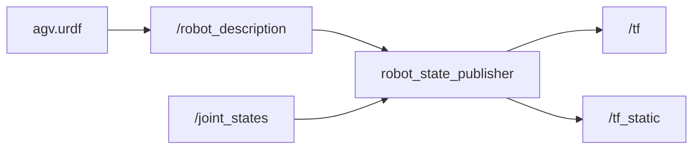
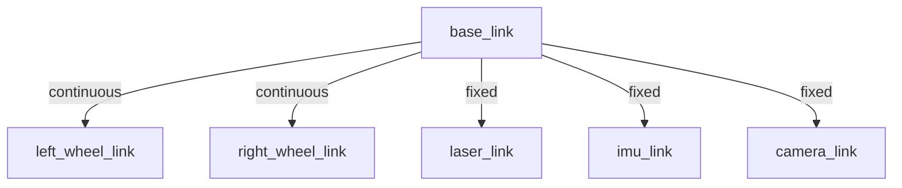
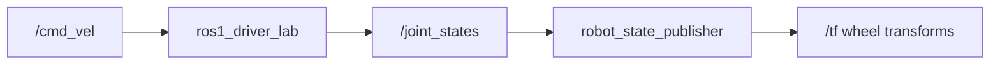
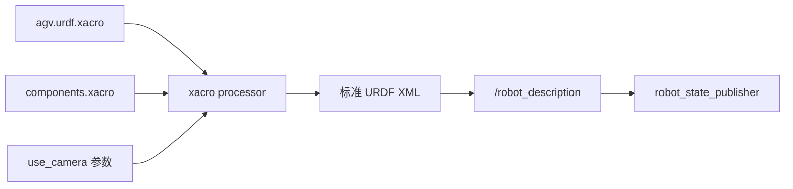

<meta name="referrer" content="no-referrer" />

# ROS教程14：URDF / Xacro / robot_state_publisher / joint_states——从机器人模型到自动生成整机 TF Tree

> 摘要：承接第 13 章 TF，以 AGV 为例读懂 URDF，并用 Xacro 完成参数化、宏复用与条件展开，再串联 robot_description、joint_states 和 robot_state_publisher 生成整机 TF。

[TOC]

第 13 章已经把 TF 的核心机制跑通：

```text
map
 -> odom
 -> base_link
 -> sensor frames
```

当时为了把注意力集中在 tf2 本身，`base_link -> laser_link`、`base_link -> imu_link` 使用了手写 `static_transform_publisher`：

```text
base_link -> laser_link
base_link -> imu_link
```

这种方法适合验证一两条边，但真实机器人通常不止两个 frame。

一台 AGV 很快就会出现：

```text
base_link
left_wheel_link
right_wheel_link
laser_link
imu_link
camera_link
...
```

机械臂还会继续出现：

```text
shoulder_link
upper_arm_link
forearm_link
wrist_link
...
```

如果每一条几何关系都手工启动一个 TF publisher，机器人结构会被拆散到 launch、参数和代码里，难以统一维护。

所以第 14 章解决的问题不是“再学一种 TF 发布 API”，而是：

> 怎样先建立一份统一的机器人几何模型，再由 ROS 根据模型和实时关节状态自动生成机器人自身的 TF tree？

本章主线是：

```text
手写 URDF
    -> 先看懂 link / joint / origin / axis

Xacro 源文件
    -> xacro processor
    -> 标准 URDF XML
    -> /robot_description
    -> robot_state_publisher

/joint_states
    -> robot_state_publisher

robot_state_publisher
    -> fixed joint  -> /tf_static
    -> moving joint -> /tf
```

这里必须先建立一个关键判断：

> URDF 是机器人模型格式；Xacro 是生成 URDF 的 XML 宏预处理层。`robot_state_publisher` 最终消费的仍然是展开后的 URDF XML，而不是 Xacro 宏本身。

实验继续复用第 12、13 章已经完成的真实上游数据：

```text
ros1_driver_lab
    -> /joint_states
    -> /odom

ros1_tf_lab/odom_tf_broadcaster
    -> odom -> base_link
```

本章新增：

```text
/workspace/ros_ws/src/ros1_description_lab
```

最终得到：

```text
map
└── odom
    └── base_link
        ├── left_wheel_link
        ├── right_wheel_link
        ├── laser_link
        ├── imu_link
        └── camera_link
```

其中：

```text
map -> odom
    仍然不是 URDF 的职责

odom -> base_link
    仍然来自运动状态 / Odometry

base_link -> wheels / sensors
    从本章开始交给 URDF + robot_state_publisher
```

这三个 ownership 必须先分清。

---

## 1. URDF 全称是什么，它真正描述什么

URDF 全称：

```text
Unified Robot Description Format
```

常译为：

```text
统一机器人描述格式
```

它本质上是一种 XML 格式，用来描述机器人模型中的：

```text
link
joint
geometry
visual
collision
inertial
material
```

本章只抓住最重要的两类对象：

```text
link
joint
```

可以先把它们理解为：

```text
link
    刚性部件 / 刚体坐标系

joint
    两个 link 之间的连接关系
```

例如：

```text
base_link
    |
    | laser_joint
    v
laser_link
```

`base_link` 和 `laser_link` 是两个 link。

`laser_joint` 说明：

```text
谁是 parent
谁是 child
child 相对 parent 放在哪里
这个连接能不能运动
如果能运动，绕哪根轴或沿哪根轴运动
```

因此 URDF 的核心价值不是“画机器人外观”，而是建立：

> 一棵有明确 parent / child、几何位置和运动自由度的机器人运动学树。

---

## 2. URDF 不是 TF，但它可以成为机器人自身 TF 的几何来源

第 13 章已经强调：

```text
frame_id != TF
```

这里还要再加一条：

```text
URDF != TF
```

URDF 文件本身只是模型。

例如：

```xml
<joint name="laser_joint" type="fixed">
  <parent link="base_link" />
  <child link="laser_link" />
  <origin xyz="0.25 0 0.15" rpy="0 0 0" />
</joint>
```

它表达的是一个几何事实：

```text
laser_link
相对 base_link
向前 0.25 m
向上 0.15 m
姿态无额外旋转
```

但仅仅把这段 XML 放在磁盘里，不会自动产生 `/tf_static`。

真正负责把模型变成 TF 的组件是：

```text
robot_state_publisher
```

所以正确关系是：



这里的两个输入承担不同职责：

```text
robot_description
    回答“机器人各部件怎样连接”

joint_states
    回答“可运动关节当前运动到了哪里”
```

`robot_state_publisher` 把两者组合起来，才能得到当前机器人 link 的实际 TF。

---

## 3. 为什么第 14 章直接复用第 12 章 `/joint_states`

第 12 章已经发布：

```text
/joint_states
sensor_msgs/JointState
```

其中 joint 名称为：

```text
left_wheel_joint
right_wheel_joint
```

并持续提供：

```text
position
velocity
```

这正好是本章 URDF 中左右轮 joint 使用的名字。

所以本章不再额外造一个“假 JointState publisher”。

真实学习链应该是：

```text
/cmd_vel
    -> ros1_driver_lab
    -> 左右轮角速度
    -> 左右轮累计角度
    -> /joint_states
    -> robot_state_publisher
    -> left/right wheel TF
```

这比单独运行一个 GUI slider 更接近后续真实 AGV 数据链。

`joint_state_publisher` 工具当然可以在没有硬件反馈时给 URDF 生成测试关节值，但这里不是主路径；本项目已经有 Driver，就直接消费 Driver 的关节状态。

---

## 4. 本章先建立哪一棵机器人模型

本章模型只描述机器人自身：



注意没有：

```text
map
odom
```

原因不是忘记写，而是它们不属于“机器人机械结构”。

URDF 可以描述：

```text
机器人自己的 link 怎样连接
```

但：

```text
map -> odom
```

来自全局定位 / SLAM / AMCL；

```text
odom -> base_link
```

来自机器人运动状态。

这两条边会随机器人在世界中的状态变化，不应该伪装成机械安装关系写进 URDF。

因此本章把 `base_link` 作为 URDF 的 root link。

---

## 5. `link` 最重要的含义不是“外壳”，而是一个刚体 frame

最小 link 甚至可以只有：

```xml
<link name="base_link" />
```

这已经定义了一个名为：

```text
base_link
```

的机器人部件。

实际文件中给 `base_link` 增加了：

```xml
<visual>
  ...
</visual>
```

只是为了让模型以后在 RViz 等工具中有可见几何体。

非常重要的一点是：

```text
link 的 visual geometry
```

和：

```text
link frame 在 TF tree 中的位置
```

不是一回事。

例如：

```xml
<link name="base_link">
  <visual>
    <origin xyz="0 0 0.10" rpy="0 0 0" />
    ...
  </visual>
</link>
```

这个 `<visual><origin>` 只是在说：

> 用于显示的盒子相对 `base_link` frame 偏移多少。

它不会创建：

```text
base_link -> 某个新 frame
```

真正决定 link 与 link 之间 TF 关系的是：

```text
joint
```

这个区别后面做机器人模型时非常重要。

---

## 6. `joint` 才是 URDF tree 中真正的“边”

以雷达为例：

```xml
<joint name="laser_joint" type="fixed">
  <parent link="base_link" />
  <child link="laser_link" />
  <origin xyz="0.25 0 0.15" rpy="0 0 0" />
</joint>
```

这条 joint 定义了：

```text
parent = base_link
child  = laser_link
```

所以树的方向是：

```text
base_link
    |
    v
laser_link
```

`origin` 表示 child joint/link 在零位时相对于 parent frame 的固定几何关系。

本例：

```text
x = +0.25 m
    雷达在机器人前方 0.25 m

y = 0
    雷达位于左右中心线上

z = +0.15 m
    雷达在 base_link 上方 0.15 m
```

这与第 13 章手写：

```text
base_link -> laser_link
```

表达的是同一个几何事实。

区别在于现在 geometry 的唯一来源变成了 URDF。

---

## 7. `<origin xyz="..." rpy="...">` 到底是什么

`xyz`：

```text
x y z
```

单位是米。

`rpy`：

```text
roll pitch yaw
```

单位是弧度。

例如：

```xml
<origin xyz="0.18 0 0.32" rpy="0 0 0" />
```

表示 `camera_link` 在：

```text
base_link 前方 0.18 m
base_link 上方 0.32 m
```

如果实际相机有安装角度，也应该在这里体现。

后面阶段 D 真正发布 `Image` / `CameraInfo` 时，它们的 `frame_id` 必须能够和这里的相机 frame 对应起来。

所以 URDF 不是纯“建模文件”；它直接参与驱动输出与上层消费者之间的空间契约。

---

## 8. `fixed joint` 为什么不需要 `/joint_states`

雷达、IMU、相机安装到车体以后，正常运行时相对 `base_link` 不会转动。

因此使用：

```xml
<joint name="imu_joint" type="fixed">
```

对于 fixed joint：

```text
parent -> child
```

完全由 URDF 中的：

```text
origin xyz/rpy
```

确定。

不需要运行时再给：

```text
imu_joint.position
```

所以 `robot_state_publisher` 可以在启动后直接生成这些固定关系。

本章：

```text
base_link -> laser_link
base_link -> imu_link
base_link -> camera_link
```

都会进入静态 TF 路径。

---

## 9. 左右轮为什么是 `continuous joint`

轮子不同。

它们相对车体位置固定，但自身会不停旋转。

因此：

```xml
<joint name="left_wheel_joint" type="continuous">
```

表示这个 joint 可以持续绕某一根轴旋转，不使用有限角度上下限描述其运动范围。

对应轴：

```xml
<axis xyz="0 1 0" />
```

本项目坐标约定是：

```text
+x forward
+y left
+z up
```

轮轴沿车体左右方向，因此使用 y 轴。

joint 的零位安装位置由：

```xml
<origin xyz="0 0.25 0" rpy="0 0 0" />
```

确定。

运行时再把：

```text
/joint_states.position[left_wheel_joint]
```

作为该 joint 的旋转量。

于是最终变换不是只有静态安装位姿，而是：

```text
零位安装变换
+
当前 joint position 对应的旋转
```

---

## 10. 为什么 URDF joint 名称必须和 `/joint_states.name` 对得上

URDF 写：

```text
left_wheel_joint
right_wheel_joint
```

第 12 章 Driver 也发布：

```text
name:
- left_wheel_joint
- right_wheel_joint
```

这个名称不是为了“看起来一致”。

它就是 `robot_state_publisher` 把运行时状态映射回模型 joint 的 key。

概念上可以理解为：

```text
/joint_states

name[0]     = left_wheel_joint
position[0] = q_left

name[1]     = right_wheel_joint
position[1] = q_right
```

随后模型查找：

```text
left_wheel_joint
    -> base_link / left_wheel_link 这一段运动学关系

right_wheel_joint
    -> base_link / right_wheel_link 这一段运动学关系
```

如果名字写成：

```text
left_motor
```

但 URDF 中只有：

```text
left_wheel_joint
```

这个状态就无法驱动期望的 wheel joint TF。

所以 joint 名称本身也是 Driver 与机器人模型之间的接口契约。

---

## 11. `JointState.position`、`velocity`、`effort` 哪个会改变 TF

第 12 章已经讲过 `sensor_msgs/JointState`：

```text
name[]
position[]
velocity[]
effort[]
```

对于 `robot_state_publisher` 的 link pose 计算，核心输入是：

```text
position
```

原因很直接。

一个 revolute / continuous joint 当前的空间姿态由：

```text
关节角度 q
```

决定。

所以概念上：

```text
URDF joint geometry
+
JointState.position
    -> 当前 child link pose
```

`velocity` 和 `effort` 对控制、诊断、动力学当然有意义，但它们不直接决定这一时刻 child link 应该旋转到什么姿态。

Noetic `robot_state_publisher` 的运行路径也是先从 JointState 中构造：

```text
joint name -> joint position
```

再据此计算 movable segment 的 pose。

因此如果消息有：

```text
name
velocity
```

却没有匹配的：

```text
position
```

不能指望它仅凭速度自动积分出 TF。

Driver 自己应该明确负责 position 数据的来源与累计语义。

---

## 12. `/robot_description` 是什么

URDF 文件在磁盘里：

```text
ros1_description_lab/urdf/agv.urdf
```

但 ROS Node 不应该依赖“大家都自己去找这个文件”。

ROS1 中常见做法是把完整 URDF XML 加载到参数服务器：

```text
/robot_description
```

本章 launch 使用：

```xml
<param name="robot_description"
       textfile="$(find ros1_description_lab)/urdf/agv.urdf" />
```

启动以后可以查看：

```bash
rosparam get /robot_description
```

得到的不是文件路径，而是已经加载到参数服务器的 XML 内容。

所以关系是：

```text
agv.urdf 文件
    |
    | roslaunch <param textfile=...>
    v
/robot_description 参数
    |
    v
robot_state_publisher
```

这一步非常重要，因为后面很多 ROS 工具都把：

```text
robot_description
```

当作机器人模型的标准入口。

---

## 13. `robot_state_publisher` 启动时内部做了什么

Noetic 的 `robot_state_publisher_node` 主入口可以压缩成：

```text
ros::init()
    -> urdf::Model::initParam("robot_description")
    -> kdl_parser::treeFromUrdfModel()
    -> JointStateListener(...)
    -> ros::spin()
```

这里有两次关键转换。

第一次：

```text
robot_description XML
    -> urdf::Model
```

也就是把 XML 解析成程序内部的：

```text
links
joints
root link
parent / child
```

第二次：

```text
urdf::Model
    -> KDL::Tree
```

也就是把模型变成一棵可用于运动学计算的树。

官方 Noetic `urdf::Model` 提供的 `initParam()` 本身就是“从参数服务器加载模型”的入口。

所以 `robot_state_publisher` 并不是每次收到 `/joint_states` 后重新解析一遍 XML。

它启动时先建立模型与运动学树，运行期主要消费关节状态并更新可运动 joint 的姿态。

---

## 14. 内部为什么要把 fixed 和 moving joint 分开

建立运动学树以后，`robot_state_publisher` 会把 segment 按 joint 类型区分。

可以把内部思路简化成：

```text
URDF/KDL tree
    |
    +--> fixed segments
    |
    +--> moving segments
```

原因是两类数据的生命周期完全不同。

fixed：

```text
启动后几何关系就确定
不依赖 /joint_states
```

moving：

```text
必须等待运行时 joint position
姿态持续变化
```

因此输出也自然分成：

```text
fixed
    -> /tf_static

moving
    -> /tf
```

这正好与第 13 章讲过的 tf2 静态 / 动态缓存语义对应起来。

---

## 15. fixed joint 怎样进入 `/tf_static`

本章 launch 显式设置：

```xml
<param name="use_tf_static" value="true" />
```

于是：

```text
laser_joint
imu_joint
camera_joint
```

对应的：

```text
base_link -> laser_link
base_link -> imu_link
base_link -> camera_link
```

会通过 static TF broadcaster 发布。

它们的计算不需要 joint position，可以理解为：

```text
pose(q = 0)
```

因为 fixed joint 根本没有运动自由度。

第 13 章里手写的：

```text
static_transform_publisher base_link laser_link
static_transform_publisher base_link imu_link
```

到了这里就应该退出。

一个几何关系只保留一个 owner：

```text
机器人自身 fixed geometry
    -> URDF + robot_state_publisher
```

否则同一 child frame 被多个 publisher 重复发布，会重新制造 TF ownership 冲突。

---

## 16. moving joint 怎样从 `/joint_states` 进入 `/tf`

对于：

```text
left_wheel_joint
right_wheel_joint
```

`robot_state_publisher` 需要等 `/joint_states`。

数据链是：



第 12 章 Driver 会持续累计：

```text
left_wheel_position_rad
right_wheel_position_rad
```

并发布到：

```text
JointState.position
```

`robot_state_publisher` 用 joint name 找到模型中的 segment，再把对应 position 代入运动学关系，得到：

```text
base_link -> left_wheel_link
base_link -> right_wheel_link
```

这就是“模型 + 状态 -> 当前 TF”的完整过程。

---

## 17. `header.stamp` 为什么仍然重要

第 13 章已经建立：

```text
动态 TF 是带时间的
```

`/joint_states` 也有：

```text
header.stamp
```

本项目 Driver 在同一个采样循环中为：

```text
JointState
Imu
Odometry
```

使用同一份：

```text
stamp
```

这非常有价值。

因为后面可以形成：

```text
/odom @ T
    -> odom -> base_link @ T

/joint_states @ T
    -> base_link -> wheel links @ T
```

同一批设备状态能够落在一致的时间语义上。

`robot_state_publisher` 还会根据 `publish_frequency` 限制 movable transform 的最大发布频率；本章显式设成：

```text
20 Hz
```

与 Driver 当前发布频率保持一致，便于观察。

---

## 18. `robot_state_publisher` 不会替代 `odom_tf_broadcaster`

这是本章最容易混淆的职责边界之一。

URDF root 是：

```text
base_link
```

所以 `robot_state_publisher` 能从这里向下展开：

```text
base_link
    -> left_wheel_link
    -> right_wheel_link
    -> laser_link
    -> imu_link
    -> camera_link
```

但它不知道机器人此刻在 `odom` 中走到了哪里。

那个信息来自：

```text
/odom.pose.pose
```

所以：

```text
odom -> base_link
```

仍由第 13 章：

```text
odom_tf_broadcaster
```

负责。

不要把这两类关系混起来：

```text
机器人在世界 / 里程计坐标系中的运动
    !=
机器人自身各部件的机械连接关系
```

---

## 19. `robot_state_publisher` 也不会替代 `map -> odom`

本章 launch 中仍然暂时存在：

```text
map -> odom
```

恒等 static TF。

它只是为了让第 13、14 章实验可以形成完整：

```text
map -> odom -> base_link -> ...
```

以后进入：

```text
SLAM
AMCL
localization
```

以后，这条边会被真正的全局定位模块接管。

所以完整 ownership 是：

| TF 边 | 本章 owner | 真实系统长期 owner |
| --- | --- | --- |
| `map -> odom` | 临时 static publisher | SLAM / AMCL / localization |
| `odom -> base_link` | `odom_tf_broadcaster` | odom / state estimator |
| `base_link -> sensor` | `robot_state_publisher` | `robot_state_publisher` |
| `base_link -> wheel` | `robot_state_publisher` + `/joint_states` | `robot_state_publisher` + joint feedback |

第 14 章真正接管的是后两行。

---

## 20. 创建 `ros1_description_lab`

本章新增 package：

```text
ros_ws/src/ros1_description_lab/
├── CMakeLists.txt
├── package.xml
├── README.md
├── launch/
│   └── description_lab.launch
└── urdf/
    ├── agv.urdf
    ├── agv.urdf.xacro
    └── macros/
        └── components.xacro
```

这个 package 不需要自己写 C++ TF publisher。

它主要保存：

```text
纯 URDF 学习基线
+
Xacro 工程化模型源文件
+
启动集成关系
```

其中：

```text
agv.urdf
    用来直接观察最终 URDF 长什么样

agv.urdf.xacro
    作为运行时模型源文件

macros/components.xacro
    保存可复用的 wheel / sensor 宏
```

这也是机器人项目里常见的 description package 职责。

---

## 21. 第一步只看一个 fixed joint：`base_link -> laser_link`

完整文件虽然已经提供，但理解时先只看这三块：

```xml
<link name="base_link">
  ...
</link>

<link name="laser_link">
  ...
</link>

<joint name="laser_joint" type="fixed">
  <parent link="base_link" />
  <child link="laser_link" />
  <origin xyz="0.25 0 0.15" rpy="0 0 0" />
</joint>
```

先不要管轮子、IMU、camera。

这已经足够建立：

```text
base_link
    |
    | fixed
    v
laser_link
```

如果以后修改雷达安装位置，应该优先修改：

```text
laser_joint origin
```

而不是再去某个 launch 文件里寻找一条神秘的 static transform 参数。

这就是把“几何事实”集中进 URDF 的收益。

---

## 22. 第二步加入左右轮运动 joint

左轮：

```xml
<joint name="left_wheel_joint" type="continuous">
  <parent link="base_link" />
  <child link="left_wheel_link" />
  <origin xyz="0 0.25 0" rpy="0 0 0" />
  <axis xyz="0 1 0" />
</joint>
```

右轮：

```xml
<joint name="right_wheel_joint" type="continuous">
  <parent link="base_link" />
  <child link="right_wheel_link" />
  <origin xyz="0 -0.25 0" rpy="0 0 0" />
  <axis xyz="0 1 0" />
</joint>
```

注意这里的：

```text
y = +0.25
```

和：

```text
y = -0.25
```

遵循第 12、13 章一直使用的：

```text
+y left
```

所以：

```text
left wheel  -> y 正方向
right wheel -> y 负方向
```

这份 URDF 的轮距因此是：

```text
0.50 m
```

正好与第 12 章 Driver 参数：

```text
wheel_separation = 0.50
```

保持一致。

这不是巧合。

Driver 的运动学参数和 URDF 的机械几何必须描述同一台机器人。

---

## 23. 第三步加入 IMU 和 camera fixed geometry

IMU：

```xml
<joint name="imu_joint" type="fixed">
  <parent link="base_link" />
  <child link="imu_link" />
  <origin xyz="0 0 0.10" rpy="0 0 0" />
</joint>
```

这里特意继续使用：

```text
imu_link
```

因为第 12 章 `/imu/data_raw` 已经发布：

```text
header.frame_id = imu_link
```

这样消息契约和 TF tree 才真正闭合：

```text
/imu/data_raw
    frame_id = imu_link
            |
            v
TF tree 中可以找到 imu_link
```

camera 本章只建立几何 frame：

```text
camera_link
```

真正的：

```text
sensor_msgs/Image
CameraInfo
image_transport
cv_bridge
```

仍然留到阶段 D。

也就是说：

> 先把“传感器装在哪里”建模好，不等于现在就开始学习传感器数据算法。

---

## 24. launch 怎样把三个章节串起来

`description_lab.launch` 做四件事。

第一，启动第 12 章 Driver：

```xml
<include file="$(find ros1_driver_lab)/launch/chassis_lab.launch" />
```

得到：

```text
/joint_states
/odom
/imu/data_raw
...
```

第二，继续启动第 13 章 `odom_tf_broadcaster`：

```text
/odom
    -> odom -> base_link
```

第三，用 Xacro 处理器展开：

```text
agv.urdf.xacro
    -> 标准 URDF XML
    -> /robot_description
```

第四，启动：

```text
robot_state_publisher
```

于是整条链变成：

```text
第 12 章 Driver
    |
    +--> /odom ---------> odom_tf_broadcaster
    |                           |
    |                           v
    |                    odom -> base_link
    |
    +--> /joint_states -------------------+
                                           |
agv.urdf.xacro                           |
    |                                      |
    v                                      |
  xacro                                    |
    |                                      |
    v                                      v
/robot_description ----------------> robot_state_publisher
                                           |
                                           v
                                  base_link -> child links
```

这就是本章真正要建立的系统关系。

---

## 25. Docker Image 增加哪些依赖

本章 Dockerfile 显式加入：

```text
ros-noetic-robot-state-publisher
ros-noetic-urdf
ros-noetic-xacro
```

因此需要在 Host 重新构建 Image：

```bash
cd /home/wdfk/share/ros1-docker
docker compose up -d --build
```

如果 Container 已经开着但没有重新 build，新 package 文件虽然能通过 bind mount 看到，系统却可能根本没有：

```text
robot_state_publisher
```

可执行程序。

这一点属于镜像依赖问题，不是 catkin package 代码问题。

---

## 26. 构建第 14 章 package

进入 Container：

```bash
docker compose exec ros1-dev bash
```

构建：

```bash
cd /workspace/ros_ws
catkin build ros1_driver_lab ros1_tf_lab ros1_description_lab
```

然后：

```bash
source /workspace/ros_ws/devel/setup.bash
```

确认 package 可以被 rospack 找到：

```bash
rospack find ros1_description_lab
```

预期路径：

```text
/workspace/ros_ws/src/ros1_description_lab
```

---

## 27. 启动前先看 `robot_description` 是怎么装进去的

第 14 章的 launch 不再直接使用：

```xml
<param name="robot_description" textfile=".../agv.urdf" />
```

而是执行 Xacro：

```xml
<param name="robot_description"
       command="$(find xacro)/xacro '$(find ros1_description_lab)/urdf/agv.urdf.xacro' use_camera:=$(arg use_camera)" />
```

这里 `command=` 的返回标准输出会成为参数值，所以真实路径是：

```text
agv.urdf.xacro
    -> xacro 可执行程序
    -> 展开后的 <robot>...</robot> XML 字符串
    -> /robot_description
```

运行：

```bash
roslaunch ros1_description_lab description_lab.launch
```

另开一个 Container 终端：

```bash
source /workspace/ros_ws/devel/setup.bash
rosparam get /robot_description
```

如果看到的是普通 URDF：

```text
<robot name="ros1_agv_lab">
  <link ...>
  <joint ...>
  ...
</robot>
```

而不是：

```text
<xacro:macro ...>
<xacro:property ...>
```

就证明 Xacro 已经在 `robot_state_publisher` 之前完成了预处理。

这也是理解 Xacro 最重要的运行时边界：

> `/robot_description` 保存的是展开结果，不保存 Xacro 源码。

---

## 28. 再确认 `/joint_states` 和 URDF joint 名字完全一致

执行：

```bash
rostopic echo -n 1 /joint_states
```

重点看：

```text
name:
  - left_wheel_joint
  - right_wheel_joint
```

再回到 Xacro 源文件及其宏：

```text
ros1_description_lab/urdf/agv.urdf.xacro
ros1_description_lab/urdf/macros/components.xacro
```

确认展开后 joint 仍然叫：

```text
left_wheel_joint
right_wheel_joint
```

如果这一步不一致，就不要继续怀疑 tf2 Buffer、时间插值或 Navigation。

错误已经发生在：

```text
Driver joint contract
        X
URDF model joint key
```

这是比“TF tree 不完整”更靠上游的故障点。

---

## 29. 先观察 fixed joint：传感器 TF 不应该随运动变化

执行：

```bash
rosrun tf2_ros tf2_echo base_link laser_link
```

应该持续看到接近：

```text
Translation:
x = 0.25
y = 0
z = 0.15
```

机器人移动、轮子旋转，都不应该改变：

```text
base_link -> laser_link
```

因为它属于：

```text
fixed joint
```

同理：

```bash
rosrun tf2_ros tf2_echo base_link imu_link
```

应该保持：

```text
x = 0
y = 0
z = 0.10
```

这就是机器人安装几何的稳定性。

---

## 30. 再观察 moving joint：轮子 TF 必须由 `/joint_states.position` 驱动

先执行：

```bash
rosrun tf2_ros tf2_echo base_link left_wheel_link
```

然后另开终端持续发送：

```bash
rostopic pub -r 5 /cmd_vel geometry_msgs/Twist \
  "linear: {x: 0.3, y: 0.0, z: 0.0}
angular: {x: 0.0, y: 0.0, z: 0.4}"
```

第 12 章 Driver 会产生：

```text
left_wheel_joint.position
right_wheel_joint.position
```

继续观察：

```bash
rostopic echo /joint_states
```

应该看到 position 持续累计。

与此同时：

```text
base_link -> left_wheel_link
```

的 translation 应保持安装位置：

```text
x = 0
y = +0.25
z = 0
```

而 rotation 会随 joint angle 改变。

这正是：

```text
固定安装位置
+
动态关节角
```

组合后的结果。

---

## 31. 为什么车体运动和轮子自转会同时出现在完整 TF 链中

此时已经有两类动态关系：

```text
odom -> base_link
```

来自 Odometry。

以及：

```text
base_link -> wheel links
```

来自 JointState + URDF。

因此 tf2 可以组合：

```text
odom
 -> base_link
 -> left_wheel_link
```

甚至再加上临时：

```text
map -> odom
```

得到：

```text
map
 -> odom
 -> base_link
 -> left_wheel_link
```

这里两种“运动”完全不同：

```text
odom -> base_link
    描述整车在 odom 中移动

base_link -> left_wheel_link
    描述轮子相对车体自身旋转
```

tf2 只是把两段正确的空间关系组合起来。

---

## 32. 用 `view_frames.py` 看现在的整棵树

执行：

```bash
cd /workspace
rosrun tf2_tools view_frames.py
```

此时应该看到类似：

```text
map
└── odom
    └── base_link
        ├── left_wheel_link
        ├── right_wheel_link
        ├── laser_link
        ├── imu_link
        └── camera_link
```

和第 13 章相比，最重要的变化不是“多了三个 frame”。

而是：

```text
第 13 章
base_link -> sensor
由多个手写 static publisher 管理

第 14 章
base_link -> robot links
由一份 URDF + robot_state_publisher 统一管理
```

这才是结构上的升级。

---

## 33. `/tf_static` 中现在应该由谁发布什么

本章仍然存在两个 static TF owner。

第一个：

```text
map_to_odom_static
    -> map -> odom
```

这是教学占位。

第二个：

```text
robot_state_publisher
    -> base_link -> laser_link
    -> base_link -> imu_link
    -> base_link -> camera_link
```

因此如果直接执行：

```bash
rostopic echo /tf_static
```

需要意识到 `/tf_static` 上可能有多个 latched publisher。

不要因为第一条看到：

```text
map -> odom
```

就误认为 `robot_state_publisher` 没有发 static TF。

更可靠的确认仍然是直接按目标边查询：

```bash
rosrun tf2_ros tf2_echo base_link laser_link
rosrun tf2_ros tf2_echo base_link imu_link
```

或者查看完整 frame tree。

---

## 34. `robot_state_publisher` 为什么不能凭 URDF 自动知道轮子转了多少

URDF 中已经写了：

```text
left_wheel_joint
continuous
axis = y
```

但这只能说明：

```text
它怎样运动
```

不能说明：

```text
它现在运动到了哪里
```

这两类信息分别属于：

```text
model
state
```

即：

```text
URDF
    -> 运动学结构

JointState.position
    -> 运行时状态
```

这也是机器人软件里非常通用的分层方式。

模型不会替代传感器反馈，传感器反馈也不会自动包含完整模型。

`robot_state_publisher` 的作用就是在两者之间做连接。

---

## 35. 如果 `/joint_states` 停了，哪些 TF 会受影响

假设 Driver 停止发布 `/joint_states`。

URDF 不会消失：

```text
/robot_description
```

仍然存在。

fixed joint：

```text
base_link -> laser_link
base_link -> imu_link
base_link -> camera_link
```

仍然是静态几何。

但 moving joint：

```text
base_link -> left_wheel_link
base_link -> right_wheel_link
```

没有新的 joint position，就不会得到新的动态姿态更新。

这说明调试时必须区分：

```text
模型不存在
```

和：

```text
模型存在，但状态输入停止
```

这两个问题的故障层完全不同。

---

## 36. 如果 `JointState.name` 对，但 `position` 不对，会发生什么

假设：

```text
left_wheel_joint
```

名称正确，但 Driver 把角度单位错当成：

```text
degree
```

而不是：

```text
radian
```

那么：

```text
Topic 正常
joint 名称正常
robot_state_publisher 正常
TF tree 连通
```

但 wheel link 的姿态仍然会错。

所以 URDF + `robot_state_publisher` 并不能替代第 12 章的数据契约检查。

它们假设上游提供的：

```text
joint name
position unit
sign
timestamp
```

已经正确。

这也是为什么本系列先讲 Driver 数据契约，再讲 TF / URDF。

顺序不能反过来。

---

## 37. 为什么不能同时保留第 13 章的 sensor static publisher

如果继续启动：

```text
base_to_laser_static
```

同时 URDF 又定义：

```text
laser_joint
```

那么：

```text
laser_link
```

就会同时收到多个 owner 的变换。

即使两边数值暂时完全相同，这也是错误的 ownership 设计。

以后只要一边修改安装位置而另一边忘记同步，就会出现非常难排查的 TF 抖动或 authority 冲突。

所以第 14 章的 `description_lab.launch` 没有 include 整个：

```text
tf_lab.launch
```

而是只复用其中真正仍然需要的：

```text
odom_tf_broadcaster
```

传感器 static TF 则彻底交给：

```text
robot_state_publisher
```

这就是“复用组件”与“复用整个 launch”之间的区别。

---

## 38. Xacro 到底是什么，它和 URDF 是什么关系

Xacro 通常展开为：

```text
XML Macros
```

它是一种用于 XML 的宏语言。ROS 机器人模型中最常见的用途，就是用更短、更可复用、更参数化的源文件生成最终 URDF XML。

先直接比较两者的职责：

| 对象 | 本质 | 运行时谁直接消费 |
| --- | --- | --- |
| URDF | 标准机器人模型 XML | `urdf::Model` / `robot_state_publisher` 等 |
| Xacro | 生成 XML 的宏预处理语言 | `xacro` 处理器 |
| `/robot_description` | 展开后的机器人 XML 字符串 | `robot_state_publisher` |

所以：

```text
Xacro != URDF 的替代运行时格式
```

更准确的理解是：

```text
Xacro source
    |
    | preprocess / expand
    v
URDF XML
    |
    v
robot_description
```

`robot_state_publisher` 不负责解释：

```text
xacro:property
xacro:macro
xacro:include
xacro:if
```

这些语法在它读取模型之前就必须已经展开掉。

这就是为什么 Xacro 不改变第 13、14 章已经建立的 TF 原理；它只改变“URDF XML 是怎样被生成和维护的”。

---

## 39. 为什么纯 URDF 一大就会开始重复

本章纯 `agv.urdf` 中，左右轮结构几乎完全相同：

```xml
<link name="left_wheel_link"> ... </link>
<joint name="left_wheel_joint" type="continuous"> ... </joint>

<link name="right_wheel_link"> ... </link>
<joint name="right_wheel_joint" type="continuous"> ... </joint>
```

真正不同的只有：

```text
left / right
+y / -y
```

如果以后再增加：

```text
front_left_wheel
front_right_wheel
rear_left_wheel
rear_right_wheel
```

复制粘贴会迅速带来两个问题。

第一，机械尺寸会散落在大量 XML 数字里：

```text
wheel radius
wheel width
track width
body size
sensor mounting offset
```

第二，相同结构修改时必须同步多个副本。

这正是 Xacro 要解决的工程问题：

> 把“重复 XML”提升成“参数 + 模板”，但最终仍生成标准 URDF。

---

## 40. `xacro:property`：把魔法数字提升成模型参数

`agv.urdf.xacro` 先定义：

```xml
<xacro:property name="body_length" value="0.60" />
<xacro:property name="body_width" value="0.44" />
<xacro:property name="body_height" value="0.20" />
<xacro:property name="wheel_radius" value="0.10" />
<xacro:property name="wheel_width" value="0.05" />
<xacro:property name="wheel_y" value="0.25" />
```

之后普通 XML 属性可以通过：

```text
${...}
```

求值：

```xml
<box size="${body_length} ${body_width} ${body_height}" />
```

还可以写表达式：

```xml
<origin xyz="0 0 ${body_height / 2.0}" rpy="0 0 0" />
```

这样 `0.60 / 0.44 / 0.20` 不再只是某段 XML 中无法解释的数字，而变成有语义的模型参数。

这里要和 ROS Parameter Server 区分：

```text
xacro:property
    Xacro 展开期间存在
    用于生成 XML

ROS parameter
    Node 运行期间存在
    由 roscore 参数服务器管理
```

两者名字都叫“参数”时很容易混淆，但生命周期完全不同。

---

## 41. `xacro:macro`：把重复 link + joint 抽成模板

本章把左右轮抽成：

```xml
<xacro:macro name="wheel" params="side y wheel_radius wheel_width">
  <link name="${side}_wheel_link">
    ...
  </link>

  <joint name="${side}_wheel_joint" type="continuous">
    <parent link="base_link" />
    <child link="${side}_wheel_link" />
    <origin xyz="0 ${y} 0" rpy="0 0 0" />
    <axis xyz="0 1 0" />
  </joint>
</xacro:macro>
```

调用两次：

```xml
<xacro:wheel side="left"
             y="${wheel_y}"
             wheel_radius="${wheel_radius}"
             wheel_width="${wheel_width}" />

<xacro:wheel side="right"
             y="${-wheel_y}"
             wheel_radius="${wheel_radius}"
             wheel_width="${wheel_width}" />
```

展开以后仍然得到两个普通 joint：

```text
left_wheel_joint
right_wheel_joint
```

因此第 12 章 `/joint_states.name` 契约完全没有改变。

Xacro macro 改变的是源码组织方式，不应该偷偷改变上层接口名称。

本章还定义了：

```text
box_sensor(name, xyz, size)
```

用同一个模板生成 IMU 和 camera 的：

```text
link
+
fixed joint
```

这就是宏复用的直接价值。

---

## 42. `xacro:include`：为什么大型机器人模型通常会拆文件

如果所有 macro 都继续堆在：

```text
agv.urdf.xacro
```

文件最终还是会变得很长。

因此本章把可复用组件放进：

```text
urdf/macros/components.xacro
```

主模型通过：

```xml
<xacro:include filename="$(find ros1_description_lab)/urdf/macros/components.xacro" />
```

加载这些宏。

当前目录职责于是变成：

```text
urdf/
├── agv.urdf
├── agv.urdf.xacro
└── macros/
    └── components.xacro
```

可以把它理解成：

```text
agv.urdf.xacro
    负责“这台机器人由什么组成”

components.xacro
    负责“某类重复组件怎样展开”
```

以后真实项目还可以继续拆成：

```text
materials.xacro
wheels.xacro
sensors.xacro
lidar.xacro
camera.xacro
...
```

但拆分的前提仍然是职责清楚，而不是为了“文件越多越工程化”。

---

## 43. `xacro:arg` 与条件展开：同一份模型怎样生成不同配置

除了模型内部 property，Xacro 还可以接收外部参数。

本章定义：

```xml
<xacro:arg name="use_camera" default="true" />
```

然后：

```xml
<xacro:if value="$(arg use_camera)">
  <xacro:box_sensor name="camera"
                    xyz="0.18 0 0.32"
                    size="0.08 0.12 0.06" />
</xacro:if>
```

默认展开结果包含：

```text
camera_link
camera_joint
```

如果启动：

```bash
roslaunch ros1_description_lab description_lab.launch use_camera:=false
```

launch 会把参数继续传给 Xacro：

```xml
<param name="robot_description"
       command="$(find xacro)/xacro '$(find ros1_description_lab)/urdf/agv.urdf.xacro' use_camera:=$(arg use_camera)" />
```

于是展开后的 URDF 中不再存在 camera 分支。

注意这里有三层参数语义：

```text
roslaunch arg
    use_camera:=false
        |
        v
xacro arg
    $(arg use_camera)
        |
        v
xacro:if
    决定是否生成 camera XML
```

它不是：

```text
robot_state_publisher 运行后再动态关掉 camera
```

因为条件判断发生在模型生成阶段。

---

## 44. Xacro 的执行原理：它做的是“展开”，不是运行机器人算法

把本章模型处理过程拆开：



Xacro 处理器主要完成：

```text
解析 Xacro XML
    -> 建立 property / arg
    -> 载入 include
    -> 展开 macro
    -> 计算 ${expression}
    -> 执行 if / unless 等条件
    -> 输出普通 XML
```

处理结束后，宏语言自身已经消失。

后续：

```text
URDF parser
KDL tree
robot_state_publisher
TF
```

都不需要知道原始模型是不是由 Xacro 生成的。

所以从系统分层上看：

```text
Xacro
    model-generation / preprocessing layer

URDF
    robot model contract

robot_state_publisher
    runtime model consumer
```

这三个层次不能混在一起。

---

## 45. 先在命令行单独展开 Xacro，再让 launch 使用它

在正式启动完整系统之前，可以只执行模型生成：

```bash
rosrun xacro xacro \
  $(rospack find ros1_description_lab)/urdf/agv.urdf.xacro \
  > /tmp/agv.generated.urdf
```

查看：

```bash
head -n 30 /tmp/agv.generated.urdf
```

应该看到普通：

```text
<robot>
<link>
<joint>
```

而不应该再看到：

```text
<xacro:macro>
<xacro:property>
```

再验证条件参数：

```bash
rosrun xacro xacro \
  $(rospack find ros1_description_lab)/urdf/agv.urdf.xacro \
  use_camera:=false \
  > /tmp/agv-no-camera.urdf
```

然后：

```bash
grep -n "camera" /tmp/agv-no-camera.urdf
```

如果没有 camera link/joint，就说明：

```text
launch 参数
不是 TF runtime 开关
而是改变 Xacro 展开结果
```

这一步把 Xacro 问题与 `robot_state_publisher` 问题分开了。

如果 Xacro 本身无法展开，就没有必要继续排查 `/tf`。

---

## 46. 为什么项目同时保留 `agv.urdf` 和 `agv.urdf.xacro`

本章故意保留两份文件：

```text
agv.urdf
agv.urdf.xacro
```

它们承担不同教学职责。

`agv.urdf` 用来直接学习最终模型：

```text
link
joint
origin
axis
```

`agv.urdf.xacro` 用来学习怎样工程化生成相同结构：

```text
property
macro
include
arg
condition
```

真正运行时，`description_lab.launch` 使用：

```text
agv.urdf.xacro
```

但调试模型时，应该随时记住：

> Xacro 的正确性最终仍要落到“它生成的 URDF 是否正确”。

因此遇到模型问题时，最有效的分层排查顺序是：

```text
Xacro 能否展开？
    -> 展开的 URDF link/joint 是否正确？
    -> robot_description 是否正确？
    -> joint_states 是否匹配？
    -> robot_state_publisher 是否生成目标 TF？
```

而不是看到 TF 异常就直接修改宏。

---

## 47. 从源码角度重新看完整数据路径

把 Noetic `robot_state_publisher` 的关键路径压缩后，可以得到：

```text
robot_state_publisher_node::main()
    |
    | 读取 robot_description
    v
urdf::Model
    |
    | URDF -> KDL
    v
KDL::Tree
    |
    v
JointStateListener
    |
    +--> fixed segments
    |       -> publishFixedTransforms()
    |       -> /tf_static
    |
    +--> subscribe /joint_states
            |
            v
        joint name -> position
            |
            v
        publishTransforms()
            |
            v
           /tf
```

这里最关键的不是函数名，而是可以明确看到三层职责：

```text
解析模型
    -> 建立运动学树

接收状态
    -> joint name / position

发布空间关系
    -> fixed / movable TF
```

这三层分开以后，再看源码会非常清楚。

---

## 48. 本章和第 13 章的知识怎样拼起来

第 13 章回答：

```text
TF 是什么？
tf2 怎样存？
怎样查链？
怎样按时间查询？
为什么会 extrapolation？
```

第 14 章回答：

```text
机器人自身那么多 TF 从哪里来？
为什么不用每条都手写 broadcaster？
URDF 怎样描述 geometry？
joint_states 怎样把运动状态带进模型？
robot_state_publisher 怎样把模型变成 /tf 与 /tf_static？
```

于是目前已经形成：

```text
Driver data contract
        |
        v
JointState / Odometry / Imu
        |
        +-----------------------+
        |                       |
        v                       v
odom_tf_broadcaster      robot_state_publisher
        |                       |
        v                       v
odom -> base_link      base_link -> robot links
        \                       /
         \                     /
          +------ tf2 tree ----+
```

这已经是后续 Navigation 数据链真正可用的机器人坐标基础。

---

## 49. 第 14 章结束后应该保留的核心判断

第一：

```text
URDF 是模型
不是 TF 本身
```

第二：

```text
joint 是 link tree 的边
joint origin 决定零位几何关系
```

第三：

```text
fixed joint
    -> 不需要运行时 joint position
    -> robot_state_publisher 发布 static TF
```

第四：

```text
moving joint
    -> URDF 提供运动规则
    -> JointState.position 提供当前状态
    -> robot_state_publisher 发布动态 TF
```

第五：

```text
JointState.name
必须与 URDF joint name 建立一致契约
```

第六：

```text
robot_state_publisher
只负责机器人模型内部 link tree
```

它不会自动产生：

```text
map -> odom
odom -> base_link
```

第七：

```text
一个 TF child frame 只应该有一个明确 owner
```

第 13 章手写 sensor static TF 在本章应退出，由 URDF 统一接管。

第八：

```text
Xacro 是 URDF 的生成层，不是 robot_state_publisher 的另一种运行时模型格式
```

第九：

```text
Xacro 调试必须先看展开结果，再看 robot_description，最后才看 TF
```

到这里，机器人自身几何关系已经从“零散 TF 参数”升级成“一份模型 + 一份状态输入”。

下一章进入 Navigation 传感器接口，开始研究：

> 即使 `laser_link` 已经存在、TF tree 也连通，`sensor_msgs/LaserScan` / `Range` 还必须满足哪些消息字段、时间和 frame 契约，costmap / SLAM 才真正能够消费？

这就是第 15 章的入口。

---

## 参考资料

- ROS Noetic `robot_state_publisher` API：<https://docs.ros.org/en/noetic/api/robot_state_publisher/html/>
- ROS Noetic `urdf::Model` API：<https://docs.ros.org/en/noetic/api/urdf/html/classurdf_1_1Model.html>
- ROS `robot_state_publisher`：<https://github.com/ros/robot_state_publisher>
- ROS1 URDF repository：<https://github.com/ros/urdf>
- ROS Noetic Xacro API：<https://docs.ros.org/en/noetic/api/xacro/html/>
- ROS Xacro repository：<https://github.com/ros/xacro>
