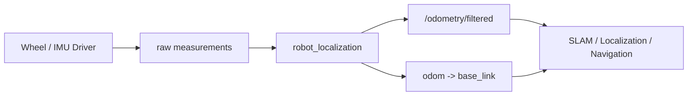
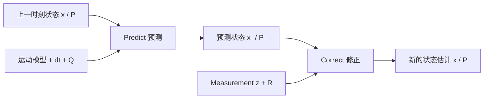
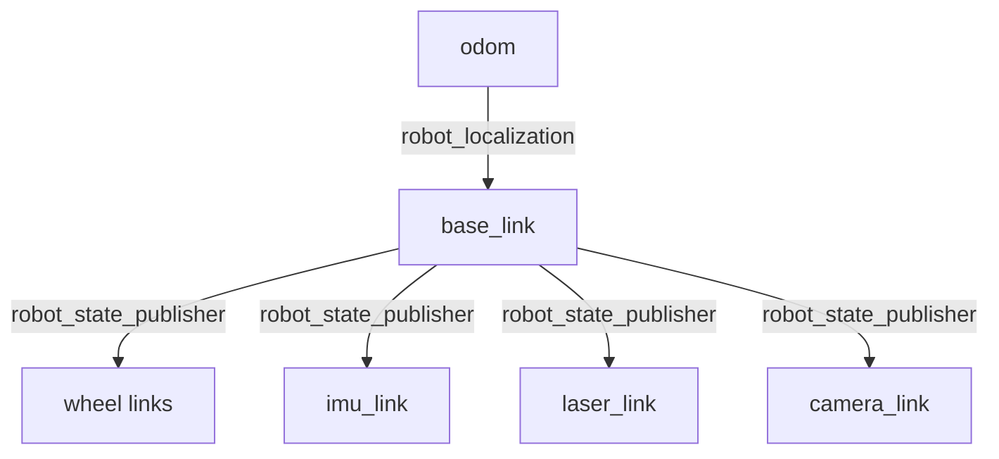
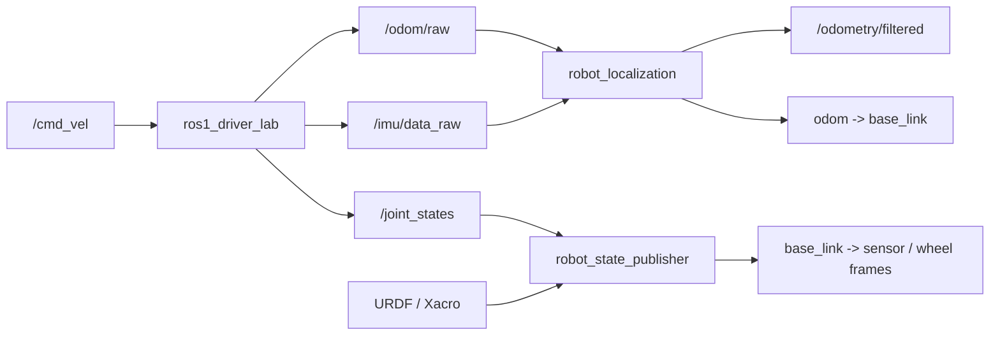

<meta name="referrer" content="no-referrer" />

# ROS教程15：robot_localization——从轮式里程计与 IMU 到机器人状态估计

> 摘要：承接差速底盘、TF 与 URDF/Xacro，使用 robot_localization 将原始轮式里程计和 IMU 接入 EKF，理解状态、协方差、时间、frame 与 TF ownership。


@[toc]
第 12～14 章已经分别建立了三层基础：

```text
第 12 章：Driver 数据契约
/cmd_vel -> wheel -> /odom、/imu/data_raw、/joint_states

第 13 章：TF / tf2
map -> odom -> base_link -> sensor frames

第 14 章：URDF / Xacro
base_link -> wheel / laser / imu / camera
```

到这里，一个新的问题出现了：

```text
Driver 已经能发布 /odom
IMU 也已经能发布 /imu/data_raw
```

为什么还需要 `robot_localization`？

因为 `/odom` 只是某个里程计来源给出的估计，并不等于“系统最终应该使用的机器人状态”。真实 AGV 中，轮编码器、IMU、视觉里程计、GPS 或其他定位源通常各自只擅长观测一部分状态，而且每个来源都有误差、漂移、延迟和不确定性。

`robot_localization` 的职责不是替代 Driver，也不是替代 SLAM，而是维护一个连续的机器人状态估计：

```text
Wheel Odometry ─┐
                ├──> robot_localization ──> /odometry/filtered
IMU ────────────┘                         └──> odom -> base_link
```

本章不把重点放在卡尔曼滤波矩阵证明，而是解决工程上更直接的问题：

```text
哪些字段应该融合？
frame 应该怎么配？
covariance 到底有什么作用？
时间戳不一致会发生什么？
谁应该发布 odom -> base_link？
```

本章新增：

```text
/workspace/ros_ws/src/ros1_localization_lab
```

并把第 13、14 章教学阶段使用的 `odom_tf_broadcaster` 从最终运行链中移除，让 `robot_localization` 正式接管 `odom -> base_link`。

---

## 1. robot_localization 是什么，它不是什么

`robot_localization` 是 ROS 中用于实时非线性状态估计的一组 Node。ROS1 Noetic 中最常用的两个状态估计 Node 是：

```text
ekf_localization_node
ukf_localization_node
```

分别使用：

```text
EKF：Extended Kalman Filter
     扩展卡尔曼滤波器

UKF：Unscented Kalman Filter
     无迹卡尔曼滤波器
```

两者对外的输入、frame/time 处理和绝大多数配置相同，但内部传播非线性状态的方式不同。本章以 EKF 作为默认工程路径，同时保留 UKF 对照实现：先理解共同的数据契约，再比较 Jacobian 线性化与 sigma-point 传播的差异。

`robot_localization` 可以接收的常见消息包括：

```text
nav_msgs/Odometry
sensor_msgs/Imu
geometry_msgs/PoseWithCovarianceStamped
geometry_msgs/TwistWithCovarianceStamped
```

它不是：

```text
电机 Driver
轮速解码器
IMU Driver
SLAM
AMCL
路径规划器
```

它位于这些模块之间：



因此，这一层真正关心的是：

> 上游给出的观测值是什么、在哪个坐标系、对应哪个时间、可信度多大；然后维护一份连续状态估计并对外发布。

---

## 2. 为什么把 `/odom` 改成 `/odom/raw`

第 12 章 Driver 默认发布：

```text
/odom
```

第 13 章为了学习 TF，又用：

```text
/odom
  -> odom_tf_broadcaster
  -> odom -> base_link
```

这条链在学习 TF 时没有问题，但进入状态估计以后必须重新划分 ownership。

本章把 Driver 的输出改成：

```text
/odom/raw
```

它代表：

> 由轮编码器和差速运动学直接得到的原始 wheel odometry 估计。

EKF 输出：

```text
/odometry/filtered
```

并发布：

```text
odom -> base_link
```

于是 ownership 变成：

```text
ros1_driver_lab
    ├── /odom/raw
    ├── /imu/data_raw
    └── /joint_states

robot_localization
    ├── /odometry/filtered
    └── odom -> base_link

robot_state_publisher
    └── base_link -> wheel / sensor frames
```

这时不再启动：

```text
ros1_tf_lab/odom_tf_broadcaster
```

否则会出现两个 Node 同时发布：

```text
odom -> base_link
```

TF tree 中同一条 parent/child 变换应有明确的唯一运行时 owner。状态估计上线以后，这条动态变换由 EKF 接管。

---

## 3. robot_localization 到底在估计什么

`robot_localization` 的状态估计 Node 维护 15 个状态变量：

```text
位置：
X, Y, Z

姿态：
roll, pitch, yaw

线速度：
Vx, Vy, Vz

角速度：
Vroll, Vpitch, Vyaw

线加速度：
Ax, Ay, Az
```

可以写成：

```text
state = [
    X, Y, Z,
    roll, pitch, yaw,
    Vx, Vy, Vz,
    Vroll, Vpitch, Vyaw,
    Ax, Ay, Az
]
```

注意这里的 15 维状态不代表必须有 15 个传感器，也不代表每个传感器都要提供全部 15 维。

一台二维差速 AGV 最常关心的通常是：

```text
X
Y
yaw
Vx
Vyaw
```

而：

```text
Z
roll
pitch
Vz
Vroll
Vpitch
Az
...
```

在平整地面导航中往往不需要作为自由状态持续漂移。

这就是 `two_d_mode` 的作用。

本章配置：

```yaml
two_d_mode: true
```

其目的不是“把所有输入消息变成二维消息”，而是让状态估计器把与三维平面外运动相关的状态约束在二维机器人模型中。

因此当前学习对象可以先收敛为：

```text
平面位置 + 平面朝向 + 前向速度 + 偏航角速度
```

---

## 4. EKF 与 UKF：都在做 predict + correct，但处理非线性的方式不同

卡尔曼滤波的核心不是“把多个传感器求平均”，而是持续维护两样东西：

```text
状态估计 x
状态不确定性 P
```

随后不断重复：



EKF 和 UKF 都遵循这条主线，差别主要发生在：

> 当运动模型或测量模型是非线性的，怎样把“均值和协方差”从当前时刻传播到下一时刻。

### 4.1 为什么移动机器人不是简单的线性系统

如果状态只有：

```text
x
vx
```

并且机器人永远沿世界坐标系 X 轴运动，可以近似写成：

```text
x(k+1) = x(k) + vx * dt
```

这是很直观的线性关系。

但移动机器人真正的平面运动还包含 yaw。车体坐标系中的前向速度 `Vx` 要投影到世界坐标系：

```text
dx = Vx * cos(yaw) * dt
dy = Vx * sin(yaw) * dt
```

一旦出现：

```text
sin()
cos()
姿态与速度耦合
```

状态转移就不再是简单的常系数线性矩阵。

`robot_localization` 的 EKF/UKF 都使用非线性机器人运动模型；两者共享绝大多数 ROS 参数和输入预处理，区别在滤波核心怎样传播这套非线性关系。

### 4.2 EKF：Extended Kalman Filter / 扩展卡尔曼滤波器

EKF 的核心思想是：

> 非线性函数本身不好直接传播协方差，就在“当前状态附近”把它局部线性化。

设状态转移为：

```text
x(k+1) = f(x(k), u(k))
```

测量模型为：

```text
z(k) = h(x(k))
```

在通用 EKF 理论中，`f()`、`h()` 都可以是非线性的。`robot_localization` 的主要非线性集中在运动模型和坐标变换；传感器消息经过 frame 转换、字段筛选后，滤波核心的测量更新主要按选中的状态分量建立观测矩阵。

#### Predict 阶段

状态本身直接通过非线性运动模型预测：

```text
x- = f(x)
```

但是协方差传播需要一个线性近似，因此 EKF 在当前状态附近计算 Jacobian：

```text
F = ∂f/∂x
```

然后近似传播：

```text
P- = F * P * F^T + Q
```

这里的 Jacobian 可以理解成：

> 当前状态附近，每一个状态量发生一点变化，会让下一时刻各状态量变化多少。

Noetic `robot_localization` 的实现中确实维护：

```text
transferFunction_
transferFunctionJacobian_
```

EKF `predict()` 会根据 roll / pitch / yaw、速度、加速度和 `dt` 建立状态转移关系，并计算对应 Jacobian 来传播协方差。

#### Correct 阶段

测量到达后，EKF 计算：

```text
innovation = measurement - predicted measurement
```

再根据预测协方差和测量协方差得到 Kalman Gain：

```text
K
```

可以把 `K` 理解为：

> 当前这一维应该更相信预测，还是更相信传感器观测。

于是完成：

```text
预测状态
  +
Kalman Gain * innovation
  ↓
修正状态
```

这就是为什么 covariance 会直接改变融合结果，而不是一个仅用于“描述精度”的附属字段。

#### EKF 的作用和适用场景

在当前 AGV 学习路径中，EKF 非常合适：

```text
轮式里程计 + IMU
二维运动
几十 Hz 更新
MCU/工控机上游数据
需要稳定、成熟、计算代价可控
```

工程上通常优先从 EKF 开始，因为它：

- 计算量较低；
- 行为容易分析；
- `robot_localization` 中使用成熟；
- 对常见移动机器人运动模型通常已经足够。

它的限制来自“局部线性化”：如果非线性很强、状态不确定性很大，单个 Jacobian 对当前概率分布的近似可能不够准确。

### 4.3 UKF：Unscented Kalman Filter / 无迹卡尔曼滤波器

UKF 不再通过 Jacobian 把非线性模型线性化。

它换了一种思路：

> 不直接近似非线性函数，而是在当前概率分布周围挑选一组代表性的状态点，让这些点真正穿过非线性函数，再由结果恢复新的均值和协方差。

这些点就是：

```text
Sigma Points
σ 点 / 西格玛点
```

对于 `n` 维状态，经典 Unscented Transform 使用：

```text
2n + 1
```

个 sigma points。

`robot_localization` 固定维护 15 维状态，因此 Noetic `ukf.cpp` 中：

```text
STATE_SIZE = 15
sigmaCount = 2 * STATE_SIZE + 1
           = 31
```

也就是说，一次 UKF 预测需要把 31 个代表性状态点通过运动模型。

可以把过程理解成：


UKF 的三个专属参数：

```yaml
alpha: 0.001
kappa: 0.0
beta: 2.0
```

作用分别可以先这样理解：

| 参数 | 作用 |
| --- | --- |
| `alpha` | 控制 sigma points 围绕均值展开的尺度 |
| `kappa` | 参与控制 sigma points 的分布范围 |
| `beta` | 注入对状态分布先验形状的知识，默认 `2` 对高斯分布较合适 |

Noetic 官方文档明确建议：如果并不熟悉 UKF 参数化，保持默认值即可。因此本教程的 UKF profile 不把调 `alpha/kappa/beta` 当作“优化手段”。

### 4.4 EKF 与 UKF 对比

| 维度 | EKF | UKF |
| --- | --- | --- |
| 全称 | Extended Kalman Filter | Unscented Kalman Filter |
| 中文 | 扩展卡尔曼滤波器 | 无迹卡尔曼滤波器 |
| 非线性处理 | 当前状态附近做 Jacobian 线性化 | 让 sigma points 通过真实非线性模型 |
| 是否需要 Jacobian | 需要 | 不需要 |
| `robot_localization` 运动模型 | 与 UKF 使用同一套机器人运动模型 | 与 EKF 使用同一套机器人运动模型 |
| 计算量 | 较低 | 较高；15 维状态需要传播 31 个 sigma points |
| 强非线性下的近似 | 依赖局部线性化质量 | 通常能更直接保留非线性传播后的均值/协方差特征 |
| 工程调试 | 相对直接 | 多出 `alpha/kappa/beta` 和 sigma-point 行为 |
| 本系列默认 | 是 | 作为对照实验 |

不能简单得出：

```text
UKF 一定比 EKF 准
```

滤波效果通常首先受这些因素限制：

```text
传感器本身是否可信
frame 是否正确
时间戳是否正确
covariance 是否合理
选择的状态维度是否合理
是否重复融合高度相关的数据
```

如果这些输入契约本身错误，换成 UKF 不会自动修复系统。

### 4.5 在本工程里怎样真正切换 EKF / UKF

为了让两种算法保持相同输入条件，`localization_lab.launch` 增加：

```xml
<arg name="filter_node" default="ekf_localization_node" />
```

Node 类型使用：

```xml
type="$(arg filter_node)"
```

默认仍运行 EKF：

```bash
roslaunch ros1_localization_lab localization_lab.launch
```

切换 UKF 时，保持 `/odom/raw`、`/imu/data_raw`、frame、TF ownership 和选中的状态量不变，只替换滤波核心：

```bash
roslaunch ros1_localization_lab localization_lab.launch \
  filter_node:=ukf_localization_node \
  config_file:=$(rospack find ros1_localization_lab)/config/ukf_wheel_imu.yaml
```

这样做的工程意义是：

```text
同一批输入
同一套 frame/time/covariance 契约
同一套输出 Topic / TF
只替换 EKF <-> UKF
```

因此比较结果才有意义。

当前教学 Driver 的“IMU”仍由左右轮数据推导，它不是独立真实传感器，所以这个实验只能验证：

```text
配置能否切换
数据链是否一致
TF owner 是否保持唯一
EKF / UKF 对外接口是否一致
```

不能用来证明哪一种滤波器在真实 AGV 上精度更高。

## 5. P、Q、R 分别代表什么

不展开矩阵推导，也必须建立三个概念：

```text
P：Estimate Error Covariance
   当前状态估计自身有多不确定

Q：Process Noise Covariance
   运动模型本身有多不可靠

R：Measurement Covariance
   这一次传感器测量有多不可靠
```

可以把它们放回 predict/correct：

```text
上一状态 + P
      |
      | Predict，受 Q 影响
      v
预测状态 + 新的 P
      |
      | Correct，结合测量值和 R
      v
修正后的状态 + 新的 P
```

在 ROS 消息接口里，第 12 章已经见过的：

```text
Odometry.pose.covariance
Odometry.twist.covariance
Imu.orientation_covariance
Imu.angular_velocity_covariance
Imu.linear_acceleration_covariance
```

主要对应测量侧的不确定性，也就是这里最常讨论的 `R`。

重要的是：

> covariance 不是“为了让消息字段填满而放几个数”。它会直接影响滤波器如何对待这份测量。

方差越小，代表这一个维度声明得越确定；方差越大，代表测量越不可信。

但这不意味着可以通过“把某个 covariance 随便调得很小”来让结果看起来稳定。真实产品中的 covariance 应来自传感器规格、实验统计、标定或可解释的误差模型。

本系列 YAML 中的数值仍然只是教学参数。

---

## 6. 15 个 true / false 到底是什么意思

每一个输入都需要一个 `_config` 数组。

顺序固定为：

```text
X, Y, Z,
roll, pitch, yaw,
Vx, Vy, Vz,
Vroll, Vpitch, Vyaw,
Ax, Ay, Az
```

例如本章默认 wheel odometry 配置：

```yaml
odom0_config: [false, false, false,
               false, false, false,
               true,  false, false,
               false, false, false,
               false, false, false]
```

只有第 7 个位置是 `true`：

```text
Vx = true
```

所以当前 wheel odometry 只贡献：

```text
车体前向线速度 Vx
```

IMU 配置：

```yaml
imu0_config: [false, false, false,
              false, false, false,
              false, false, false,
              false, false, true,
              false, false, false]
```

这里只融合：

```text
Vyaw = angular_velocity.z
```

于是默认实验的观测关系非常清楚：

```text
wheel odometry -> Vx
IMU             -> Vyaw
```

而不是“消息里有什么字段就全部设置 true”。

---

## 7. 为什么默认不融合 `/odom/raw` 的 X、Y、yaw

第 12 章的 `/odom` 是怎样得到的？

```text
left/right encoder velocity
        |
        v
差速运动学
        |
        +--> Vx
        +--> Vyaw
        |
        v
时间积分
        |
        +--> X
        +--> Y
        +--> yaw
```

也就是说，在当前教学 Driver 中：

```text
X / Y / yaw
```

和：

```text
Vx / Vyaw
```

不是互相独立的传感器信息。

前者本来就是后者积分出来的。

如果把：

```text
X
Y
yaw
Vx
Vyaw
```

全部机械设置为 `true`，就很容易产生一个认知错误：

> 好像 EKF 同时获得了五份独立证据。

实际上它们高度相关，来源仍然是同一套轮编码器。

因此默认 profile 故意只从 wheel odometry 中取：

```text
Vx
```

再从 IMU 接口中取：

```text
Vyaw
```

这样配置的教学目的不是宣称它在数值上“最优”，而是建立正确的数据来源意识：

> 先问这个状态是谁真正测到的，再决定是否把它作为观测输入，而不是按消息字段数量配置滤波器。

本工程中的 Demo IMU 还有一个必须明确的限制：

```text
imu_angular_velocity_z
```

目前仍然是由左右轮速度在进程内推导出来的，并不是真实独立的 IMU 硬件测量。

因此本实验可以验证：

```text
接口
配置
frame
时间
TF ownership
状态估计数据流
```

但不能拿来证明“融合后定位精度一定提高”。

真实硬件接入后，IMU 和轮编码器才会形成真正不同的误差来源。

---

## 8. 为什么当前 IMU 只用 angular_velocity.z

第 12 章的 IMU 消息明确写了：

```cpp
msg.orientation_covariance[0] = -1.0;
```

这表示当前设备没有提供可用的 orientation 估计。

虽然示例消息中：

```text
orientation.w = 1.0
```

但这个四元数只是为了保持消息字段合法，不代表存在真实姿态解算结果。

因此本章不能突然配置：

```text
yaw = true
```

去融合 `orientation`。

当前能够使用的是：

```text
angular_velocity.z
```

即：

```text
绕 Z 轴角速度
```

它在当前 IMU frame：

```text
imu_link
```

中表达。

第 14 章已经通过 URDF/Xacro 建立：

```text
base_link -> imu_link
```

所以 `robot_localization` 可以借助 TF 把 IMU 测量正确地转换到机器人状态估计所需的坐标关系中。

这也说明三个章节不是独立知识点：

```text
Driver 给 frame_id
    |
TF 提供 frame 之间的变换
    |
robot_localization 才能正确解释观测方向
```

---

## 9. world_frame 决定谁负责哪一条 TF

本章配置：

```yaml
map_frame: map
odom_frame: odom
base_link_frame: base_link
world_frame: odom
publish_tf: true
```

这里最重要的是：

```text
world_frame: odom
```

对于当前只融合连续局部运动信息的场景：

```text
wheel odometry
IMU
```

使用 `odom` 作为 world frame 最自然。

此时 `robot_localization` 对外发布：

```text
odom -> base_link
```

于是本章 TF ownership 为：



这里故意没有：

```text
map -> odom
```

因为本章还没有进入全局定位。

下一章 SLAM / AMCL 才会真正处理：

```text
map -> odom
```

这一层设计背后的含义是：

```text
odom
    追求短期连续
    可以长期漂移

map
    追求全局一致
    允许全局校正带来的离散变化
```

因此不能为了“TF tree 看起来完整”就在状态估计阶段随便用 static transform 固定 `map -> odom`。

---

## 10. 时间：filter 不是收到消息才简单回调一次

状态估计器有自己的输出频率：

```yaml
frequency: 30.0
```

它还需要处理：

```text
输入消息时间戳
消息到达顺序
传感器频率
短暂丢帧
TF 查询时间
```

本章设置：

```yaml
sensor_timeout: 0.20
```

含义不是：

```text
0.20 s 没消息 -> Node 退出
```

而是：

> 当输入传感器在该时间范围内没有提供新的修正信息时，滤波器仍可依据内部模型继续执行 prediction，而不是进行 measurement correction。

这就是为什么：

```text
Predict
```

和：

```text
Correct
```

必须区分。

两个输入的 queue 也设置为：

```yaml
odom0_queue_size: 10
imu0_queue_size: 10
```

queue 的价值主要体现在传感器频率高于滤波更新频率，或者短时间内多条消息到达时，避免只依赖一个极小 subscriber queue 丢失待处理测量。

当前：

```yaml
transform_timeout: 0.0
```

表示不为了等待 TF 长时间阻塞滤波循环。后续真实系统如果存在 TF 发布延迟，需要结合传感器时间戳和整体实时性重新评估，而不是简单把 timeout 调大。

---

## 11. differential 和 relative：不是两个“让起点归零”的开关

`robot_localization` 为包含 pose 信息的输入提供：

```text
[sensor]_differential
[sensor]_relative
```

例如：

```yaml
odom0_differential: false
odom0_relative: false

imu0_differential: false
imu0_relative: false

pose0_differential: false
pose0_relative: false
```

这两个参数经常因为都涉及“做差”而被混淆，但它们改变的是完全不同的观测语义。

先假设同一个 pose 传感器连续输出：

```text
t0: x = 10.0 m, yaw = 30°
t1: x = 10.5 m, yaw = 32°
t2: x = 11.2 m, yaw = 35°
```

### 11.1 differential 的原理：相邻两帧做差，然后转换成速度观测

设置：

```yaml
pose0_differential: true
```

核心不是简单把：

```text
10.0 m
10.5 m
11.2 m
```

改成：

```text
0
0.5
0.7
```

而是：

```text
当前 pose
  -
上一帧 pose
  ↓
相邻两帧位姿变化 Δpose
  +
时间差 Δt
  ↓
转换为 velocity 类型的观测
```

对于最简单的一维平移，可以近似理解成：

```text
vx ≈ (x_t - x_t-1) / dt
```

对于姿态，实际实现需要在变换关系中计算相邻姿态变化，而不是直接把 Euler 角机械相减。

因此 `differential=true` 之后，原本的“绝对 pose 测量”不再以绝对 pose 的形式约束滤波器，而变成对运动变化率的约束。

这也是它名字叫：

```text
differential
差分
```

而不是 `relative_to_start`。

#### differential 的作用

典型问题是存在两个绝对 yaw 来源：

```text
wheel odometry yaw
IMU orientation yaw
```

理论上两者都描述 yaw，但长时间后可能逐渐分离：

```text
wheel yaw: 20° -> 40° -> 65°
IMU yaw:   20° -> 42° -> 70°
```

如果两个输入都宣称很小 covariance，滤波器会不断被两个彼此冲突的绝对姿态拉扯。

一种策略是：

```text
最可信的来源 -> 保留 absolute pose
另一个来源   -> differential -> 转成变化率
```

这样第二个来源不再持续要求状态“回到它的绝对角度”，而主要告诉滤波器：

```text
这一小段时间转了多少
```

#### differential 的使用场景

适合考虑：

- 两个独立传感器都提供同一个绝对 pose / orientation 变量；
- 两个绝对值会逐渐发生偏移；
- 第二个来源没有更合适的原生 velocity 输出；
- 更关心它提供的局部变化，而不是绝对零点。

如果传感器本来就有高质量速度，例如 IMU 已经直接给：

```text
angular_velocity.z
```

通常优先直接融合这个速度，而不是先拿 orientation 再 `differential` 回速度。

#### differential 的代价

把 absolute orientation 转成角速度以后，相当于失去了这个输入提供的“绝对朝向锚点”。

如果所有 orientation 来源最终都被 differential 化，那么 yaw 的绝对误差缺少观测去拉回，姿态相关 covariance 可以持续增长。

因此：

> `differential=true` 是改变观测模型，不是一个无代价的“防抖开关”。

另外，官方文档明确要求通过 `navsat_transform_node` / UTM 融合 GPS 类绝对位置时，相关输入的 `_differential` 应保持 `false`。

### 11.2 relative 的原理：始终减去首帧，但仍然保持 pose 语义

设置：

```yaml
pose0_relative: true
```

处理关系可以概念化为：

```text
第 0 帧 = reference
后续每一帧相对于第 0 帧重新表达
```

对单独的标量分量，可以直观理解为：

```text
x:   10.0 -> 0.0, 10.5 -> 0.5, 11.2 -> 1.2
yaw: 30°  -> 0°,  32°  -> 2°,  35°  -> 5°
```

但完整 2D/3D pose 不是把 `x/y/yaw` 三个数字彼此独立机械相减。首帧本身带有旋转时，后续平移还要在首帧参考姿态下重新表达；工程上应把它理解为“当前位姿相对首帧位姿的变换”。

关键区别是：

```text
relative 之后仍然是 pose
```

它不会除以 `dt`，也不会把结果转换成 velocity。

所以它表达的是：

> 相对这个传感器第一次出现的位置，现在在哪里。

#### relative 的作用

有些传感器启动时会给出一个不方便直接放进当前局部坐标系的绝对初值，例如：

```text
第一次位置 = (10.0, 2.0)
第一次 yaw  = 30°
```

如果当前实验只关心“从启动时刻以后运动了多少”，可以让首帧变成局部零点：

```text
(10.0, 2.0, 30°) -> (0, 0, 0)
```

之后仍然使用完整 pose 变化：

```text
当前 pose
      ↓ relative to first pose transform
首帧局部坐标系中的相对 pose
```

#### relative 的使用场景

适合考虑：

- 需要让某个 pose 传感器以首帧作为局部原点；
- 关心从启动位置开始的相对位姿；
- 不希望把 pose 转换成 velocity；
- 传感器初始绝对值本身不是当前系统想保留的全局锚点。

它不适合拿来解决：

```text
两个绝对传感器长期漂移后互相冲突
```

因为 `relative` 只消除了“初始常量偏移”，不会消除后续不同传感器各自的漂移。

### 11.3 differential 与 relative 的核心对比

| 维度 | `differential` | `relative` |
| --- | --- | --- |
| 参考对象 | 上一帧 `t-1` | 第一帧 `t0` |
| 基本处理 | 相邻 pose 做差 | 当前 pose 减首帧 pose |
| 是否使用 `dt` | 是 | 否 |
| 输出给滤波器的语义 | velocity | pose |
| 是否保留绝对 pose 锚点 | 不保留该输入的绝对 pose | 保留“相对首帧”的 pose 约束 |
| 主要目的 | 把绝对 pose 来源改造成增量/速度来源 | 让传感器从本地零点开始 |
| 典型场景 | 多个绝对 pose 来源冲突，且缺少直接速度观测 | 初始 pose 非零，但只关心启动后的相对位姿 |
| 主要风险 | 失去绝对姿态约束，相关 covariance 可能持续增长 | 只能去掉初始偏置，不能解决后续漂移 |

可以把两者压缩成一句：

```text
differential: 当前 - 上一帧 -> 再除以 dt -> velocity
relative:     当前 - 第一帧 -> 仍然是 pose
```

### 11.4 当前默认工程为什么两个都关闭

本章默认融合：

```text
/odom/raw -> Vx
/imu/data_raw -> angular_velocity.z
```

也就是说，真正启用的字段已经是：

```text
velocity
```

并没有启用：

```text
wheel pose X/Y/yaw
IMU orientation
```

所以：

```yaml
odom0_differential: false
odom0_relative: false
imu0_differential: false
imu0_relative: false
```

是有意选择。

尤其当前 IMU 已经直接提供：

```text
angular_velocity.z
```

再去融合一个 orientation 并设置 `imu0_differential=true`，本质上是在绕一圈重新生成角速度观测，没有教学和工程必要。

### 11.5 工程实现：给 differential / relative 单独建立 pose 实验 profile

为了不污染默认 wheel + IMU 链路，本工程新增两个独立配置：

```text
config/ekf_pose_differential.yaml
config/ekf_pose_relative.yaml
```

它们都订阅：

```text
/demo_pose
geometry_msgs/PoseWithCovarianceStamped
```

并选择：

```text
X
Y
yaw
```

作为 pose 输入。

`differential` profile：

```yaml
pose0: /demo_pose
pose0_config: [true,  true,  false,
               false, false, true,
               false, false, false,
               false, false, false,
               false, false, false]
pose0_differential: true
pose0_relative: false
```

`relative` profile：

```yaml
pose0: /demo_pose
pose0_config: [true,  true,  false,
               false, false, true,
               false, false, false,
               false, false, false,
               false, false, false]
pose0_differential: false
pose0_relative: true
```

配套 launch：

```text
launch/pose_mode_lab.launch
```

默认启动 relative：

```bash
roslaunch ros1_localization_lab pose_mode_lab.launch
```

切换 differential：

```bash
roslaunch ros1_localization_lab pose_mode_lab.launch \
  config_file:=$(rospack find ros1_localization_lab)/config/ekf_pose_differential.yaml
```

这个实验 launch 故意不启动 Driver，也不接 `/odom/raw` 和 `/imu/data_raw`：

```text
/demo_pose
    ↓
pose preprocessing
    ↓
differential 或 relative
    ↓
EKF
    ↓
/odometry/filtered
```

这样观察到的变化只来自这两个参数本身，而不会被其它观测混在一起。

### 11.6 怎样观察两种模式的区别

本工程新增 `demo_pose_sequence.py`，固定发布三帧非零初始 pose：

```text
第 1 帧: x=10.0, y=2.0, yaw=30°
第 2 帧: x=10.5, y=2.1, yaw=32°
第 3 帧: x=11.2, y=2.2, yaw=35°
```

先启动 relative profile：

```bash
roslaunch ros1_localization_lab pose_mode_lab.launch \
  config_file:=$(rospack find ros1_localization_lab)/config/ekf_pose_relative.yaml
```

另开终端发布测试序列：

```bash
rosrun ros1_localization_lab demo_pose_sequence.py
```

再观察：

```bash
rostopic echo /odometry/filtered
```

然后停止当前 filter，换成 differential profile：

```bash
roslaunch ros1_localization_lab pose_mode_lab.launch \
  config_file:=$(rospack find ros1_localization_lab)/config/ekf_pose_differential.yaml
```

再次执行：

```bash
rosrun ros1_localization_lab demo_pose_sequence.py
rostopic echo /odometry/filtered
```

两个 pose profile 的 `sensor_timeout` 设为 `2.0 s`，大于演示脚本的 `1.0 s` 发帧间隔，避免在比较参数语义时额外混入 sensor-timeout 的 predict-only 周期。

`differential` 至少需要前后两帧才能形成第一份差分观测；`relative` 在收到第一帧时就已经建立了首帧参考。

`relative` 模式应该重点看：

```text
首帧是否成为局部零点
后续输出是否仍然表现为 pose 变化
```

`differential` 模式应该重点看：

```text
绝对的 10 m / 30° 是否不再直接约束状态
相邻 pose 变化是否转成速度型约束
```

这里不要拿两种输出数值直接比较“谁更准”。它们本来就在表达不同的观测语义。

## 12. 创建 ros1_localization_lab

本章新增 package：

```text
ros1_localization_lab/
├── CMakeLists.txt
├── package.xml
├── README.md
├── config/
│   ├── ekf_wheel_imu.yaml
│   ├── ekf_wheel_only.yaml
│   ├── ukf_wheel_imu.yaml
│   ├── ekf_pose_differential.yaml
│   └── ekf_pose_relative.yaml
├── launch/
│   ├── localization_lab.launch
│   └── pose_mode_lab.launch
└── scripts/
    └── demo_pose_sequence.py
```

`package.xml` 的运行时依赖重点是：

```xml
<exec_depend>geometry_msgs</exec_depend>
<exec_depend>rospy</exec_depend>
<exec_depend>robot_localization</exec_depend>
<exec_depend>robot_state_publisher</exec_depend>
<exec_depend>ros1_description_lab</exec_depend>
<exec_depend>ros1_driver_lab</exec_depend>
<exec_depend>roslaunch</exec_depend>
<exec_depend>xacro</exec_depend>
```

Docker Image 中也新增：

```text
ros-noetic-robot-localization
```

因此更新代码后需要重新构建 Image：

```bash
docker compose up -d --build
```

进入 Container：

```bash
docker compose exec ros1-dev bash
```

然后重新构建业务 workspace：

```bash
cd /workspace/ros_ws
catkin build ros1_driver_lab ros1_description_lab ros1_localization_lab
source devel/setup.bash
```

这里的 `catkin build` 是读者在 Noetic Container 中执行的操作；本文交付环境没有运行 ROS Noetic，因此不把静态检查声明为实际构建通过。

---

## 13. 默认 EKF 配置为什么这样写

打开：

```text
/workspace/ros_ws/src/ros1_localization_lab/config/ekf_wheel_imu.yaml
```

主配置：

```yaml
frequency: 30.0
sensor_timeout: 0.20
two_d_mode: true

transform_time_offset: 0.0
transform_timeout: 0.0
print_diagnostics: true
publish_tf: true
publish_acceleration: false

map_frame: map
odom_frame: odom
base_link_frame: base_link
world_frame: odom
```

然后是两个输入：

```yaml
odom0: /odom/raw
imu0: /imu/data_raw
```

选择矩阵：

```text
odom0 -> Vx
imu0  -> Vyaw
```

这不是一套可以直接复制到所有机器人上的“标准答案”。

它只和当前教学工程的已知数据来源匹配：

```text
Wheel:
  有差速运动学得到的前向速度

Demo IMU:
  有 angular_velocity.z
  没有可用 orientation
```

真实项目中必须重新回答：

```text
每个字段是谁测到的？
它的 frame 是什么？
时间戳从哪里来？
单位和符号是否一致？
covariance 是否真实？
与其它输入是否高度相关？
```

再决定 `_config`。

UKF 对照文件：

```text
/workspace/ros_ws/src/ros1_localization_lab/config/ukf_wheel_imu.yaml
```

与默认 EKF 保持相同的 sensor 配置，只增加 UKF 专属参数：

```yaml
alpha: 0.001
kappa: 0.0
beta: 2.0
```

因此两份配置的差异集中在滤波算法本身，而不是偷偷改变输入字段或 covariance。

---

## 14. launch 如何重新划分整个运行链

启动文件：

```text
/workspace/ros_ws/src/ros1_localization_lab/launch/localization_lab.launch
```

做三件事。

第一，启动第 12 章 Driver，但覆盖里程计 Topic：

```xml
<param name="odom_topic" value="/odom/raw" />
<param name="imu_topic" value="/imu/data_raw" />
```

第二，继续加载第 14 章 Xacro，并启动：

```text
robot_state_publisher
```

这是为了保留：

```text
base_link -> imu_link
base_link -> laser_link
base_link -> wheel links
```

第三，通过 launch 参数选择滤波核心：

```xml
<arg name="filter_node" default="ekf_localization_node" />

<node pkg="robot_localization"
      type="$(arg filter_node)"
      name="$(arg filter_node)">
```

默认加载：

```text
ekf_wheel_imu.yaml
```

切换 UKF 时同时指定：

```text
filter_node:=ukf_localization_node
config_file:=.../ukf_wheel_imu.yaml
```

注意整个 launch 中没有：

```text
odom_tf_broadcaster
```

这是有意删除，而不是遗漏。

因为：

```text
publish_tf=true
world_frame=odom
```

以后 `odom -> base_link` 已属于当前启动的状态估计器（EKF 或 UKF）。

---

## 15. 第一次启动：先观察 raw，再观察 filtered

启动：

```bash
roslaunch ros1_localization_lab localization_lab.launch
```

如果需要在完全相同的 wheel + IMU 输入下切换 UKF：

```bash
roslaunch ros1_localization_lab localization_lab.launch \
  filter_node:=ukf_localization_node \
  config_file:=$(rospack find ros1_localization_lab)/config/ukf_wheel_imu.yaml
```

两种模式都继续观察同一个输出接口：

```text
/odometry/filtered
odom -> base_link
```

因此上层消费者不需要因为 EKF/UKF 切换而改 Topic 或 TF 契约。

另开终端，加载环境：

```bash
source /workspace/ros_ws/devel/setup.bash
```

先看 Node：

```bash
rosnode list
```

至少应看到：

```text
/chassis_driver_node
/ekf_localization_node
/robot_state_publisher
```

然后看输入：

```bash
rostopic echo -n 1 /odom/raw
```

再看 IMU：

```bash
rostopic echo -n 1 /imu/data_raw
```

最后看滤波输出：

```bash
rostopic echo -n 1 /odometry/filtered
```

如果还没有发送速度命令，机器人保持静止，filtered odometry 的位置和速度应保持在初始状态附近。

发送：

```bash
rostopic pub -r 10 /cmd_vel geometry_msgs/Twist \
  '{linear: {x: 0.5, y: 0.0, z: 0.0}, angular: {x: 0.0, y: 0.0, z: 0.2}}'
```

再观察：

```bash
rostopic echo /odometry/filtered
```

重点不是比较某一个瞬间数值“谁更准”，而是确认数据链已经变成：

```text
/cmd_vel
    -> Driver
    -> /odom/raw + /imu/data_raw
    -> EKF
    -> /odometry/filtered
```

---

## 16. 再检查 TF：现在是谁在发布 odom -> base_link

执行：

```bash
rosrun tf tf_echo odom base_link
```

还可以：

```bash
rosrun tf2_tools view_frames.py
```

当前树应该形成：

```text
odom
└── base_link
    ├── left_wheel_link
    ├── right_wheel_link
    ├── laser_link
    ├── imu_link
    └── camera_link
```

但这一次：

```text
odom -> base_link
```

不是第 13 章的 `odom_tf_broadcaster` 发布，而是：

```text
ekf_localization_node
```

这是本章最重要的结构变化之一。

如果仍然额外启动：

```text
ros1_tf_lab/odom_tf_broadcaster
```

就重新制造了 TF ownership 冲突。

---

## 17. wheel-only profile 用来比较“有没有第二种输入”

本 package 还提供：

```text
config/ekf_wheel_only.yaml
```

它只使用：

```text
wheel Vx
wheel Vyaw
```

启动：

```bash
roslaunch ros1_localization_lab localization_lab.launch \
  config_file:=$(rospack find ros1_localization_lab)/config/ekf_wheel_only.yaml
```

默认 profile：

```text
ekf_wheel_imu.yaml
```

使用：

```text
wheel Vx
IMU Vyaw
```

两个 profile 的目的不是进行“算法性能评测”，而是让输入 ownership 清晰可见：

```text
wheel-only：同一个 Odometry 输入贡献 Vx + Vyaw

wheel+imu：Odometry 贡献 Vx，Imu 贡献 Vyaw
```

由于当前 Demo IMU 本身仍由 wheel velocity 推导，不能把二者差异解释为真实硬件传感器融合收益。

当后续换成真实 IMU 后，这个接口结构无需改变：

```text
/imu/data_raw
```

的 producer 换成真实设备 Driver 即可。

---

## 18. 用 launch 参数观察 covariance 契约

`localization_lab.launch` 暴露两个参数：

```text
imu_angular_velocity_variance
odom_twist_linear_variance
```

例如：

```bash
roslaunch ros1_localization_lab localization_lab.launch \
  imu_angular_velocity_variance:=0.1
```

或者：

```bash
roslaunch ros1_localization_lab localization_lab.launch \
  odom_twist_linear_variance:=0.5
```

然后查看原始消息：

```bash
rostopic echo -n 1 /imu/data_raw/angular_velocity_covariance
rostopic echo -n 1 /odom/raw/twist/covariance
```

这些参数改变的是上游测量声明的不确定性。

当前默认 profile 中：

```text
wheel 只观测 Vx
IMU   只观测 Vyaw
```

二者没有直接竞争同一个状态维度，所以不要期待通过这一实验看到“两个 yaw 数值相互抢权重”的效果。

本实验真正验证的是：

> covariance 属于传感器数据契约，并且它会随观测进入滤波器；不能在 EKF 配置之外被当作无意义字段。

真正需要比较两个来源对同一状态的权重时，应使用两份物理上独立、都能观测该状态的传感器数据，再分析 covariance，而不是人为制造重复信息。

---

## 19. 这一章把前面的三层第一次真正合在一起

现在可以把第 12～15 章重新串成一条链：



其中每个组件的 ownership 已经变得清楚：

| 数据 / 变换 | 当前 owner |
| --- | --- |
| `/odom/raw` | `ros1_driver_lab` |
| `/imu/data_raw` | `ros1_driver_lab` |
| `/joint_states` | `ros1_driver_lab` |
| `/odometry/filtered` | `ekf_localization_node` |
| `odom -> base_link` | `ekf_localization_node` |
| `base_link -> imu_link / laser_link / wheel links` | `robot_state_publisher` |
| `map -> odom` | **尚未进入，本章无人发布** |

最后这一行非常重要。

当前 TF tree 故意还没有全局层：

```text
map -> odom
```

下一章才进入：

```text
SLAM
AMCL
/map
map -> odom
```

也就是从“连续局部状态估计”进入“机器人在全局地图中的位置”。

---

## 20. 本章使用的官方资料边界

本章关于 `robot_localization` 的 15 维状态、EKF/UKF、`two_d_mode`、`sensor_timeout`、`world_frame`、`publish_tf`、`*_config`、`*_differential` 和 `*_relative` 的行为，依据 ROS `robot_localization` 官方文档与维护仓库说明：

- ROS Noetic API 文档入口：<https://docs.ros.org/en/noetic/api/robot_localization/html/index.html>
- `robot_localization` 状态估计 Node 文档：<https://github.com/cra-ros-pkg/robot_localization/blob/noetic-devel/doc/state_estimation_nodes.rst>
- 配置说明：<https://github.com/cra-ros-pkg/robot_localization/blob/noetic-devel/doc/configuring_robot_localization.rst>
- Noetic `FilterBase` API：<https://docs.ros.org/en/noetic/api/robot_localization/html/api/classRobotLocalization_1_1FilterBase.html>
- Noetic UKF 源码：<https://docs.ros.org/en/noetic/api/robot_localization/html/api/ukf_8cpp_source.html>

本工程固定在 ROS1 Noetic；仓库链接也绑定 `noetic-devel`，避免把 ROS2 分支上的参数或行为误写进本章。
