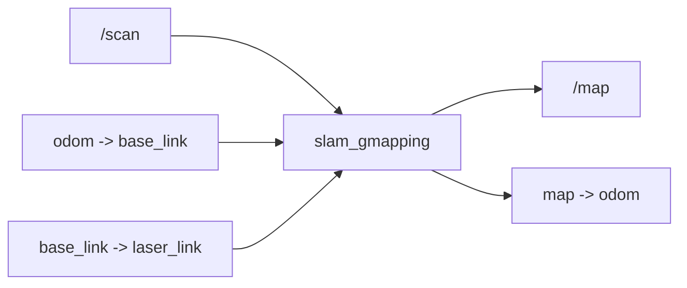
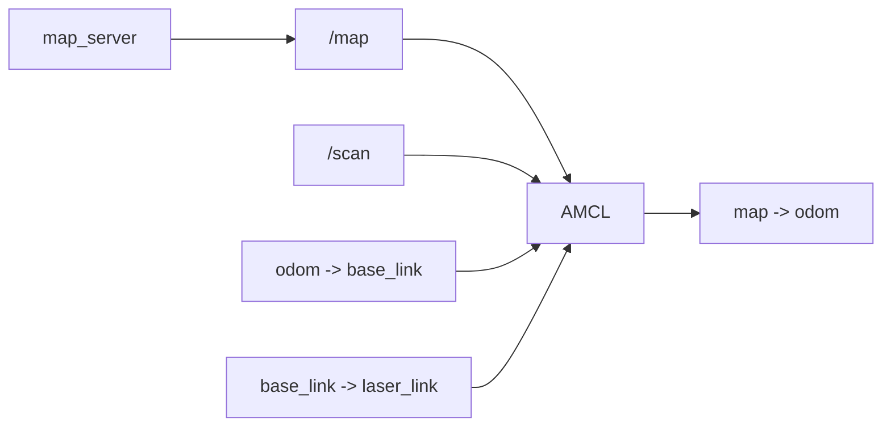

<meta name="referrer" content="no-referrer" />

# ROS教程16：SLAM 与定位——从激光雷达到地图、AMCL 与 map→odom

> 摘要：从激光测距、扫描角度和多线 3D 雷达出发，串联 LaserScan、GMapping、OccupancyGrid、AMCL 与 map→odom，建立 ROS1 建图和已有地图定位的完整数据链。


@[toc]
第 15 章已经把轮式里程计与 IMU 接入 `robot_localization`，并让状态估计器稳定提供：

```text
odom -> base_link
```

这条变换适合描述机器人**连续的局部运动**，但 `odom` 允许随着时间积累漂移。真正进入移动机器人全局定位时，还需要回答另一个问题：

```text
机器人现在位于整张地图的什么位置？
```

第 16 章从激光雷达开始，把这个问题拆成一条完整链路：

```text
激光如何得到距离
    -> 一帧扫描为什么是“角度 + 距离”
    -> 2D 单平面与 3D 多线雷达有什么区别
    -> /scan 怎样与 TF / odom 结合
    -> SLAM 为什么能一边定位一边建图
    -> /map 与 map frame 为什么不是一回事
    -> AMCL 为什么已有地图后只做定位
    -> 为什么 SLAM / AMCL 最终都要修正 map -> odom
```

本章不推导粒子滤波、scan matching 或 SLAM 后端优化的数学细节。目标是先把 ROS1 中**谁提供什么数据、谁消费什么数据、谁拥有哪条 TF**建立清楚。

本章新增配套包：

```text
/workspace/ros_ws/src/ros1_slam_lab
```

它使用一个确定的二维墙体环境生成 `/scan`，避免先引入 Gazebo。这样可以直接观察 `LaserScan -> SLAM/AMCL -> map -> odom` 的关系。

---

## 1. 激光雷达到底在测什么

移动机器人常见的激光雷达本质上是**主动测距传感器**：自己发出激光，再接收物体反射回来的能量，根据测量结果求出目标距离。

最容易建立直觉的是脉冲式飞行时间法（Time of Flight，ToF）。假设发出一个激光脉冲，经过时间 `Δt` 收到反射：

```text
雷达 ----> 障碍物
     光传播

雷达 <---- 障碍物
     反射返回
```

光走过的是“去程 + 回程”，所以距离近似为：

```text
d = c * Δt / 2
```

其中：

```text
c   光速
Δt  发射到接收之间的飞行时间
d   雷达到目标表面的距离
```

真实产品还会处理脉冲整形、接收阈值、回波强度、多回波、温漂和标定等问题。本章只需要保留一个核心结论：

> 雷达的一次测量首先得到的是“某一个方向上的距离”，还不是地图。

另外，并非所有激光雷达都采用完全相同的 ToF 实现。相位式、FMCW、MEMS/固态扫描等方案在硬件实现上不同；本章用 ToF + 扫描方向作为移动机器人数据模型的直观入口，不把它泛化成所有雷达的唯一原理。

---

## 2. 为什么还要“扫描”：一个距离不够描述周围环境

如果雷达只朝机器人正前方发射一束激光，只能得到：

```text
0° -> 2.35 m
```

这只能说明“正前方约 2.35 m 有反射目标”。

要知道周围一整圈环境，就需要不断改变测量方向。例如二维旋转激光雷达可以依次测量：

```text
-90° -> 1.82 m
-89° -> 1.80 m
...
  0° -> 2.35 m
...
+89° -> 3.12 m
+90° -> 3.08 m
```

把这些方向放在同一个雷达坐标系中，可以形成一圈极坐标采样：

```text
                  +x / 0°
                     ^
                     |
          +90°       |       -90°
          左侧       |       右侧
                 \   |   /
                  \  |  /
                   [雷达]
```

ROS 的标准坐标约定中，如果 `+Z` 朝上，则 `LaserScan` 的角度绕 `+Z` 轴测量，正角度为逆时针，`0 rad` 沿 `+X` 方向。

因此从上往下看，一个常见移动机器人坐标系可以记成：

```text
          +Y / 左
             ^
             |
             |
             o------> +X / 前
            +Z 朝上
```

这也是后面理解 `angle_min`、`angle_max` 和 `angle_increment` 的基础。

---

## 3. “1 线、16 线、32 线、64 线”到底是什么意思

这一组术语主要出现在 3D 激光雷达中。

### 3.1 先看二维雷达：本质上只有一个扫描平面

典型 2D 激光雷达测量的是某个固定高度附近的一张平面：

```text
侧视：

       激光扫描平面
  ----------------------
            [雷达]

俯视：

           一整圈角度采样
        .----------------.
      .'                  '.
     /        [雷达]        \
      '.                  .'
        '----------------'
```

所以它最终适合用：

```text
角度 θ + 距离 r
```

来表达。

二维雷达通常不会用“32 线、64 线”描述，因为它主要只有一个扫描平面。

### 3.2 多线 3D 雷达：垂直方向同时有多个采样方向

机械式多线 3D 雷达可以粗略理解为：在垂直方向安排多个不同俯仰角的测距通道。

例如一个简化的 4 线示意：

```text
侧视：

        /  +15°
       /
------/---- +5°
 [LiDAR]
------\---- -5°
       \
        \  -15°
```

当整个雷达再绕竖直轴旋转时，每个垂直通道都会扫过水平方向，于是得到三维空间中的大量点。

因此常说的：

```text
16 线
32 线
64 线
128 线
```

通常表示**垂直方向存在多少个测距通道/扫描层**。线数越多，一般意味着垂直方向采样更密，但不能直接把“线数”理解成总点数、水平角分辨率或最终地图精度。

实际产品的垂直角可能并不均匀。例如 32 条线不一定正好在一个固定垂直视场中等间隔排列，每条 channel 的 elevation angle 往往以厂家标定值为准。

固态、MEMS、Flash 或其他扫描架构也不一定适合直接套用传统机械雷达的“几线”概念，所以“线数”更适合作为机械多通道 3D LiDAR 的常见工程术语，而不是所有激光雷达的统一物理定义。

---

## 4. 雷达中经常说的“角度”至少要区分四件事

看到雷达规格中的“角度”，不能只问“是多少度”，还要问它描述哪个方向、哪个概念。

### 4.1 水平视场角 Horizontal FOV

表示水平方向能看到多大范围。

例如旋转式雷达常见：

```text
Horizontal FOV = 360°
```

意味着绕竖直轴可以观察完整一圈。

二维前向激光也可能只有：

```text
180°
270°
```

等有限视场。

### 4.2 水平角分辨率 / angle increment

假设一圈 360° 采样 360 个方向，可以近似理解成：

```text
水平角间隔约 1°
```

如果采样 720 个方向，则约为：

```text
0.5°
```

角间隔越小，相邻射线越密，但点数、转速、带宽和处理量也会上升。

### 4.3 垂直视场角 Vertical FOV

3D 雷达还需要描述向上、向下能看到多大的角度范围。例如：

```text
-15° ~ +15°
```

表示总垂直视场约 30°。

### 4.4 垂直通道角 / elevation angle

16 线、32 线雷达的每一条“线”通常对应一个具体的垂直俯仰角。

因此一个 3D 点至少可以从：

```text
水平角 azimuth
垂直角 elevation
距离 range
```

计算到笛卡尔坐标：

```text
x, y, z
```

后面第 19～21 章进入 `PointCloud2` 与 PCL 时，再详细处理这些三维点的数据布局、字段访问、TF 转换和滤波。本章只把 3D 雷达接回定位主线。

---

## 5. ROS1 中二维激光为什么用 `sensor_msgs/LaserScan`

ROS1 对平面激光扫描定义了：

```text
sensor_msgs/LaserScan
```

最重要的字段是：

```text
std_msgs/Header header

float32 angle_min
float32 angle_max
float32 angle_increment
float32 time_increment
float32 scan_time

float32 range_min
float32 range_max
float32[] ranges
float32[] intensities
```

它描述的不是图片，而是一组按固定角度顺序排列的测距结果。

### 5.1 `angle_min / angle_max / angle_increment`

假设：

```text
angle_min       = -π
angle_max       ≈ +π
angle_increment = 1° = π / 180 rad
```

那么：

```text
ranges[0]   -> -180°
ranges[1]   -> -179°
ranges[2]   -> -178°
...
```

第 `i` 个点对应角度近似为：

```text
angle_i = angle_min + i * angle_increment
```

射线数量通常满足近似关系：

```text
N ≈ floor((angle_max - angle_min) / angle_increment) + 1
```

具体驱动必须以消息中的实际数组长度和角参数为准，不要仅凭产品宣传中的“360°”反推出数组大小。

### 5.2 `ranges[]`

`ranges[i]` 是第 `i` 个角度方向测得的距离，单位为米。

例如：

```text
angle = 0 rad
range = 2.0 m
```

表示：

> 在 `header.frame_id` 所表示的雷达坐标系中，沿 +X 方向大约 2 m 处检测到回波目标。

标准消息约定低于 `range_min` 或高于 `range_max` 的距离不应作为有效测量使用。

### 5.3 `intensities[]`

某些雷达还能给出回波强度：

```text
intensities[]
```

它可以和物体反射特性、入射角、距离以及设备内部处理有关，但单位和标定通常是设备相关的，不能把不同厂商的强度值直接当成统一物理量比较。

设备不提供强度时，该数组可以为空。

### 5.4 `header.stamp` 与 `time_increment`

这一点对真正的 SLAM 很重要。

`LaserScan` 约定 `header.stamp` 对应扫描第一条射线的采集时间；真实旋转雷达的一整圈扫描并不是物理上完全同时完成的，因此还存在：

```text
time_increment
scan_time
```

机器人如果边移动边扫描，不同射线实际对应的机器人姿态可能不同。更高精度的系统会利用时间戳进行运动补偿或 deskew。

本章教学仿真器为了把第一条成功路径保持简单，把一整帧 `/scan` 视为同一时刻，因此：

```text
time_increment = 0
```

这只是教学模型，不代表真实旋转雷达应该固定填 0。

---

## 6. 3D 雷达为什么通常不再用 `LaserScan`

`LaserScan` 天然表达的是：

```text
一个平面
+ 一串角度
+ 每个角度一个距离
```

多线 3D 雷达最终得到的是大量三维点，因此 ROS 中常见输出是：

```text
sensor_msgs/PointCloud2
```

其核心可以理解成：

```text
header
height / width
fields
point_step / row_step
data[]
```

真正的点内容由 `fields` 描述。常见字段可能包括：

```text
x
y
z
intensity
```

某些 3D LiDAR Driver 还会增加：

```text
ring
时间相关字段
return type
```

这些额外字段不是所有 `PointCloud2` 都强制存在，必须以具体 Driver 的 `fields` 为准。

因此可以先记住：

```text
2D LiDAR
    -> sensor_msgs/LaserScan
    -> angle + range

3D LiDAR
    -> 常见 sensor_msgs/PointCloud2
    -> x + y + z + 可选附加字段
```

二者的数据格式不同，但进入定位系统以后仍然会反复遇到同样的三件事：

```text
数据在哪个 frame？
数据是什么时间？
机器人在那个时间位于哪里？
```

---

## 7. 为什么只有 `/scan` 还不能得到地图

假设某一帧激光看到：

```text
前方 2.0 m 有墙
左侧 1.2 m 有墙
右侧 3.1 m 有墙
```

这只是在 `laser_link` 中描述环境。

如果下一秒机器人向前走了 0.5 m，又得到一帧扫描，那么要把两帧数据放在同一张地图上，就必须知道：

```text
第一帧扫描发生时机器人在哪里？
第二帧扫描发生时机器人在哪里？
laser_link 相对 base_link 安装在哪里？
```

所以真正进入 SLAM 时，最少要同时理解三类输入：

```text
/scan
    环境观测

odom -> base_link
    连续运动估计

base_link -> laser_link
    传感器安装几何关系
```

第 14 章已经由 URDF / `robot_state_publisher` 提供：

```text
base_link -> laser_link
```

第 15 章已经由 `robot_localization` 提供：

```text
odom -> base_link
```

现在第 16 章只需要把 `/scan` 接进来。

---

## 8. `frame_id` 为什么不是一个随便填写的字符串

本章教学 `/scan` 使用：

```text
header.frame_id = laser_link
```

这意味着一条距离数据首先存在于 `laser_link` 坐标系。

例如：

```text
ranges[i] = 2.0 m
angle_i   = 30°
```

在二维平面中可以转换成雷达坐标系点：

```text
x_laser = 2.0 * cos(30°)
y_laser = 2.0 * sin(30°)
```

但 SLAM 不能停在这里，因为它还需要把这个点与机器人运动联系起来：

```text
laser_link
    -> base_link
    -> odom
    -> map
```

如果真实雷达安装在机器人前方 25 cm，而 TF 错误写成机器人原点，所有激光点都会系统性错位。Topic 即使持续有数据，地图仍可能扭曲。

因此对于激光问题，排查顺序不能只看：

```bash
rostopic echo /scan
```

还必须同时看 TF 与时间。

---

## 9. SLAM 是什么：地图未知时，同时解决定位与建图

SLAM 全称：

```text
Simultaneous Localization and Mapping
```

即：

```text
同时定位与建图
```

这里有一个天然的“鸡生蛋”问题：

```text
没有地图 -> 很难知道机器人全局位置
不知道机器人位置 -> 又不知道应该把激光点画到地图哪里
```

SLAM 的核心任务就是在机器人运动和持续观测过程中，同时估计：

```text
机器人轨迹
环境地图
```

本章使用 ROS1 Noetic 中经典的 `slam_gmapping` 作为教学实现。它消费平面激光扫描，并通过 odom/TF 获得运动先验，再进行扫描匹配和粒子式 SLAM；这里不展开算法内部推导。

从 ROS 数据链看，更重要的是：



因此建图阶段真正发生的是：

```text
/scan + odom + TF
       -> SLAM
       -> /map + map -> odom
```

---

## 10. `/map` 和 `map` frame 是两件完全不同的东西

这是进入 Navigation 前必须彻底分开的概念。

### 10.1 `/map` 是 Topic

常见类型：

```text
nav_msgs/OccupancyGrid
```

它描述一张二维栅格地图，包括：

```text
resolution
width / height
origin
栅格 occupancy data
```

常见语义为：

```text
-1   unknown
0    free
100  occupied
```

它回答的是：

> 环境中哪些网格是自由空间、障碍物或未知区域？

### 10.2 `map` 是 TF frame

`map` frame 回答的是：

> 全局地图使用哪个坐标参考系？

所以：

```text
/map               地图数据
map                坐标系名称
map -> odom        坐标变换
```

三者不能混为一谈。

---

## 11. 为什么还要有 `map -> odom`

REP-105 对移动机器人坐标系的核心设计是：

```text
map -> odom -> base_link
```

其中：

```text
odom
    适合作为连续、短时间可靠的局部参考
    允许长期漂移

map
    适合作为长期全局参考
    全局定位修正时可以出现离散变化
```

假设轮式里程计认为机器人已经走到：

```text
x_odom = 9.7 m
```

而激光与全局地图匹配后判断机器人实际应该在：

```text
x_map = 10.0 m
```

不应该直接把连续的 `odom -> base_link` 从 9.7 m 瞬间改成 10.0 m。否则依赖局部连续运动的控制器会看到突跳。

更合理的分层是：

```text
map
 |
 | 全局修正，可变化
 v
odom
 |
 | 连续局部运动
 v
base_link
```

变换关系可以写成：

```text
T_map_base = T_map_odom * T_odom_base
```

因此全局定位器可以求：

```text
T_map_odom = T_map_base * inverse(T_odom_base)
```

也就是让：

```text
map -> odom
```

吸收“全局判断”和“局部里程计”之间的差值。

这就是本章最重要的 TF ownership。

---

## 12. 本章实验为什么故意制造 3% 里程计尺度误差

如果激光观测和里程计都完全理想：

```text
真实走 1.00 m
odom 也正好走 1.00 m
```

那么 `map -> odom` 很可能长期非常接近单位变换，不容易直观看到它在“修正什么”。

因此 `ros1_slam_lab` 做了一个**只用于教学**的可控误差：

```yaml
truth_linear_scale: 1.03
```

含义是：

```text
/cmd_vel 要求 1.00 m 的名义运动

Driver / EKF 的 odom：约 1.00 m
教学环境中的真实运动：约 1.03 m
```

于是机器人走得越远，激光看到的环境和 odom 预测之间差异越明显。

SLAM 或 AMCL 根据环境观测纠正全局位姿时，就会逐渐把差值反映到：

```text
map -> odom
```

把参数改成：

```text
truth_linear_scale:=1.0
```

即可得到一个近似无尺度漂移的对照组。

---

## 13. 先看 `ros1_slam_lab` 的最小运行结构

新增目录：

```text
ros_ws/src/ros1_slam_lab/
├── CMakeLists.txt
├── package.xml
├── README.md
├── config/
│   ├── amcl.yaml
│   ├── gmapping.yaml
│   └── lab_world.yaml
├── launch/
│   ├── amcl_localization.launch
│   ├── base_stack.launch
│   └── slam_mapping.launch
├── maps/
│   ├── lab_map.pgm
│   └── lab_map.yaml
└── scripts/
    └── simple_laser_world.py
```

其中职责是：

```text
ros1_driver_lab
    -> /odom/raw
    -> /joint_states

robot_localization
    -> /odometry/filtered
    -> odom -> base_link

robot_state_publisher
    -> base_link -> laser_link

simple_laser_world.py
    -> /scan

slam_gmapping
    -> /map
    -> map -> odom
```

`simple_laser_world.py` 不模拟串口、UDP、厂商 packet 或真实雷达协议。它只承担本章需要的一个职责：

> 根据一个确定的二维墙体几何环境生成符合 `sensor_msgs/LaserScan` 数据契约的 `/scan`。

真实项目中，它的位置应该被真实 LiDAR Driver 替换。

---

## 14. 更新 Container：安装 GMapping、AMCL、map_server、RViz 与 teleop

`Dockerfile` 已增加：

```text
ros-noetic-slam-gmapping
ros-noetic-amcl
ros-noetic-map-server
ros-noetic-rviz
ros-noetic-teleop-twist-keyboard
```

由于 Dockerfile 发生变化，需要在 Host 重新构建镜像：

```bash
cd /home/wdfk/share/ros1-docker
docker compose up -d --build
```

进入 Container：

```bash
docker compose exec ros1-dev bash
```

然后构建新增 package：

```bash
cd /workspace/ros_ws
source /opt/ros/noetic/setup.bash
catkin build ros1_slam_lab
source /workspace/ros_ws/devel/setup.bash
```

这些构建命令属于本章需要在实际 ROS Container 中执行的操作；当前仓库修改本身不等于已经完成编译验证。

---

## 15. 第一次观察 `/scan`：先不急着看地图

启动建图实验：

```bash
roslaunch ros1_slam_lab slam_mapping.launch
```

另开一个 Container 终端：

```bash
source /workspace/ros_ws/devel/setup.bash
rostopic type /scan
```

预期：

```text
sensor_msgs/LaserScan
```

查看消息定义：

```bash
rosmsg show sensor_msgs/LaserScan
```

只取一帧：

```bash
rostopic echo -n 1 /scan
```

重点观察：

```text
header.frame_id: laser_link
angle_min
angle_max
angle_increment
range_min
range_max
ranges
```

本实验默认：

```text
beam_count = 360
scan_rate  = 10 Hz
range_max  = 8 m
```

所以可以把它理解成：

> 每 0.1 s 发布一帧；每帧大约围绕机器人扫描一整圈，包含 360 个水平方向的距离结果。

---

## 16. 再看 TF：一帧激光是怎样找到机器人位置的

查看局部位姿：

```bash
rosrun tf tf_echo odom base_link
```

再查看雷达安装关系：

```bash
rosrun tf tf_echo base_link laser_link
```

第 14 章的 URDF 定义雷达大致位于：

```text
base_link 前方 0.25 m
上方 0.15 m
```

二维扫描本身主要使用平面位置和 yaw，但完整 TF 仍然保留三维安装关系。

现在 SLAM 可以在扫描对应时间建立：

```text
odom -> base_link -> laser_link
```

于是 `/scan` 中的极坐标点才能被变换到机器人运动参考系中。

---

## 17. 让机器人移动，观察 GMapping 接管 `map -> odom`

另开终端运行键盘控制：

```bash
rosrun teleop_twist_keyboard teleop_twist_keyboard.py
```

让机器人在环境中缓慢前进、转弯，不要长期顶着边界墙。

再开一个终端查看：

```bash
rosrun tf tf_echo map odom
```

同时可以看：

```bash
rostopic info /map
rostopic echo -n 1 /map/info
```

此时 ownership 应该是：

| 数据 / TF | owner |
| --- | --- |
| `/odom/raw` | `ros1_driver_lab` |
| `odom -> base_link` | `robot_localization` |
| `base_link -> laser_link` | `robot_state_publisher` |
| `/scan` | `simple_laser_world` |
| `/map` | `slam_gmapping` |
| `map -> odom` | `slam_gmapping` |

注意：

> GMapping 不应该重新接管 `odom -> base_link`。它利用这条连续局部运动链，再通过自己的全局估计补上 `map -> odom`。

---

## 18. 在 RViz 中把“数据”和“坐标系”同时看见

Container 已有 X11 显示通路，可以启动：

```bash
rviz
```

把：

```text
Fixed Frame
```

设为：

```text
map
```

然后添加：

```text
Map       -> /map
LaserScan -> /scan
TF
```

这里最值得观察的不是界面效果，而是三种信息处在不同层：

```text
Map
    OccupancyGrid 地图数据

LaserScan
    当前激光观测

TF
    map -> odom -> base_link -> laser_link 坐标关系
```

如果 `/scan` 有数据但 RViz 中不显示在正确位置，优先检查：

```text
Fixed Frame
header.frame_id
TF 是否连通
时间戳对应时刻是否存在变换
```

而不是马上怀疑 SLAM 算法。

---

## 19. 保存建好的地图：保存的是地图数据，不是 TF

走完一部分环境后，可以保存 `/map`：

```bash
mkdir -p /workspace/ros_ws/src/ros1_slam_lab/maps/generated
rosrun map_server map_saver \
    -f /workspace/ros_ws/src/ros1_slam_lab/maps/generated/my_map
```

会生成类似：

```text
my_map.pgm
my_map.yaml
```

其中 YAML 通常描述：

```text
image
resolution
origin
negate
occupied_thresh
free_thresh
```

`PGM` 保存地图图像；`YAML` 告诉 `map_server` 如何把图像解释成 ROS 栅格地图。

这里必须注意：

> 保存地图并没有保存一条永久的 `map -> odom`。

下一次启动时，机器人仍然需要重新确定自己在这张地图中的位置，这就是 AMCL 要解决的问题。

---

## 20. AMCL 是什么：地图已经存在，只做定位

AMCL 全称：

```text
Adaptive Monte Carlo Localization
```

常译为：

```text
自适应蒙特卡洛定位
```

和 SLAM 最大的任务区别是：

```text
SLAM
    地图未知
    -> 建图 + 定位

AMCL
    地图已知
    -> 只定位
```

AMCL 的直观思路可以先理解成：维护许多可能的机器人位姿假设，也就是粒子。

假设已有地图，同时当前 `/scan` 看到：

```text
前方墙约 2.0 m
左侧墙约 1.0 m
右侧开阔
```

AMCL 会比较：

```text
如果机器人在位置 A，地图预测的激光观测像不像当前 /scan？
如果机器人在位置 B，像不像？
如果机器人在位置 C，像不像？
```

更符合实际观测的位姿假设会获得更高权重，粒子分布逐步集中到更可信的位置附近。

本章不继续推导重要性采样、KLD sampling 和 measurement model，只保留数据流：



---

## 21. `map_server` 负责什么，它不负责什么

停止 GMapping 后，已有地图通常由：

```text
map_server
```

加载。

它读取：

```text
map.yaml
map.pgm / png
```

然后提供：

```text
/map
/map_metadata
/static_map service
```

它的职责是**提供静态地图数据**。

它不会根据激光定位机器人，也不会因为 `/map` 已经存在就自动发布：

```text
map -> odom
```

所以已有地图定位阶段是两个组件协作：

```text
map_server
    -> 提供 /map

AMCL
    -> 使用地图 + 激光 + odom/TF
    -> 估计机器人全局位姿
    -> 发布 map -> odom
```

---

## 22. 运行已有地图定位实验

先停止前面的 GMapping launch，确保系统中不再有另一个 `map -> odom` owner。

然后启动：

```bash
roslaunch ros1_slam_lab amcl_localization.launch
```

本仓库附带一张和教学墙体环境一致的：

```text
maps/lab_map.yaml
maps/lab_map.pgm
```

默认初始位姿是：

```text
x = 0
y = 0
yaw = 0
```

与教学环境内部初始状态一致，因此第一次运行不要求先手工设置 `2D Pose Estimate`。

如果要使用前面 GMapping 自己保存的地图：

```bash
roslaunch ros1_slam_lab amcl_localization.launch \
    map_yaml:=/workspace/ros_ws/src/ros1_slam_lab/maps/generated/my_map.yaml
```

此时必须确保保存地图时的环境几何与当前激光仿真环境一致；否则 AMCL 会拿错误地图解释当前 `/scan`。

---

## 23. 看 AMCL 的输出：`/amcl_pose` 和 `map -> odom` 分别表达什么

查看 AMCL 位姿：

```bash
rostopic echo /amcl_pose
```

常见类型：

```text
geometry_msgs/PoseWithCovarianceStamped
```

这里表达的是：

> AMCL 对机器人在全局 `map` frame 中位姿的估计及其不确定性。

再看 TF：

```bash
rosrun tf tf_echo map odom
```

这条变换是 AMCL 为了把全局定位结果接到连续 odom 链上而发布的修正。

完整关系仍然是：

```text
map -> odom -> base_link -> laser_link
```

所以 AMCL 并没有替代第 15 章的状态估计器。

二者职责不同：

```text
robot_localization
    维护连续局部状态
    -> odom -> base_link

AMCL
    使用已知地图做全局定位
    -> map -> odom
```

---

## 24. 为什么 AMCL 不直接发布 `map -> base_link`

假设某一时刻：

```text
odom -> base_link
```

给出的局部位姿是：

```text
x = 9.7 m
```

AMCL 根据地图与激光判断机器人全局位姿应该是：

```text
map 中 x = 10.0 m
```

如果直接用 AMCL 强行覆盖 `odom -> base_link`，就破坏了 odom 连续性的职责边界。

ROS 的分层做法是保留：

```text
odom -> base_link = 连续局部运动
```

再求一个：

```text
map -> odom = 全局校正
```

使组合结果：

```text
map -> odom -> base_link
```

与 AMCL 的全局判断一致。

因此 `map -> odom` 可以理解成：

> “全局世界认为 odom 原点现在应该放在哪里”的修正量。

这也是为什么全局重定位或闭环发生时，`map` 层可以变化，而底层控制仍继续使用平滑的 odom 运动。

---

## 25. 建图和已有地图定位终于可以放在同一条链中理解

现在两种运行模式只需要看 owner 变化。

### 25.1 建图阶段

```text
/scan + odom + TF
        |
        v
   slam_gmapping
      |       |
      v       v
    /map   map -> odom
```

### 25.2 已有地图定位阶段

```text
map_server -> /map ----\
                       \
/scan -----------------> AMCL -> map -> odom
                        /
odom + TF --------------/
```

最核心的区别不是“有没有激光”，因为两者都使用激光。

而是：

```text
SLAM
    地图本身也是未知量

AMCL
    地图已经固定，只估计机器人位姿
```

---

## 26. 把 2D 经验扩展到 3D：主干关系没有消失

换成 3D 多线 LiDAR 后，传感器输出常从：

```text
LaserScan
```

变成：

```text
PointCloud2
```

环境表示也可能从二维：

```text
OccupancyGrid
```

变成：

```text
3D point cloud
voxel map
octree
surfel / feature map
```

具体 SLAM/Localization 算法也会变化，但系统工程上仍然绕不开：

```text
LiDAR observation
        +
odometry / IMU
        +
TF + timestamp
        |
        v
SLAM / Localization
        |
        v
global pose correction
```

也就是说，从二维升级到三维以后，不应该丢掉本章建立的三个问题：

```text
1. 点在哪个传感器 frame？
2. 点是什么时间采集的？
3. 当时机器人相对于局部/全局坐标系在哪里？
```

3D 点云数据量更大，扫描过程中运动畸变通常也更明显，因此时间同步、IMU、deskew 和外参标定的重要性只会提高。

本章只建立这条迁移关系。`PointCloud2` 二进制布局、organized/unorganized cloud、PCL 类型转换与滤波仍留在第 19～21 章系统展开，避免把 SLAM 主线变成点云接口百科。

---

## 27. 最终应该形成的模块 ownership

第 12～16 章组合后，可以得到一张稳定的职责表：

| 模块 | 主要输出 | 不应该顺手接管的职责 |
| --- | --- | --- |
| Chassis Driver | `/odom/raw`、`/imu/data_raw`、`/joint_states` | 不负责 `map -> odom` |
| `robot_localization` | `/odometry/filtered`、`odom -> base_link` | 不负责建图 |
| `robot_state_publisher` | `base_link -> laser_link / imu_link / ...` | 不负责全局定位 |
| LiDAR Driver / 本章教学仿真器 | `/scan` 或 3D 场景中的点云 | 不负责机器人全局位姿 |
| `slam_gmapping` | `/map`、`map -> odom` | 不替代连续 odom owner |
| `map_server` | 静态 `/map` | 不定位，不发布 `map -> odom` |
| AMCL | `/amcl_pose`、`map -> odom` | 不重新建图 |

因此最终 TF 主链仍是：

```text
map
 |
 | SLAM 或 AMCL
 v
odom
 |
 | robot_localization
 v
base_link
 |
 | URDF + robot_state_publisher
 v
laser_link
```

`map -> odom` 的 owner 在同一个运行模式中应该只有一个：

```text
建图：slam_gmapping
已有地图定位：AMCL
```

不要同时启动两者并让它们竞争同一条 TF。

---

## 28. 从这一章进入 Navigation

到这里，Navigation 的关键前置链已经完整：

```text
/map
map -> odom
odom -> base_link
base_link -> sensor
/scan
```

下一章进入 `move_base` 后，重点会从“地图和定位是谁提供的”转向：

```text
localization
    -> costmap
    -> global planner
    -> local planner
    -> /cmd_vel
```

如果第 16 章中的 `/scan`、时间、TF 或 `map -> odom` ownership 有问题，错误会继续向 costmap 和 planner 传播。因此在进入规划之前，先把这条定位基础链建立正确。

---

## 参考资料

- ROS `sensor_msgs/LaserScan`：https://docs.ros.org/en/noetic/api/sensor_msgs/html/msg/LaserScan.html
- ROS `sensor_msgs/PointCloud2`：https://github.com/ros/common_msgs/blob/noetic-devel/sensor_msgs/msg/PointCloud2.msg
- REP-105 Coordinate Frames for Mobile Platforms：https://reps.openrobotics.org/rep-0105/
- ROS1 Noetic `slam_gmapping` API：https://docs.ros.org/en/noetic/api/gmapping/html/index.html
- ROS1 Navigation `amcl` Noetic 源码：https://github.com/ros-planning/navigation/blob/noetic-devel/amcl/src/amcl_node.cpp
- ROS1 Navigation `map_server` Noetic 源码：https://github.com/ros-planning/navigation/blob/noetic-devel/map_server/src/main.cpp
