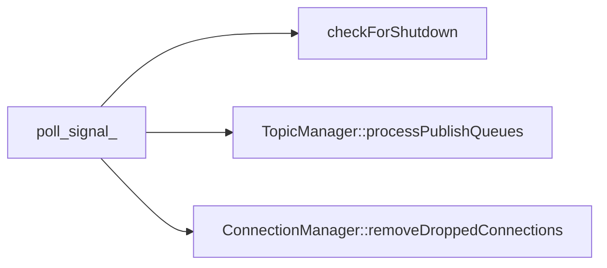
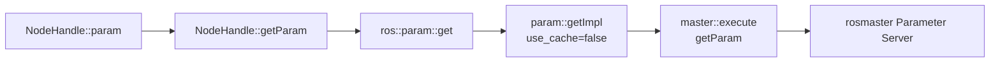

<meta name="referrer" content="no-referrer" />

# ROS教程07：从 ros::start() 顺着源码读懂 Master、XML-RPC 与 Topic 注册发现

> 摘要：沿 ros::start() 的真实调用顺序逐层阅读 Poll、XML-RPC、Topic、Service 与 callback 源码，再回看 Publisher/Subscriber 的注册发现全过程。


@[toc]
本章继续使用现有工程：

```text
ros_ws/src/ros1_hello/src/hello_node.cpp
ros_ws/src/ros1_hello/src/hello_listener.cpp
ros_debug_ws/src/ros_comm
```

第 06 章已经确认第一条启动链：

```text
ros::init()
    ↓
第一个 ros::NodeHandle
    ↓
NodeHandle::construct()
    ↓
ros::start()
```

第 07 章直接从 `ros::start()` 的源码入口继续向下阅读。阅读顺序遵循真实调用关系：先认识 roscpp 在启动阶段创建或注册的 Manager、线程、监听端口和 callback，再进入业务代码的 `advertise()`、`publish()`、`subscribe()` 与 `spin()`。完成这些源码路径后，再统一回看 Master、Node API、`registerPublisher`、`publisherUpdate`、`requestTopic` 与 TCPROS 入口之间的关系。

本章追到 `TransportTCP::connect()` 和 TCPROS 入口为止。TCPROS connection header、序列化格式和 socket 数据收发留到第 08 章继续展开。

---

## 1. 从 `ros::start()` 开始：先把启动顺序看清

源码：

```text
ros_comm/clients/roscpp/src/libros/init.cpp
```

先只看 `ros::start()` 的主干：

```cpp
void start()
{
    ...

    param::param("/tcp_keepalive",
                 TransportTCP::s_use_keepalive_,
                 TransportTCP::s_use_keepalive_);

    PollManager::instance()->addPollThreadListener(checkForShutdown);
    XMLRPCManager::instance()->bind("shutdown", shutdownCallback);

    initInternalTimerManager();

    TopicManager::instance()->start();
    ServiceManager::instance()->start();
    ConnectionManager::instance()->start();
    PollManager::instance()->start();
    XMLRPCManager::instance()->start();

    ...

    if (!(no_rosout || (g_init_options & init_options::NoRosout)))
    {
        g_rosout_appender = new ROSOutAppender;
        ros::console::register_appender(g_rosout_appender);
    }

    ...

    // 注册 roscpp 内部 Service
    // 处理 /use_sim_time 与 /clock

    ...

    g_internal_queue_thread =
        boost::thread(internalCallbackQueueThreadFunc);

    ...

    getGlobalCallbackQueue()->enable();
}
```

读取主干后，先记录 `start()` 的真实执行顺序。该流程节点较多，使用独立技术图表示：


图中需要区分三个后台执行面：

1. **Poll 线程**：网络 fd 轮询、发送队列推进、连接清理、shutdown 检查；
2. **Node XML-RPC server 线程**：处理 `publisherUpdate`、`requestTopic`、`shutdown` 等 Node API；
3. **roscpp 内部 callback 线程**：处理 roscpp 自己的 Service、`/clock` 等内部 callback。

随后还会出现 `ROSOutAppender` 自己的日志线程。

所以第 06 章看到的：

```text
ros::start()
  -> TopicManager::start()
  -> ServiceManager::start()
  -> ConnectionManager::start()
  -> PollManager::start()
  -> XMLRPCManager::start()
```

继续向下阅读时，需要回答以下问题：

```text
start() 里面到底注册了什么？
哪些组件真正创建线程？
哪些组件只保存对象引用？
callback 最后在哪个线程执行？
```

以下章节严格按照该顺序进入对应函数。

---

## 2. `param::param("/tcp_keepalive", ...)`：`start()` 一开始为什么先读参数

`ros::start()` 先执行：

```cpp
param::param("/tcp_keepalive",
             TransportTCP::s_use_keepalive_,
             TransportTCP::s_use_keepalive_);
```

`ros::param::param()` 是一个“读取参数，失败则使用默认值”的模板辅助函数：

```cpp
template<typename T>
bool param(const std::string& param_name,
           T& param_val,
           const T& default_val)
{
    if (has(param_name))
    {
        if (get(param_name, param_val))
        {
            return true;
        }
    }

    param_val = default_val;
    return false;
}
```

这里第三个参数仍然传：

```cpp
TransportTCP::s_use_keepalive_
```

意思不是“固定默认 true/false”，而是：

```text
如果 Parameter Server 中存在 /tcp_keepalive
    -> 用参数值覆盖 TransportTCP::s_use_keepalive_

否则
    -> 保持当前默认值
```

这一行同时说明：**Parameter Server 在 Node 建立 Topic 连接之前就可能被 roscpp 内部使用。**

不过参数机制不是这一章的主线，后面会单独说明本阶段应该掌握到什么深度。

---

## 3. `PollManager::addPollThreadListener()`：先把回调挂上去，再启动 Poll 线程

接下来：

```cpp
PollManager::instance()->addPollThreadListener(checkForShutdown);
```

这里同时需要把相关 Boost 类型与连接机制说明清楚。

### 3.1 `VoidSignal` 到底是什么

`poll_manager.h`：

```cpp
typedef boost::signals2::signal<void(void)> VoidSignal;
typedef boost::function<void(void)> VoidFunc;

class PollManager
{
    ...

    VoidSignal poll_signal_;
};
```

这一句：

```cpp
typedef boost::signals2::signal<void(void)> VoidSignal;
```

可以拆成：

```text
boost::signals2::signal<函数签名>

函数签名：void(void)
    -> 无参数
    -> 无返回值
```

因此：

```cpp
VoidSignal poll_signal_;
```

可以把它先理解成一个“**可以挂多个 `void()` 回调的事件广播器**”。

和普通函数指针最大的区别是，它不是只能保存一个函数，而是可以：

```text
signal
  ├─ slot A
  ├─ slot B
  └─ slot C
```

当代码执行：

```cpp
poll_signal_();
```

当前关系是单向广播，使用短流程表示：



这些已经连接到 signal 上的 slot 会在**调用 `poll_signal_()` 的当前线程**里被同步触发。

这里不要把它理解成：

```text
connect() 之后自动创建一个线程执行 func
```

`boost::signals2` 本身不会在这里自动创建 Poll 线程。线程是后面的：

```cpp
PollManager::start()
```

创建的。

### 3.2 `return poll_signal_.connect(func);` 在做什么

实现：

```cpp
boost::signals2::connection
PollManager::addPollThreadListener(const VoidFunc& func)
{
    boost::recursive_mutex::scoped_lock lock(signal_mutex_);
    return poll_signal_.connect(func);
}
```

其中：

```cpp
poll_signal_.connect(func)
```

表示：

```text
把 func 注册到 poll_signal_ 的 slot 列表
```

返回值：

```cpp
boost::signals2::connection
```

是这次连接的“句柄”。以后可以：

```cpp
c.disconnect();
```

取消这一条回调连接。

`ConnectionManager` 就保存了这个返回值：

```cpp
poll_conn_ = poll_manager_->addPollThreadListener(
    boost::bind(&ConnectionManager::removeDroppedConnections, this));
```

shutdown 时再：

```cpp
poll_manager_->removePollThreadListener(poll_conn_);
```

### 3.3 `checkForShutdown` 为什么先注册，线程却后启动

现在：

```cpp
PollManager::instance()->addPollThreadListener(checkForShutdown);
```

只是：

```text
把 checkForShutdown 挂到 poll_signal_
```

这时 `PollManager` 的线程还没有启动。

后面 `start()` 执行到：

```cpp
PollManager::instance()->start();
```

才真正创建线程。

所以顺序是：

```text
先注册 listener
    ↓
再启动 Poll 线程
    ↓
Poll 线程每轮执行 poll_signal_()
    ↓
checkForShutdown() 才开始被周期性触发
```

这和第 06 章的 shutdown 路径正好接起来：

```text
SIGINT
  -> basicSigintHandler()
  -> requestShutdown()
  -> g_shutdown_requested = true

Poll 线程下一轮
  -> poll_signal_()
  -> checkForShutdown()
  -> ros::shutdown()
```

---

## 4. `XMLRPCManager::bind("shutdown", ...)`：Node API 在 server 启动之前就能先注册

下一行：

```cpp
XMLRPCManager::instance()->bind("shutdown", shutdownCallback);
```

这里很容易产生一个疑问：

```text
XMLRPCManager::start() 明明还没执行，为什么现在就能 bind？
```

因为 `bind()` 做的不是“开始监听端口”，而是先往 `XmlRpcServer` 对象中登记：

```text
XML-RPC 方法名
    -> 对应的 C++ callback
```

核心实现：

```cpp
bool XMLRPCManager::bind(const std::string& function_name,
                         const XMLRPCFunc& cb)
{
    boost::mutex::scoped_lock lock(functions_mutex_);

    if (functions_.find(function_name) != functions_.end())
    {
        return false;
    }

    FunctionInfo info;
    info.name = function_name;
    info.function = cb;
    info.wrapper.reset(
        new XMLRPCCallWrapper(function_name, cb, &server_));

    functions_[function_name] = info;
    return true;
}
```

`XMLRPCFunc` 的类型是：

```cpp
typedef boost::function<
    void(XmlRpc::XmlRpcValue&, XmlRpc::XmlRpcValue&)
> XMLRPCFunc;
```

也就是说所有 roscpp Node API callback 都统一成：

```cpp
void callback(XmlRpcValue& params,
              XmlRpcValue& result);
```

`XMLRPCCallWrapper` 再把这个 `boost::function` 包装成 xmlrpcpp 能识别的 `XmlRpcServerMethod`：

```cpp
class XMLRPCCallWrapper : public XmlRpcServerMethod
{
public:
    ...

    void execute(XmlRpcValue& params,
                 XmlRpcValue& result)
    {
        func_(params, result);
    }
};
```

而 `XmlRpcServerMethod` 构造时会直接：

```cpp
_server->addMethod(this);
```

因此：

```text
XMLRPCManager::bind("shutdown", shutdownCallback)
    ↓
创建 XMLRPCCallWrapper
    ↓
XmlRpcServerMethod 构造
    ↓
server_.addMethod(...)
    ↓
shutdown 方法已经进入 server 的 method table
```

但这时还没有 socket 监听。

监听端口要等：

```cpp
XMLRPCManager::start()
```

---

## 5. `TopicManager::start()`：这里一次绑定了六个 Node API

`ros::start()` 接下来进入：

```cpp
TopicManager::instance()->start();
```

源码：

```cpp
void TopicManager::start()
{
    boost::mutex::scoped_lock shutdown_lock(shutting_down_mutex_);
    shutting_down_ = false;

    poll_manager_ = PollManager::instance();
    connection_manager_ = ConnectionManager::instance();
    xmlrpc_manager_ = XMLRPCManager::instance();

    xmlrpc_manager_->bind(
        "publisherUpdate",
        boost::bind(&TopicManager::pubUpdateCallback,
                    this,
                    boost::placeholders::_1,
                    boost::placeholders::_2));

    xmlrpc_manager_->bind(
        "requestTopic",
        boost::bind(&TopicManager::requestTopicCallback,
                    this,
                    boost::placeholders::_1,
                    boost::placeholders::_2));

    xmlrpc_manager_->bind("getBusStats", ...);
    xmlrpc_manager_->bind("getBusInfo", ...);
    xmlrpc_manager_->bind("getSubscriptions", ...);
    xmlrpc_manager_->bind("getPublications", ...);

    poll_manager_->addPollThreadListener(
        boost::bind(&TopicManager::processPublishQueues, this));
}
```

这一段非常关键，因为本章后面出现的：

```text
publisherUpdate
requestTopic
```

并不是 Master 进程里的函数，而是每个 roscpp Node 自己在这里暴露出去的 **Node API**。

### 5.1 `boost::bind(... _1, _2)` 到底在绑定什么

先看：

```cpp
boost::bind(&TopicManager::pubUpdateCallback,
            this,
            boost::placeholders::_1,
            boost::placeholders::_2)
```

`&TopicManager::pubUpdateCallback` 是一个成员函数指针。

`this` 表示：

```text
将来调用这个成员函数时，固定使用当前 TopicManager 对象
```

而：

```cpp
boost::placeholders::_1
boost::placeholders::_2
```

不是两个实际参数，它们是“将来调用这个函数对象时，第 1、第 2 个实参放到这里”的占位符。

可以把它近似理解成 C++11 lambda：

```cpp
[this](XmlRpc::XmlRpcValue& params,
       XmlRpc::XmlRpcValue& result)
{
    this->pubUpdateCallback(params, result);
}
```

因此：

```cpp
boost::bind(&TopicManager::pubUpdateCallback,
            this, _1, _2)
```

最终生成的是一个符合：

```cpp
void(XmlRpcValue&, XmlRpcValue&)
```

签名的可调用对象，正好能装进：

```cpp
XMLRPCFunc
```

### 5.2 六个 Node API 分别干什么

这里先只建立职责：

| Node API | 主要作用 |
| --- | --- |
| `publisherUpdate` | Master 通知 Subscriber：某 Topic 的 Publisher 列表变化了 |
| `requestTopic` | Subscriber 向 Publisher 协商实际数据传输协议和地址 |
| `getBusStats` | 查询当前通信统计 |
| `getBusInfo` | 查询当前连接信息 |
| `getSubscriptions` | 查询当前 Node 的订阅列表 |
| `getPublications` | 查询当前 Node 的发布列表 |

其中这一章重点追：

```text
publisherUpdate
requestTopic
```

其它四个知道它们是 Node API 即可。

### 5.3 `processPublishQueues` 为什么也挂到 Poll 线程

最后：

```cpp
poll_manager_->addPollThreadListener(
    boost::bind(&TopicManager::processPublishQueues, this));
```

这意味着以后 Poll 线程每轮执行：

```cpp
poll_signal_();
```

时，会调用：

```cpp
TopicManager::processPublishQueues()
```

实现：

```cpp
void TopicManager::processPublishQueues()
{
    boost::recursive_mutex::scoped_lock lock(advertised_topics_mutex_);

    for (...)
    {
        const PublicationPtr& pub = *it;
        pub->processPublishQueue();
    }
}
```

也就是说 Publisher 跨进程发送路径中的“待发送消息推进”，并不是只靠用户调用 `Publisher::publish()` 的线程完成。

后面讲 `Publication::publish()` 时会重新回到这里。

---

## 6. `ServiceManager::start()`：它本身没有再创建线程

下一步：

```cpp
ServiceManager::instance()->start();
```

实现其实很短：

```cpp
void ServiceManager::start()
{
    shutting_down_ = false;

    poll_manager_ = PollManager::instance();
    connection_manager_ = ConnectionManager::instance();
    xmlrpc_manager_ = XMLRPCManager::instance();
}
```

它主要是把后面需要用到的 Manager 单例保存下来。

这里要注意：

```text
ServiceManager::start()
```

并不等于：

```text
新建一个 ServiceManager 线程
```

Service 的网络连接还是依赖：

```text
ConnectionManager
PollManager
```

而 Service 注册发现仍然要通过：

```text
Master
```

真正注册内部 Service 的动作要等 `ros::start()` 后半段。

---

## 7. `ConnectionManager::start()`：把 TCPROS/UDPROS 的监听入口真正建起来

接下来：

```cpp
ConnectionManager::instance()->start();
```

实现：

```cpp
void ConnectionManager::start()
{
    poll_manager_ = PollManager::instance();

    poll_conn_ = poll_manager_->addPollThreadListener(
        boost::bind(&ConnectionManager::removeDroppedConnections,
                    this));

    tcpserver_transport_ = boost::make_shared<TransportTCP>(
        &poll_manager_->getPollSet());

    tcpserver_transport_->listen(
        network::getTCPROSPort(),
        MAX_TCPROS_CONN_QUEUE,
        boost::bind(&ConnectionManager::tcprosAcceptConnection,
                    this,
                    boost::placeholders::_1));

    udpserver_transport_ = boost::make_shared<TransportUDP>(
        &poll_manager_->getPollSet());

    udpserver_transport_->createIncoming(0, true);
}
```

这里做三件事。

### 7.1 把“已掉线连接清理”注册到 Poll 线程

```cpp
poll_conn_ = poll_manager_->addPollThreadListener(
    boost::bind(&ConnectionManager::removeDroppedConnections, this));
```

以后每轮：

```text
poll_signal_()
```

都会有机会进入：

```cpp
ConnectionManager::removeDroppedConnections()
```

把已经被标记为 dropped 的 `Connection` 从连接集合中移除。

### 7.2 创建 TCPROS server transport

```cpp
tcpserver_transport_->listen(...)
```

会建立 TCP 监听 socket，并把它纳入：

```cpp
PollManager::getPollSet()
```

当新 TCP 连接到来时，回调：

```cpp
ConnectionManager::tcprosAcceptConnection(...)
```

再创建：

```cpp
Connection
```

并等待 connection header，最后依据 header 中有没有：

```text
topic
service
```

分别创建：

```text
TransportSubscriberLink
ServiceClientLink
```

这些连接细节在 08/11 再深入。

这一章先记住：

> `ConnectionManager::start()` 让当前 Node 拥有了一个真正可被其它 Node 连接的 TCPROS/Service TCP 监听入口。

### 7.3 UDP 监听也在这里准备

```cpp
udpserver_transport_->createIncoming(0, true);
```

为 UDPROS 准备入口。

当前 `/chatter` 默认走 TCPROS，因此后面主要追 TCP 路径。

---

## 8. `PollManager::start()`：100 ms 到底是什么意思

现在终于执行：

```cpp
PollManager::instance()->start();
```

源码：

```cpp
void PollManager::start()
{
    shutting_down_ = false;
    thread_ = boost::thread(&PollManager::threadFunc, this);
}
```

真正线程函数：

```cpp
void PollManager::threadFunc()
{
    disableAllSignalsInThisThread();

    while (!shutting_down_)
    {
        {
            boost::recursive_mutex::scoped_lock lock(signal_mutex_);
            poll_signal_();
        }

        if (shutting_down_)
        {
            return;
        }

        poll_set_.update(100);
    }
}
```

这里要修正一个非常容易形成的错误印象：

```text
PollManager 并不是“每 100 ms 执行一次 listener”。
```

真实顺序是：

```text
while
  ↓
poll_signal_()
  ↓
同步调用当前所有 Poll listener
  ↓
poll_set_.update(100)
  ↓
最多阻塞 100 ms 等待 fd 事件
  ↓
下一轮
```

`100` 是：

```text
PollSet I/O 轮询的最大阻塞超时，单位 ms
```

如果：

```text
socket 事件提前到达
```

或者其它线程调用：

```cpp
poll_set_.signal();
```

Poll 会提前被唤醒，并不一定真的睡满 100 ms。

### 8.1 当前 `poll_signal_` 上已经注册了哪些回调

到目前为止至少有：

```text
checkForShutdown
TopicManager::processPublishQueues
ConnectionManager::removeDroppedConnections
```

所以 Poll 线程不只是：

```text
“看看要不要 shutdown”
```

它同时承担：

```text
推进 Publisher 发送队列
清理掉线连接
驱动 socket fd 事件
```

### 8.2 `PollSet::update(100)` 又做了什么

`PollSet::update()` 最终对已经注册的 socket 执行底层 poll/epoll 等等待；如果某个 fd 出现：

```text
POLLIN
POLLOUT
POLLERR
POLLHUP
...
```

就取出这个 fd 对应的 `SocketUpdateFunc` 并执行。

`PollSet::signal()` 使用内部 signal pipe 唤醒阻塞中的 poll，所以后面：

```cpp
TopicManager::publish()
```

在有序列化消息需要发送时会调用：

```cpp
poll_manager_->getPollSet().signal();
```

让 Poll 线程尽快来处理新的 publish queue，而不是傻等 100 ms 超时。

---

## 9. `XMLRPCManager::start()`：当前 Node 的 XML-RPC server 真正开始监听

接下来：

```cpp
XMLRPCManager::instance()->start();
```

源码：

```cpp
void XMLRPCManager::start()
{
    shutting_down_ = false;
    port_ = 0;

    bind("getPid", getPid);

    bool bound = server_.bindAndListen(0);
    ROS_ASSERT(bound);

    port_ = server_.get_port();
    ROS_ASSERT(port_ != 0);

    std::stringstream ss;
    ss << "http://"
       << network::getHost()
       << ":"
       << port_
       << "/";

    uri_ = ss.str();

    server_thread_ = boost::thread(
        boost::bind(&XMLRPCManager::serverThreadFunc, this));
}
```

这里要分四步看。

### 9.1 `getPid` 也是 Node API

先：

```cpp
bind("getPid", getPid);
```

所以后面：

```bash
rosnode ping /hello_node
```

这类工具能够拿到 Node URI 后再访问 Node 的 XML-RPC API。

### 9.2 `bindAndListen(0)` 为什么传 0

进入 xmlrpcpp：

```cpp
bool XmlRpcServer::bindAndListen(int port, int backlog)
{
    int fd = XmlRpcSocket::socket();

    setfd(fd);
    XmlRpcSocket::setNonBlocking(fd);
    XmlRpcSocket::setReuseAddr(fd);
    XmlRpcSocket::bind(fd, port);
    XmlRpcSocket::listen(fd, backlog);

    _port = XmlRpcSocket::get_port(fd);

    _disp.addSource(this, XmlRpcDispatch::ReadableEvent);
    return true;
}
```

`port = 0` 是让 OS 分配一个当前可用端口。

因此每个 roscpp Node 的 XML-RPC Node API 地址通常是：

```text
http://<node-host>:<dynamic-port>/
```

它和固定的：

```text
ROS Master: 11311
```

不是一回事。

### 9.3 `serverThreadFunc()` 才真正持续处理 Node API 请求

线程入口：

```cpp
void XMLRPCManager::serverThreadFunc()
{
    disableAllSignalsInThisThread();

    while (!shutting_down_)
    {
        // 加入新的异步 XML-RPC connection
        ...

        {
            boost::mutex::scoped_lock lock(functions_mutex_);
            server_.work(0.1);
        }

        ...

        // 检查异步 XML-RPC connection 是否完成
        ...

        // 清理需要移除的异步 connection
        ...
    }
}
```

源码注释已经写得很直接：

```text
server_.work(0.1)
最多在 select() 中阻塞 100 ms
```

当远端发送：

```text
publisherUpdate
requestTopic
shutdown
getPid
getBusInfo
...
```

xmlrpcpp 会找到之前 `bind()` 注册进 method table 的 `XMLRPCCallWrapper`，然后：

```text
XmlRpcServerMethod::execute()
    ↓
XMLRPCCallWrapper::execute(params, result)
    ↓
func_(params, result)
    ↓
TopicManager::pubUpdateCallback(...)
或其它具体 callback
```

### 9.4 为什么里面还有 `ASyncXMLRPCConnection`

后面 Subscriber 要调用 Publisher：

```text
requestTopic
```

roscpp 没有把这个协商写成一个会长期阻塞用户线程的同步过程，而是使用：

```text
executeNonBlock("requestTopic", ...)
    ↓
PendingConnection
    ↓
XMLRPCManager::addASyncConnection(...)
```

`serverThreadFunc()` 每轮会同时检查这些异步 XML-RPC connection 是否完成。

所以 `XMLRPCManager` 同时承担两类职责：

```text
Server：外部调用当前 Node 暴露的 Node API
Client 管理：当前 Node 调用 Master 或其它 Node 的 XML-RPC API
```

---

## 10. `ROSOutAppender`：`ROS_INFO` 为什么最终能变成 `/rosout` Topic

`ros::start()` 在 Manager 都运行以后继续：

```cpp
if (!(no_rosout ||
      (g_init_options & init_options::NoRosout)))
{
    g_rosout_appender = new ROSOutAppender;
    ros::console::register_appender(g_rosout_appender);
}
```

这里不是启动 `/rosout` Node；而是在当前 roscpp Node 内部注册一个 rosconsole appender。

### 10.1 `ROSOutAppender` 构造时直接 advertise `/rosout`

源码：

```cpp
ROSOutAppender::ROSOutAppender()
: shutting_down_(false)
, disable_topics_(false)
, publish_thread_(boost::bind(&ROSOutAppender::logThread, this))
{
    AdvertiseOptions ops;
    ops.init<rosgraph_msgs::Log>(
        names::resolve("/rosout"), 0);

    ops.latch = true;

    SubscriberCallbacksPtr cbs(
        boost::make_shared<SubscriberCallbacks>());

    TopicManager::instance()->advertise(ops, cbs);
}
```

这里同时发生两件事：

```text
publish_thread_
    -> 建立 ROSOutAppender 自己的日志发布线程

TopicManager::advertise(/rosout)
    -> 当前 Node 本身成为 /rosout 的 Publisher
```

因此系统中每个正常启用 rosout 的 roscpp Node 都会发布：

```text
/rosout
```

而名为：

```text
/rosout
```

的那个独立 Node 再负责汇聚这些日志。

### 10.2 `ROSOutAppender::log()` 先把日志放入自己的 queue

当 rosconsole 调 appender：

```cpp
void ROSOutAppender::log(...)
```

它会构造：

```cpp
rosgraph_msgs::Log
```

填入：

```text
level
name
msg
file
function
line
topics
```

然后：

```cpp
log_queue_.push_back(msg);
queue_condition_.notify_all();
```

这时只是放入日志队列。

### 10.3 `logThread()` 再真正调用 TopicManager 发布

```cpp
void ROSOutAppender::logThread()
{
    while (!shutting_down_)
    {
        V_Log local_queue;

        {
            boost::mutex::scoped_lock lock(queue_mutex_);

            if (log_queue_.empty())
            {
                queue_condition_.wait(lock);
            }

            local_queue.swap(log_queue_);
        }

        for (...)
        {
            TopicManager::instance()->publish(
                names::resolve("/rosout"), *(*it));
        }
    }
}
```

因此：

```text
ROS_INFO(...)
    ↓
rosconsole
    ↓
ROSOutAppender::log()
    ↓
log_queue_
    ↓
ROSOutAppender::logThread()
    ↓
TopicManager::publish("/rosout", ...)
```

这里已经能看到同一个 Node 内至少存在：

```text
Poll 线程
XML-RPC server 线程
ROSOutAppender 日志线程
后面还有 internal callback queue 线程
```

这也是为什么 roscpp Node 不能简单理解成“只有 main + spin 那一个线程”。

---

## 11. `~get_loggers`、`~set_logger_level` 为什么在 `start()` 里自动出现

接下来这几段：

```cpp
{
    ros::AdvertiseServiceOptions ops;
    ops.init<roscpp::GetLoggers>(
        names::resolve("~get_loggers"), getLoggers);

    ops.callback_queue = getInternalCallbackQueue().get();
    ServiceManager::instance()->advertiseService(ops);
}

{
    ros::AdvertiseServiceOptions ops;
    ops.init<roscpp::SetLoggerLevel>(
        names::resolve("~set_logger_level"), setLoggerLevel);

    ops.callback_queue = getInternalCallbackQueue().get();
    ServiceManager::instance()->advertiseService(ops);
}
```

如果：

```text
Node = /hello_node
```

那么：

```text
~get_loggers
    -> /hello_node/get_loggers

~set_logger_level
    -> /hello_node/set_logger_level
```

这两个 Service 不是业务代码手工 advertise 的，而是 roscpp runtime 自动提供的内部 Service。

当：

```text
ROSCPP_ENABLE_DEBUG=true
```

还会额外注册：

```text
~debug/close_all_connections
```

### 11.1 `ServiceManager::advertiseService()` 逐层看

核心实现：

```cpp
bool ServiceManager::advertiseService(
    const AdvertiseServiceOptions& ops)
{
    boost::recursive_mutex::scoped_lock shutdown_lock(
        shutting_down_mutex_);

    if (shutting_down_)
    {
        return false;
    }

    {
        boost::mutex::scoped_lock lock(
            service_publications_mutex_);

        if (isServiceAdvertised(ops.service))
        {
            return false;
        }

        ServicePublicationPtr pub(
            boost::make_shared<ServicePublication>(
                ops.service,
                ops.md5sum,
                ops.datatype,
                ops.req_datatype,
                ops.res_datatype,
                ops.helper,
                ops.callback_queue,
                ops.tracked_object));

        service_publications_.push_back(pub);
    }

    XmlRpcValue args, result, payload;
    args[0] = this_node::getName();
    args[1] = ops.service;

    char uri_buf[1024];
    std::snprintf(uri_buf, sizeof(uri_buf),
                  "rosrpc://%s:%d",
                  network::getHost().c_str(),
                  connection_manager_->getTCPPort());

    args[2] = string(uri_buf);
    args[3] = xmlrpc_manager_->getServerURI();

    master::execute(
        "registerService", args, result, payload, true);

    return true;
}
```

把四个参数拆开：

```text
args[0]
    当前 Node 名，例如 /hello_node

args[1]
    Service 名，例如 /hello_node/get_loggers

args[2]
    rosrpc://host:tcp-port
    真正 Service 客户端后续连接的 ROSRPC 数据入口

args[3]
    http://host:xmlrpc-port/
    当前 Node 的 XML-RPC Node API URI
```

然后：

```cpp
master::execute("registerService", ...)
```

向 Master 注册。

这里已经能看出 Service 和 Topic 的共同设计：

```text
Master 保存“服务名与提供方”
真正请求/响应并不经 Master 转发
```

Service 详细建链留到第 11 章。

---

## 12. `g_internal_callback_queue` 到底干嘛：不是“发布 start 成功通知”

源码中可以看到：

```cpp
static CallbackQueuePtr g_internal_callback_queue;
static boost::thread g_internal_queue_thread;
```

又会看到：

```cpp
g_internal_queue_thread =
    boost::thread(internalCallbackQueueThreadFunc);
```

如果只搜索：

```text
g_internal_callback_queue->addCallback(...)
```

源码阅读时容易产生“没有看到 callback 入队位置”的疑问。

原因是很多地方不是直接访问变量，而是把：

```cpp
getInternalCallbackQueue().get()
```

作为 callback queue 指针交给其它对象。

### 12.1 内部 queue 是懒创建的

```cpp
CallbackQueuePtr getInternalCallbackQueue()
{
    if (!g_internal_callback_queue)
    {
        g_internal_callback_queue.reset(new CallbackQueue);
    }

    return g_internal_callback_queue;
}
```

第一次有人请求它时才创建。

### 12.2 `start()` 里已经有明确使用者

前面两个内部 Service：

```cpp
ops.callback_queue = getInternalCallbackQueue().get();
```

所以它们的 Service callback 最后不是进入业务代码使用的：

```text
g_global_queue
```

而是进入：

```text
g_internal_callback_queue
```

如果启用模拟时间：

```cpp
ops.init<rosgraph_msgs::Clock>(
    names::resolve("/clock"),
    1,
    clockCallback);

ops.callback_queue = getInternalCallbackQueue().get();
TopicManager::instance()->subscribe(ops);
```

`/clock` 的 callback 也进入内部 queue。

除此之外，roscpp 内部的重连 timer 等机制也会使用这条 queue。例如 TCPROS publisher link 掉线重试时，内部 timer callback 会绑定到：

```cpp
getInternalCallbackQueue().get()
```

### 12.3 独立线程怎样处理它

```cpp
void internalCallbackQueueThreadFunc()
{
    disableAllSignalsInThisThread();

    CallbackQueuePtr queue = getInternalCallbackQueue();

    while (!g_shutting_down)
    {
        queue->callAvailable(WallDuration(0.1));
    }
}
```

所以这条内部线程的核心目的可以概括为：

> **保证 roscpp 自己必须工作的 callback，不依赖用户是否调用 `ros::spin()`。**

例如即使用户业务代码一时没有处理 global callback queue，roscpp 仍然需要能够处理：

```text
日志级别 Service
/clock
某些内部 timer/retry
```

因此它和：

```text
“对外发布 start 成功通知”
```

没有关系。

`ros::start()` 最后那条：

```cpp
ROSCPP_LOG_DEBUG("Started node ...")
```

只是日志，不是 `g_internal_callback_queue` 的用途。

---

## 13. 回到业务代码：`nh.advertise()` 从模板 API 一直走到 `registerPublisher`

前面只是把 roscpp runtime 启动好。现在回到当前业务代码：

```cpp
ros::Publisher publisher =
    nh.advertise<std_msgs::String>("chatter", 10);
```

这时才开始建立 `/chatter` Publisher。

### 13.1 `AdvertiseOptions::init<M>()` 先把消息类型信息补全

`NodeHandle::advertise<M>()` 最终会构造 `AdvertiseOptions`，其中一个关键模板辅助函数是：

```cpp
template <class M>
void init(const std::string& _topic,
          uint32_t _queue_size,
          const SubscriberStatusCallback& _connect_cb =
              SubscriberStatusCallback(),
          const SubscriberStatusCallback& _disconnect_cb =
              SubscriberStatusCallback())
{
    topic = _topic;
    queue_size = _queue_size;
    connect_cb = _connect_cb;
    disconnect_cb = _disconnect_cb;

    md5sum = message_traits::md5sum<M>();
    datatype = message_traits::datatype<M>();
    message_definition = message_traits::definition<M>();
    has_header = message_traits::hasHeader<M>();
}
```

对于：

```cpp
M = std_msgs::String
```

模板在编译期就知道消息类型，因此可以从 `message_traits` 中取得：

```text
md5sum
    ROS1 消息兼容性标识

datatype
    例如 std_msgs/String

message_definition
    完整 .msg 定义文本

has_header
    这个消息是否包含 std_msgs/Header
```

因此：

```cpp
nh.advertise<std_msgs::String>("chatter", 10)
```

不只是保存：

```text
topic = chatter
queue_size = 10
```

它还把后续注册、连接 header 校验、序列化需要的消息元信息一起装进 `AdvertiseOptions`。

### 13.2 `NodeHandle::advertise(AdvertiseOptions&)`

真正进入非模板实现：

```cpp
Publisher NodeHandle::advertise(AdvertiseOptions& ops)
{
    ops.topic = resolveName(ops.topic);

    if (ops.callback_queue == 0)
    {
        if (callback_queue_)
        {
            ops.callback_queue = callback_queue_;
        }
        else
        {
            ops.callback_queue = getGlobalCallbackQueue();
        }
    }

    SubscriberCallbacksPtr callbacks(
        boost::make_shared<SubscriberCallbacks>(
            ops.connect_cb,
            ops.disconnect_cb,
            ops.tracked_object,
            ops.callback_queue));

    Publisher pub(
        ops.topic,
        ops.md5sum,
        ops.datatype,
        ops.latch,
        *this,
        callbacks);

    if (ops.latch)
    {
        callbacks->push_latched_message_ =
            pub.getLastMessageCallback();
    }

    if (TopicManager::instance()->advertise(ops, callbacks))
    {
        ...
        return pub;
    }

    return Publisher();
}
```

按顺序看。

#### 第一步：Topic 名先解析

```cpp
ops.topic = resolveName(ops.topic);
```

当前没有 namespace/remap 时：

```text
chatter
   ↓
/chatter
```

也就是说，后面 `TopicManager` 和 Master 看到的是解析后的名字。

#### 第二步：确定 Publisher status callback 用哪条 queue

如果用户没有指定 callback queue：

```cpp
ops.callback_queue = getGlobalCallbackQueue();
```

这里的 callback 不是消息接收 callback，而是：

```text
Subscriber 连接时的 connect callback
Subscriber 断开时的 disconnect callback
```

当前 `hello_node` 没设置它们，因此现在知道这个默认行为即可。

#### 第三步：构造 `Publisher`

```cpp
Publisher pub(...);
```

`Publisher` 本身更像一个轻量 handle；真正 Topic 级共享状态后面在 `TopicManager::advertise()` 里形成 `Publication`。

### 13.3 `getLastMessageCallback()`：latch 是怎样接进来的

需要重点关注：

```cpp
boost::function<void(const SubscriberLinkPtr&)>
getLastMessageCallback()
{
    return boost::bind(
        &Impl::pushLastMessage,
        impl_.get(),
        boost::placeholders::_1);
}
```

它可以近似理解为：

```cpp
[sub_impl = impl_.get()](const SubscriberLinkPtr& link)
{
    sub_impl->pushLastMessage(link);
}
```

如果：

```cpp
ops.latch = true;
```

`NodeHandle::advertise()` 会把这个回调保存到：

```cpp
callbacks->push_latched_message_
```

后面 `Publication::peerConnect()` 发现新 Subscriber 时：

```cpp
if (cbs->push_latched_message_)
{
    cbs->push_latched_message_(sub_link);
}
```

最终进入：

```cpp
Publisher::Impl::pushLastMessage(...)
```

把之前保存的最后一条消息重新 enqueue 给新 Subscriber。

当前 `/chatter`：

```text
latch = false
```

所以这条路径不会实际触发，但它解释了为什么 `Publisher` 要把 `getLastMessageCallback()` 暴露给 `NodeHandle`。

### 13.4 `TopicManager::advertise()`：先建立 Publication，再向 Master 注册

接下来：

```cpp
TopicManager::instance()->advertise(ops, callbacks)
```

这个函数比较长，但当前只需要按真实执行顺序抓主干。

首先检查：

```text
datatype
md5sum
message_definition
```

是否合法。

然后查当前 Node 内是否已经有同名 `Publication`。

没有的话创建：

```cpp
PublicationPtr pub(
    boost::make_shared<Publication>(
        ops.topic,
        ops.datatype,
        ops.md5sum,
        ops.message_definition,
        ops.queue_size,
        false,
        ops.has_header));
```

再：

```cpp
pub->addCallbacks(callbacks);
advertised_topics_.push_back(pub);
```

因此这里的：

```text
Publication
```

才是 TopicManager 维护的“这个 Topic 在当前进程中的发布实体”。

`Publisher` handle 可以有多份，而同一个 Topic 的 `Publication` 是 TopicManager 用来集中维护 subscriber links、发送队列、序列号等状态的对象。

### 13.5 为什么 `advertise()` 里还检查“自己是否也订阅了同一个 Topic”

源码会扫描：

```cpp
subscriptions_
```

如果当前**同一个进程**已经订阅同名且 md5sum 匹配的 Topic：

```cpp
sub->addLocalConnection(pub);
```

这样可以建立：

```text
intra-process connection
```

而不是等 Master 回调自己的 XML-RPC URI 再兜一圈网络协议。

当前：

```text
hello_node
hello_listener
```

是两个独立进程，因此当前示例不走这条 local connection；源码仍然包含该分支，需要明确它不属于 TCPROS 路径。

### 13.6 最后才是 `registerPublisher`

函数末尾：

```cpp
XmlRpcValue args, result, payload;

args[0] = this_node::getName();
args[1] = ops.topic;
args[2] = ops.datatype;
args[3] = xmlrpc_manager_->getServerURI();

master::execute(
    "registerPublisher",
    args,
    result,
    payload,
    true);
```

当前大致是：

```text
caller_id
    /hello_node

topic
    /chatter

topic_type
    std_msgs/String

caller_api
    http://<host>:<hello_node XMLRPC port>/
```

注意第四个参数仍然是：

```text
Node XML-RPC API URI
```

不是 TCPROS port。

`master::execute()` 再创建/复用指向 `ROS_MASTER_URI` 的 XML-RPC client，调用 Master API：

```text
registerPublisher
```

### 13.7 `master::execute()` 里面又做了什么

`master.cpp` 的主干是：

```text
master::execute(method, request, response, payload, wait_for_master)
    ↓
master::getHost() / getPort()
    ↓
XMLRPCManager::getXMLRPCClient(master_host, master_port, "/")
    ↓
XmlRpcClient::execute(method, request, response)
    ↓
XMLRPCManager::validateXmlrpcResponse(...)
    ↓
取出 response[2] 到 payload
    ↓
XMLRPCManager::releaseXMLRPCClient(...)
```

这里有两个细节。

第一，roscpp 会缓存并复用 XML-RPC client。`getXMLRPCClient()` 会先在 `clients_` 中找：

```text
host + port + uri 都相同
并且当前不在使用
```

的 client；没有才新建。

第二，最后一个参数：

```cpp
wait_for_master = true
```

表示 Master 暂时不可达时，`master::execute()` 会按 roscpp 的重试规则等待/重试，而不是第一次连接失败就立刻返回。`registerPublisher`、`registerSubscriber` 这类启动关键注册通常使用 `true`。

XML-RPC 返回值还要通过：

```cpp
validateXmlrpcResponse()
```

验证 ROS1 约定的：

```text
[status_code, status_message, payload]
```

只有：

```text
status_code == 1
```

才视为成功。

所以 Publisher 注册主链现在已经完整：

```text
nh.advertise<std_msgs::String>()
    ↓
AdvertiseOptions::init<std_msgs::String>()
    ↓
NodeHandle::advertise()
    ↓
resolveName()
    ↓
构造 Publisher handle
    ↓
TopicManager::advertise()
    ↓
创建/复用 Publication
    ↓
master::execute("registerPublisher")
    ↓
ROS Master
```

---

## 14. `publisher.publish(msg)`：从用户 API 到 Publication，再交给 Poll 线程

当前业务代码：

```cpp
publisher.publish(msg);
```

要分清模板入口和非模板实现。

### 14.1 当前 `hello_node` 实际走的是 `publish(const M&)`

因为：

```cpp
std_msgs::String msg;
publisher.publish(msg);
```

传的是普通对象，而不是 `boost::shared_ptr<M>`。

模板大致是：

```cpp
template <typename M>
void publish(const M& message) const
{
    SerializedMessage m;

    publish(
        boost::bind(
            serializeMessage<M>,
            boost::ref(message)),
        m);
}
```

这里很重要：

```text
serializeMessage<M>
```

被包装成 `serfunc`，并没有在模板入口立即执行。

这是一个“延迟序列化”的设计。

如果当前 Topic：

```text
没有 Subscriber
并且不是 latched Publisher
```

后面 `TopicManager::publish()` 可以直接不序列化，从而省掉无意义工作。

而另一个 overload：

```cpp
publish(const boost::shared_ptr<M>& message)
```

会额外把：

```cpp
m.type_info = &typeid(M);
m.message = message;
```

保存下来，从而给同进程 `nocopy` 路径机会。

当前 `hello_node` 的普通对象版本没有这些字段，因此跨进程路径一定需要序列化。

### 14.2 非模板 `Publisher::publish()` 很薄

```cpp
void Publisher::publish(
    const boost::function<SerializedMessage(void)>& serfunc,
    SerializedMessage& m) const
{
    ...

    TopicManager::instance()->publish(
        impl_->topic_,
        serfunc,
        m);

    if (isLatched())
    {
        boost::mutex::scoped_lock lock(
            impl_->last_message_mutex_);

        impl_->last_message_ = m;
    }
}
```

它主要做：

```text
检查 Publisher handle 是否有效
    ↓
交给 TopicManager::publish()
    ↓
如果 latch，保存最后一条消息
```

### 14.3 `TopicManager::publish()` 决定要不要序列化、要不要走 nocopy

关键逻辑：

```cpp
PublicationPtr p = lookupPublicationWithoutLock(topic);

if (p->hasSubscribers() || p->isLatching())
{
    bool nocopy = false;
    bool serialize = false;

    if (m.type_info && m.message)
    {
        p->getPublishTypes(serialize, nocopy, *m.type_info);
    }
    else
    {
        serialize = true;
    }

    if (!nocopy)
    {
        m.message.reset();
        m.type_info = 0;
    }

    if (serialize || p->isLatching())
    {
        SerializedMessage m2 = serfunc();
        m.buf = m2.buf;
        m.num_bytes = m2.num_bytes;
        m.message_start = m2.message_start;
    }

    p->publish(m);

    if (serialize)
    {
        poll_manager_->getPollSet().signal();
    }
}
else
{
    p->incrementSequence();
}
```

对于当前两个独立进程：

```text
hello_node
    -> hello_listener
```

是 transport subscriber，因此：

```text
serialize = true
```

于是调用：

```cpp
serfunc()
```

得到序列化后的 `SerializedMessage`。

### 14.4 `Publication::publish()` 为什么没有立即遍历所有 TCP socket 写出去

实现：

```cpp
void Publication::publish(SerializedMessage& m)
{
    if (m.message)
    {
        ...
        // intra-process nocopy path
    }

    if (m.buf)
    {
        boost::mutex::scoped_lock lock(
            publish_queue_mutex_);

        publish_queue_.push_back(m);
    }
}
```

跨进程时有：

```cpp
m.buf
```

因此只是先进入：

```text
Publication::publish_queue_
```

然后前面 `TopicManager::publish()` 调：

```cpp
poll_manager_->getPollSet().signal();
```

唤醒 Poll 线程。

Poll 线程下一轮：

```text
poll_signal_()
    ↓
TopicManager::processPublishQueues()
    ↓
Publication::processPublishQueue()
```

`processPublishQueue()` 把内部 queue 换到局部变量，逐条执行：

```cpp
enqueueMessage(*it);
```

而 `Publication::enqueueMessage()` 再遍历：

```text
subscriber_links_
```

对每个 link：

```cpp
sub_link->enqueueMessage(m, true, false);
```

后面 transport link 怎样把消息进一步写进 `Connection/TransportTCP`，留到 08。

所以当前跨进程 Publisher 发送链应该理解成：

```text
用户 main 线程
Publisher::publish()
    ↓
TopicManager::publish()
    ↓
序列化
    ↓
Publication::publish()
    ↓
publish_queue_
    ↓
PollSet::signal()

Poll 线程被唤醒
    ↓
TopicManager::processPublishQueues()
    ↓
Publication::processPublishQueue()
    ↓
Publication::enqueueMessage()
    ↓
SubscriberLink::enqueueMessage()
    ↓
Connection / TransportTCP
```

这里已经能看出：

> 用户调用 `Publisher::publish()` 的线程与实际持续驱动网络发送的 Poll 线程不是同一个概念。

### 14.5 同进程时：`IntraProcessSubscriberLink -> IntraProcessPublisherLink -> Subscription`

如果 Publisher 和 Subscriber 在**同一个进程**，`Publication::publish()` 还可以处理：

```text
m.message != nullptr
```

的 nocopy 路径。

`IntraProcessSubscriberLink::enqueueMessage()`：

```cpp
void IntraProcessSubscriberLink::enqueueMessage(
    const SerializedMessage& m,
    bool ser,
    bool nocopy)
{
    ...
    subscriber_->handleMessage(m, ser, nocopy);
}
```

这里的 `subscriber_` 实际指向配对的：

```text
IntraProcessPublisherLink
```

然后：

```cpp
void IntraProcessPublisherLink::handleMessage(
    const SerializedMessage& m,
    bool ser,
    bool nocopy)
{
    ...

    SubscriptionPtr parent = parent_.lock();

    if (parent)
    {
        stats_.drops_ += parent->handleMessage(
            m,
            ser,
            nocopy,
            header_.getValues(),
            shared_from_this());
    }
}
```

最后仍然汇入：

```cpp
Subscription::handleMessage(...)
```

这就是为什么 `Subscription::handleMessage()` 同时能接：

```text
TCPROS 收到的序列化消息
同进程 nocopy 消息
```

它后面再根据：

```text
ser
nocopy
m.type_info
```

决定是否需要反序列化/复用对象。

### 14.6 `Subscription::handleMessage()` 最终不是直接调用业务 callback

关键部分：

```cpp
info->subscription_queue_->push(
    info->helper_,
    deserializer,
    ...,
    &was_full);

if (was_full)
{
    ++drops;
}
else
{
    info->callback_queue_->addCallback(
        info->subscription_queue_,
        (uint64_t)info.get());
}
```

也就是说消息到达后先进入：

```text
SubscriptionQueue
```

然后这个 `SubscriptionQueue` 自己作为一个 `CallbackInterface` 被加入：

```text
CallbackQueue
```

只有 Spinner 后面真正从 CallbackQueue 取出它并调用：

```cpp
SubscriptionQueue::call()
```

才会：

```text
取队头消息
    ↓
deserialize()
    ↓
SubscriptionCallbackHelper::call(...)
    ↓
chatterCallback(...)
```

这条链正好把：

```text
网络 I/O
消息接收队列
CallbackQueue
业务 callback
```

分成了不同层。

---

## 15. Subscriber：从 `nh.subscribe()` 一直走到 `requestTopic`

当前代码：

```cpp
ros::Subscriber subscriber =
    nh.subscribe("chatter", 10, chatterCallback);
```

bare function 版本的模板入口如下：

```cpp
template<class M>
Subscriber subscribe(
    const std::string& topic,
    uint32_t queue_size,
    void(*fp)(const boost::shared_ptr<M const>&),
    const TransportHints& transport_hints = TransportHints())
{
    SubscribeOptions ops;
    ops.template init<M>(topic, queue_size, fp);
    ops.transport_hints = transport_hints;
    return subscribe(ops);
}
```

### 15.1 `SubscribeOptions::init<M>()` 做什么

它会填：

```text
topic
queue_size
md5sum
datatype
helper
```

这里的：

```cpp
helper
```

是 `SubscriptionCallbackHelper`，它把各种可能的业务 callback 形式统一包装起来。

后续 `SubscriptionQueue::call()` 不需要关心原始 callback 的具体声明形式，例如：

```text
普通函数
成员函数
boost::function
MessageEvent
```

只需要统一调用 helper。

### 15.2 `NodeHandle::subscribe(SubscribeOptions&)`

非模板实现：

```cpp
Subscriber NodeHandle::subscribe(SubscribeOptions& ops)
{
    ops.topic = resolveName(ops.topic);

    if (ops.callback_queue == 0)
    {
        if (callback_queue_)
        {
            ops.callback_queue = callback_queue_;
        }
        else
        {
            ops.callback_queue = getGlobalCallbackQueue();
        }
    }

    if (TopicManager::instance()->subscribe(ops))
    {
        Subscriber sub(ops.topic, *this, ops.helper);
        ...
        return sub;
    }

    return Subscriber();
}
```

和 Publisher 一样：

```text
先 resolveName
再确定 callback queue
再交给 TopicManager
```

当前 listener 没使用自定义 queue，因此：

```text
chatterCallback
最终进入 global callback queue
```

### 15.3 `TopicManager::subscribe()`：先建立本地 Subscription

主干：

```cpp
bool TopicManager::subscribe(const SubscribeOptions& ops)
{
    ...

    SubscriptionPtr s(
        boost::make_shared<Subscription>(
            ops.topic,
            md5sum,
            datatype,
            ops.transport_hints));

    s->addCallback(
        ops.helper,
        ops.md5sum,
        ops.callback_queue,
        ops.queue_size,
        ops.tracked_object,
        ops.allow_concurrent_callbacks);

    if (!registerSubscriber(s, ops.datatype))
    {
        ...
        return false;
    }

    subscriptions_.push_back(s);
    return true;
}
```

`Subscription::addCallback()` 内会建立：

```cpp
SubscriptionQueue(
    name_,
    queue_size,
    allow_concurrent_callbacks)
```

这里的：

```text
queue_size = 10
```

约束的是**等待业务 callback 处理的订阅消息队列容量**。

它不是：

```text
TCP socket recv buffer = 10
```

也不是：

```text
Master 只记 10 条消息
```

### 15.4 `registerSubscriber()`：向 Master 注册，同时拿回已有 Publisher

```cpp
args[0] = this_node::getName();
args[1] = s->getName();
args[2] = datatype;
args[3] = xmlrpc_manager_->getServerURI();

master::execute(
    "registerSubscriber",
    args,
    result,
    payload,
    true);
```

当前大致是：

```text
registerSubscriber(
    /hello_listener,
    /chatter,
    std_msgs/String,
    http://<host>:<listener-xmlrpc-port>/
)
```

Master 的响应 `payload` 不是单纯：

```text
OK
```

而是：

```text
当前已经存在的 Publisher Node API URI 列表
```

roscpp 取出后：

```cpp
s->pubUpdate(pub_uris);
```

因此：

```text
Publisher 先启动
```

时，Subscriber 第一次发现 Publisher 并不依赖未来的 `publisherUpdate` 推送；`registerSubscriber` 的返回值已经足够。

### 15.5 `Subscription::pubUpdate()`：比较“新列表”和“当前连接”

它会比较：

```text
Master 提供的 new_pubs
```

和当前：

```text
publisher_links_
pending_connections_
```

得到：

```text
需要删除的连接
需要新增的 Publisher URI
```

对新增项：

```cpp
negotiateConnection(xmlrpc_uri);
```

### 15.6 `negotiateConnection()`：从这里开始直接找 Publisher，不再找 Master

默认可靠传输会准备：

```text
[["TCPROS"]]
```

再把 Publisher Node API URI：

```text
http://host:xmlrpc-port/
```

拆成 host/port，创建：

```cpp
XmlRpc::XmlRpcClient
```

并异步执行：

```cpp
executeNonBlock("requestTopic", params)
```

请求参数大意：

```text
caller_id
    /hello_listener

topic
    /chatter

protocols
    [["TCPROS"]]
```

这里最重要的一点是：

> `requestTopic` 是 Subscriber 调 Publisher Node API，不是调用 Master。

请求被加入 `XMLRPCManager` 的异步连接集合，后面由 XML-RPC server thread 持续检查。

### 15.7 Publisher 收到 `requestTopic`

Publisher 的 `TopicManager::start()` 早已绑定：

```text
requestTopic
```

所以进入：

```text
TopicManager::requestTopicCallback()
    ↓
TopicManager::requestTopic()
```

TCPROS 分支返回：

```cpp
["TCPROS",
 network::getHost(),
 connection_manager_->getTCPPort()]
```

也就是：

```text
真正 TCPROS 数据入口的 host/port
```

注意此时出现了三个不同地址：

```text
Master XML-RPC
    http://...:11311/

Publisher Node API XML-RPC
    http://...:<dynamic-xmlrpc-port>/

Publisher TCPROS
    tcp://...:<tcpros-port>
```

### 15.8 Subscriber 的 `pendingConnectionDone()` 再建立 TCPROS

异步 `requestTopic` 完成后：

```text
Subscription::pendingConnectionDone()
```

验证 XML-RPC 响应，发现：

```text
proto_name == TCPROS
```

于是：

```cpp
TransportTCPPtr transport(...);
transport->connect(pub_host, pub_port);
```

再建立：

```text
Connection
TransportPublisherLink
```

加入：

```text
ConnectionManager
Subscription::publisher_links_
```

到这里双方已经互相发现，并开始进入真正 TCPROS 建链阶段。

后面的 connection header 和消息二进制格式就是第 08 章主线。

---

## 16. `spinOnce()` 与 `spin()`：为什么消息到了，业务 callback 还需要 Spinner

前面已经看到：

```text
Subscription::handleMessage()
    ↓
SubscriptionQueue
    ↓
CallbackQueue
```

这只说明 callback **已经排队**。

还需要有人执行 CallbackQueue。

### 16.1 `spinOnce()`

实现极短：

```cpp
void spinOnce()
{
    g_global_queue->callAvailable(
        ros::WallDuration());
}
```

默认构造的：

```cpp
ros::WallDuration()
```

是零超时。

所以可以先理解为：

```text
当前调用线程
    ↓
把 global callback queue 当前可执行的 callback 处理一轮
    ↓
立即返回
```

`CallbackQueue::callAvailable()` 会把共享 callback 列表移动到当前线程的 TLS callback 列表，然后持续：

```text
callOneCB()
```

直到这批 callback 处理完。

所以 `spinOnce()` 不是“只执行一个 callback”。

它更接近：

```text
处理当前这轮所有可用 callback，然后返回
```

### 16.2 `spin()`

```cpp
void spin()
{
    SingleThreadedSpinner s;
    spin(s);
}

void spin(Spinner& s)
{
    s.spin();
}
```

进入：

```cpp
void SingleThreadedSpinner::spin(CallbackQueue* queue)
{
    if (!queue)
    {
        queue = getGlobalCallbackQueue();
    }

    ros::WallDuration timeout(0.1f);
    ros::NodeHandle n;

    while (n.ok())
    {
        queue->callAvailable(timeout);
    }
}
```

因此：

```text
ros::spin()
    ↓
SingleThreadedSpinner
    ↓
global CallbackQueue
    ↓
callAvailable(0.1)
    ↓
等待/执行 callback
    ↓
ros::ok() 仍为 true 就继续
```

### 16.3 `hello_listener` 的完整 callback 路径

完成相关源码阅读后，listener 的 callback 路径可以串联为：


这里也解释了一个很关键的边界：

```text
Poll 线程/网络线程负责把消息送到 callback queue
Spinner 所在线程负责真正执行业务 callback
```

第 09 章会专门深入各种 Spinner 与多线程模型。

---

## 17. ROS Master 是否属于普通 roscpp Node：启动进程与线程模型

“Master Node”这一历史叫法容易与普通 roscpp Node 混淆。普通 roscpp Node 通常通过：

```cpp
ros::init()
ros::NodeHandle
```

建立运行时，而 ROS Master 并不走这条路径。

结论先说：

> **ROS Master 是 ROS1 核心基础设施中的 XML-RPC 注册/发现服务，不是通过 roscpp `ros::init()` + `NodeHandle` 创建的普通 ROS graph Node。**

它有独立进程、固定 Master API、Parameter Server 状态和自己的 XML-RPC server。

### 17.1 `roscore` 本身先进入 Python `roslaunch`

`roscore` 脚本最后执行：

```python
import roslaunch
roslaunch.main(['roscore', '--core'] + sys.argv[1:])
```

入口关系较短，可压缩为：


因此：

```text
roscore
    ↓
roslaunch --core
```

### 17.2 roslaunch 再启动独立 `rosmaster --core` 进程

`ROSLaunchRunner::_launch_master()` 中：

```text
检查 Master 是否已经运行
    ↓
create_master_process(...)
    ↓
p.start()
```

`create_master_process()` 构造的命令是：

```text
rosmaster --core -p <port> -w <workers>
```

默认 port：

```text
11311
```

因此：

```text
hello_node 的第一个 NodeHandle
```

不会“顺手创建 Master”。

必须已经存在：

```text
roscore/rosmaster
```

或者由：

```text
roslaunch
```

在需要时启动 core。

### 17.3 `rosmaster` 进程内部怎样启动 XML-RPC server

`rosmaster_main()`：

```python
master = rosmaster.master.Master(port, options.num_workers)
master.start()

while master.ok():
    time.sleep(.1)
```

`Master.start()`：

```python
handler = rosmaster.master_api.ROSMasterHandler(
    self.num_workers)

master_node = rosgraph.xmlrpc.XmlRpcNode(
    self.port,
    handler)

master_node.start()
```

`XmlRpcNode.start()` 又会：

```python
_thread.start_new_thread(self.run, ())
```

所以 Master 的 XML-RPC server 运行在 Python 创建的独立线程中。

`ThreadingXMLRPCServer` 本身还能为并发 XML-RPC 请求建立处理线程。

同时 `ROSMasterHandler` 还有：

```python
MarkedThreadPool(num_workers)
```

用于执行类似：

```text
publisherUpdate
paramUpdate
```

这类向其它 Node 发出的通知任务。

因此不要把 Master 想成：

```text
单线程 while 循环，所有 Node 都排队等它转发消息
```

它本身就是一套独立的 Python XML-RPC 服务实现。

### 17.4 Parameter Server 就在同一个 `rosmaster` 进程里

`ROSMasterHandler` 构造中同时建立：

```python
self.reg_manager = RegistrationManager(...)

self.publishers
self.subscribers
self.services

self.param_server =
    rosmaster.paramserver.ParamDictionary(...)
```

所以 Noetic 中：

```text
Master API
Parameter Server API
```

虽然职责不同，但实际都由同一个 `rosmaster` XML-RPC server 对外提供。

### 17.5 `/rosout` 才是一个普通 core Node

roslaunch 在启动 Master 后还会：

```text
_launch_core_nodes()
```

其中会启动 `/rosout` 等 core Node。

因此：

```text
Master
    -> 基础设施 XML-RPC server

/rosout
    -> 正常注册到 Master 的 ROS Node
```

这也是为什么常见：

```bash
rosnode list
```

会看到：

```text
/rosout
```

而不是把 Master 当成普通 `/master` Node 列出来。

---

## 18. 名称解析、namespace、remap 与 private namespace：注册前已经完成

前面 `NodeHandle::advertise()` 和 `subscribe()` 都先执行：

```cpp
resolveName(...)
```

所以名称解析发生在：

```text
向 TopicManager / Master 注册之前
```

Master 不负责替每个 Node 解析相对名和 remap。

### 18.1 全局名

```text
/chatter
```

以 `/` 开头，已经是完整 graph resource name。

### 18.2 相对名

```text
chatter
```

需要结合当前 `NodeHandle` namespace。

例如 Node namespace：

```text
/lab
```

则普通 `NodeHandle nh;`：

```text
chatter
    -> /lab/chatter
```

### 18.3 private namespace

```cpp
ros::NodeHandle pnh("~");
```

`~` 基于最终 Node 全名。

例如：

```text
Node = /lab/talker
```

那么：

```text
~publish_rate
    -> /lab/talker/publish_rate
```

这就是当前：

```cpp
pnh.param("publish_rate", ...)
```

为什么最终是 Node 私有参数。

### 18.4 remap 在注册前就完成

例如启动：

```bash
rosrun ros1_hello hello_node \
    __ns:=/lab \
    __name:=talker \
    chatter:=telemetry \
    _publish_rate:=2.0
```

最终：

```text
Node
    /lab/talker

Topic
    /lab/telemetry

private parameter
    /lab/talker/publish_rate
```

其中：

```text
chatter:=telemetry
```

会在 `names::init()` / `NodeHandle::resolveName()` 的名称环境中生效。

等执行：

```cpp
TopicManager::advertise()
```

时，`ops.topic` 已经是：

```text
/lab/telemetry
```

Master 从来不会先保存：

```text
/lab/chatter
```

再执行名称修改。

---

## 19. Parameter 在本章掌握到 XML-RPC 机制边界

第 03 章已经学过：

```text
rosparam
pnh.param()
private parameter
```

到第 07 章，需要补的是：

```text
Parameter 和 XML-RPC / Master / Node API 到底是什么关系
```

### 19.1 普通 `pnh.param()` 的读取路径

当前代码：

```cpp
pnh.param("publish_rate",
          publish_rate,
          1.0);
```

参数名先解析成：

```text
/hello_node/publish_rate
```

该调用链节点少、方向单一，使用 Mermaid 表示更合适：



所以参数值不是存在 `NodeHandle` 对象里。

普通 `get/set` 是 Node 通过 XML-RPC 访问集中式 Parameter Server。

### 19.2 为什么 `rosparam set` 不会自动改已经构造好的 `ros::Rate`

当前代码：

```cpp
double publish_rate = 1.0;
pnh.param("publish_rate", publish_rate, 1.0);
ros::Rate rate(publish_rate);
```

这里：

```text
pnh.param()
    -> 读取一次参数
    -> 把结果复制进 C++ 变量 publish_rate

ros::Rate
    -> 再用这个数值构造对象
```

所以运行期间：

```bash
rosparam set /hello_node/publish_rate 5.0
```

只改变 Parameter Server 中的值，不会反向修改：

```text
已经存在的 double publish_rate
已经存在的 ros::Rate
```

### 19.3 `getParamCached()` 为什么又会出现 `paramUpdate`

`getParamCached()` 第一次缓存某个参数时，会调用 Master/Parameter Server：

```text
subscribeParam
```

并附带当前 Node 的 XML-RPC URI。

以后参数变化：

```text
Parameter Server
    -> Node API.paramUpdate(...)
```

而 `param::init()` 早在 `ros::init()` 阶段就已经：

```cpp
XMLRPCManager::instance()->bind(
    "paramUpdate",
    paramUpdateCallback);
```

这里和 Topic 发现非常像：

```text
Topic:
Subscriber -> Master.registerSubscriber
Master -> Subscriber.publisherUpdate

Parameter:
Node -> Master.subscribeParam
Master -> Node.paramUpdate
```

这一对照有助于理解 ROS1 的 XML-RPC 设计模式。

### 19.4 这一章 Parameter 掌握到这里就够

完成本节后应能回答：

```text
Parameter Server 在哪里？
普通 get/set 怎样走 XML-RPC？
private parameter 名字怎样形成？
为什么 set 参数不会自动改 C++ 变量？
getParamCached 为什么需要 paramUpdate Node API？
```

本章不继续深入：

```text
dynamic_reconfigure 内部实现
复杂 YAML 参数树
参数热更新架构设计
参数性能优化
```

这些内容与本章的 Master/Topic 注册发现主线没有直接关系。

---

## 20. 完整机制回看第一步：先分清 Master URI、Node XML-RPC URI 与 TCPROS 端口

到这里已经读过具体源码，再看注册发现就不再是几个抽象箭头。

ROS1 Topic 建链中至少要区分三个网络入口。

### 20.1 Master XML-RPC URI

通常：

```text
http://<master-host>:11311/
```

由：

```text
ROS_MASTER_URI
```

指定。

Node 调：

```text
registerPublisher
registerSubscriber
getSystemState
lookupNode
getParam
setParam
...
```

都先找到这个入口。

### 20.2 每个 Node 自己的 XML-RPC URI

来自：

```cpp
XMLRPCManager::start()
    -> bindAndListen(0)
```

例如：

```text
http://192.168.1.10:43861/
```

这里提供：

```text
publisherUpdate
requestTopic
getPid
getBusInfo
shutdown
paramUpdate
...
```

### 20.3 TCPROS 监听端口

来自：

```cpp
ConnectionManager::start()
```

最终可由：

```cpp
ConnectionManager::getTCPPort()
```

取得。

`requestTopic` 的 TCPROS 响应返回的就是这个入口。

因此：

```text
Master XML-RPC port
Node XML-RPC port
TCPROS port
```

是三种不同职责，不能混成一个“ROS 端口”。

---

## 21. 完整机制回看：两种启动顺序为什么会走不同的首次发现路径

完成 Publisher、Subscriber 与 Master 相关源码阅读后，再使用双路径图回看首次发现过程：


两种情况最终都会进入：

```text
Subscription::pubUpdate()
    ↓
Subscription::negotiateConnection()
    ↓
requestTopic
    ↓
TCPROS host/port
    ↓
TCP connect
```

两种路径真正不同的是：

```text
Publisher URI 第一次从哪里得到？
```

### 21.1 情况 A：Publisher 先启动

先：

```text
/hello_node
    -> registerPublisher(/chatter)
    -> Master
```

Master 已经知道：

```text
/chatter
    Publisher = /hello_node
    caller_api = http://...:<publisher-xmlrpc-port>/
```

之后 listener 启动：

```text
/hello_listener
    -> registerSubscriber(/chatter)
```

Master 的 `registerSubscriber()` 会直接把当前 Publisher URI 列表放进响应：

```text
registerSubscriber response
    -> [publisher API URI ...]
```

于是 roscpp：

```text
TopicManager::registerSubscriber()
    ↓
Subscription::pubUpdate(pub_uris)
```

因此这种顺序下，Subscriber 的第一次发现来源是：

```text
registerSubscriber 的返回值
```

### 21.2 情况 B：Subscriber 先启动

先：

```text
/hello_listener
    -> registerSubscriber(/chatter)
```

此时 Master 没有 Publisher，所以返回：

```text
[]
```

listener 不会退出，它只是暂时没有 Publisher link。

之后：

```text
/hello_node
    -> registerPublisher(/chatter)
```

Master 的 `registerPublisher()` 发现：

```text
/chatter 已经存在 Subscriber
```

于是：

```text
_notify_topic_subscribers()
    ↓
publisher_update_task()
    ↓
Subscriber Node API.publisherUpdate(...)
```

而 listener 端：

```text
TopicManager::pubUpdateCallback()
    ↓
TopicManager::pubUpdate()
    ↓
Subscription::pubUpdate()
```

因此这种顺序下，新 Publisher 的第一次发现来源是：

```text
Master 主动调用 Subscriber 的 publisherUpdate Node API
```

### 21.3 Master 端 `registerSubscriber()` / `registerPublisher()` 实际做了什么

Noetic 的实现位于：

```text
tools/rosmaster/src/rosmaster/master_api.py
```

`registerSubscriber()` 的主干可以压缩为：

```text
reg_manager.register_subscriber(topic, caller_id, caller_api)
    ↓
必要时记录 topic type
    ↓
publishers.get_apis(topic)
    ↓
把当前 Publisher Node API URI 列表直接作为返回值
```

这就是 Publisher 先启动时：

```text
registerSubscriber response
```

为什么已经足够触发第一次发现。

`registerPublisher()` 的主干则是：

```text
reg_manager.register_publisher(topic, caller_id, caller_api)
    ↓
记录/更新 topic type
    ↓
取当前 Publisher URI 列表
    ↓
取当前 Subscriber URI 列表
    ↓
_notify_topic_subscribers(topic, pub_uris, sub_uris)
    ↓
返回当前 Subscriber URI 列表
```

`_notify_topic_subscribers()` 最终把通知任务放进 rosmaster 的 thread pool：

```text
publisher_update_task(subscriber_api, topic, pub_uris)
    ↓
xmlrpcapi(subscriber_api).publisherUpdate(...)
```

因此：

```text
Publisher 注册 Master
```

与：

```text
Master 回调 Subscriber.publisherUpdate
```

是两个不同的 XML-RPC 调用。

### 21.4 `publisherUpdate` 和 `requestTopic` 的边界

这两个名字容易混：

```text
publisherUpdate
    调用方：Master
    被调用方：Subscriber Node
    作用：告诉 Subscriber 当前 Publisher URI 列表

requestTopic
    调用方：Subscriber Node
    被调用方：Publisher Node
    作用：协商数据传输协议，并获取 TCPROS/UDPROS 入口
```

因此：

```text
publisherUpdate
```

不是 Publisher 主动直接调用 Subscriber。

而：

```text
requestTopic
```

更不是 Subscriber 去 Master 查询 TCPROS port。

Master 只帮 Subscriber 找到：

```text
Publisher 的 Node API URI
```

之后 Subscriber 与 Publisher 直接协商。

### 21.5 Master 为什么不是 Topic 数据中转站

当 `requestTopic` 完成后：

```text
Subscriber
    -> Publisher TCPROS port
```

建立直接连接。

之后正常消息路径：

```text
Publisher
    ==================>
Subscriber
```

Master 不在 payload 路径中。

这也是为什么 Master 挂掉之后，**已经建立好的部分 Topic TCP 连接并不等价于立刻断开**；但新的注册发现、重连和 graph 更新会受影响。

---

## 22. 完整机制回看：Master API、Node API、Parameter Server API 与数据面的边界

完整源码路径建立后，可以把控制面与数据面的边界收敛成一张表。

| 层次 | 典型入口 | 调用方向 | 职责 |
| --- | --- | --- | --- |
| Master API | `registerPublisher`、`registerSubscriber`、`lookupNode`、`getSystemState` | Node/工具 -> Master | 注册、发现、ROS graph 查询 |
| Parameter Server API | `getParam`、`setParam`、`hasParam`、`subscribeParam` | Node/工具 -> rosmaster | 集中式参数存取与订阅 |
| Node API | `publisherUpdate`、`requestTopic`、`getPid`、`getBusInfo`、`shutdown`、`paramUpdate` | Master/工具/其它 Node -> 某 Node | 通知、查询、控制、传输协商 |
| TCPROS/UDPROS | connection header + payload | Node <-> Node | Topic 实际数据传输 |
| ROSRPC | Service TCP 请求/响应 | Service Client <-> Server | Service 实际数据传输 |

这张表最重要的不是背所有方法，而是知道：

```text
registerPublisher/registerSubscriber
    -> Master API

publisherUpdate/requestTopic
    -> Node API

Topic payload
    -> TCPROS/UDPROS
```

---

## 23. 源码主线与完整机制已经闭合：第 08 章从 TCPROS 入口继续

本章已经建立下面这条真实源码链：

```text
第一个 NodeHandle
    -> ros::start()
        -> PollManager
        -> TopicManager
        -> ServiceManager
        -> ConnectionManager
        -> XMLRPCManager
        -> ROSOutAppender
        -> internal callback queue

Publisher
    -> NodeHandle::advertise()
    -> TopicManager::advertise()
    -> registerPublisher

Subscriber
    -> NodeHandle::subscribe()
    -> TopicManager::subscribe()
    -> registerSubscriber
    -> Subscription::pubUpdate()
    -> requestTopic
    -> TransportTCP::connect()
```

第 08 章就从最后这里继续：

```text
TransportTCP::connect()
    ↓
Connection
    ↓
TCPROS connection header
    ↓
callerid / topic / type / md5sum
    ↓
header negotiation
    ↓
serialized message
    ↓
socket
```

也就是从本章的“**双方怎样找到彼此并拿到 TCPROS 入口**”，进入下一章的“**一条消息的字节到底怎样从 Publisher 走到 Subscriber**”。

---

## 参考源码与资料
本章实现以 ROS1 Noetic `noetic-devel` 源码为准：

- roscpp `init.cpp`：`https://github.com/ros/ros_comm/blob/noetic-devel/clients/roscpp/src/libros/init.cpp`
- roscpp `poll_manager.h`：`https://github.com/ros/ros_comm/blob/noetic-devel/clients/roscpp/include/ros/poll_manager.h`
- roscpp `poll_manager.cpp`：`https://github.com/ros/ros_comm/blob/noetic-devel/clients/roscpp/src/libros/poll_manager.cpp`
- roscpp `poll_set.cpp`：`https://github.com/ros/ros_comm/blob/noetic-devel/clients/roscpp/src/libros/poll_set.cpp`
- roscpp `topic_manager.cpp`：`https://github.com/ros/ros_comm/blob/noetic-devel/clients/roscpp/src/libros/topic_manager.cpp`
- roscpp `service_manager.cpp`：`https://github.com/ros/ros_comm/blob/noetic-devel/clients/roscpp/src/libros/service_manager.cpp`
- roscpp `connection_manager.cpp`：`https://github.com/ros/ros_comm/blob/noetic-devel/clients/roscpp/src/libros/connection_manager.cpp`
- roscpp `xmlrpc_manager.h/.cpp`：`https://github.com/ros/ros_comm/tree/noetic-devel/clients/roscpp`
- xmlrpcpp `XmlRpcServer.cpp`：`https://github.com/ros/ros_comm/blob/noetic-devel/utilities/xmlrpcpp/src/XmlRpcServer.cpp`
- xmlrpcpp `XmlRpcServerMethod.cpp`：`https://github.com/ros/ros_comm/blob/noetic-devel/utilities/xmlrpcpp/src/XmlRpcServerMethod.cpp`
- roscpp `rosout_appender.cpp`：`https://github.com/ros/ros_comm/blob/noetic-devel/clients/roscpp/src/libros/rosout_appender.cpp`
- roscpp `advertise_options.h`：`https://github.com/ros/ros_comm/blob/noetic-devel/clients/roscpp/include/ros/advertise_options.h`
- roscpp `publisher.h/.cpp`：`https://github.com/ros/ros_comm/tree/noetic-devel/clients/roscpp`
- roscpp `publication.cpp`：`https://github.com/ros/ros_comm/blob/noetic-devel/clients/roscpp/src/libros/publication.cpp`
- roscpp `subscribe_options.h`：`https://github.com/ros/ros_comm/blob/noetic-devel/clients/roscpp/include/ros/subscribe_options.h`
- roscpp `subscription.cpp`：`https://github.com/ros/ros_comm/blob/noetic-devel/clients/roscpp/src/libros/subscription.cpp`
- roscpp `subscription_queue.cpp`：`https://github.com/ros/ros_comm/blob/noetic-devel/clients/roscpp/src/libros/subscription_queue.cpp`
- roscpp `spinner.cpp`：`https://github.com/ros/ros_comm/blob/noetic-devel/clients/roscpp/src/libros/spinner.cpp`
- rosmaster `master.py`：`https://github.com/ros/ros_comm/blob/noetic-devel/tools/rosmaster/src/rosmaster/master.py`
- rosmaster `master_api.py`：`https://github.com/ros/ros_comm/blob/noetic-devel/tools/rosmaster/src/rosmaster/master_api.py`
- roslaunch `launch.py`：`https://github.com/ros/ros_comm/blob/noetic-devel/tools/roslaunch/src/roslaunch/launch.py`
- roslaunch `nodeprocess.py`：`https://github.com/ros/ros_comm/blob/noetic-devel/tools/roslaunch/src/roslaunch/nodeprocess.py`
- rosgraph `xmlrpc.py`：`https://github.com/ros/ros_comm/blob/noetic-devel/tools/rosgraph/src/rosgraph/xmlrpc.py`
