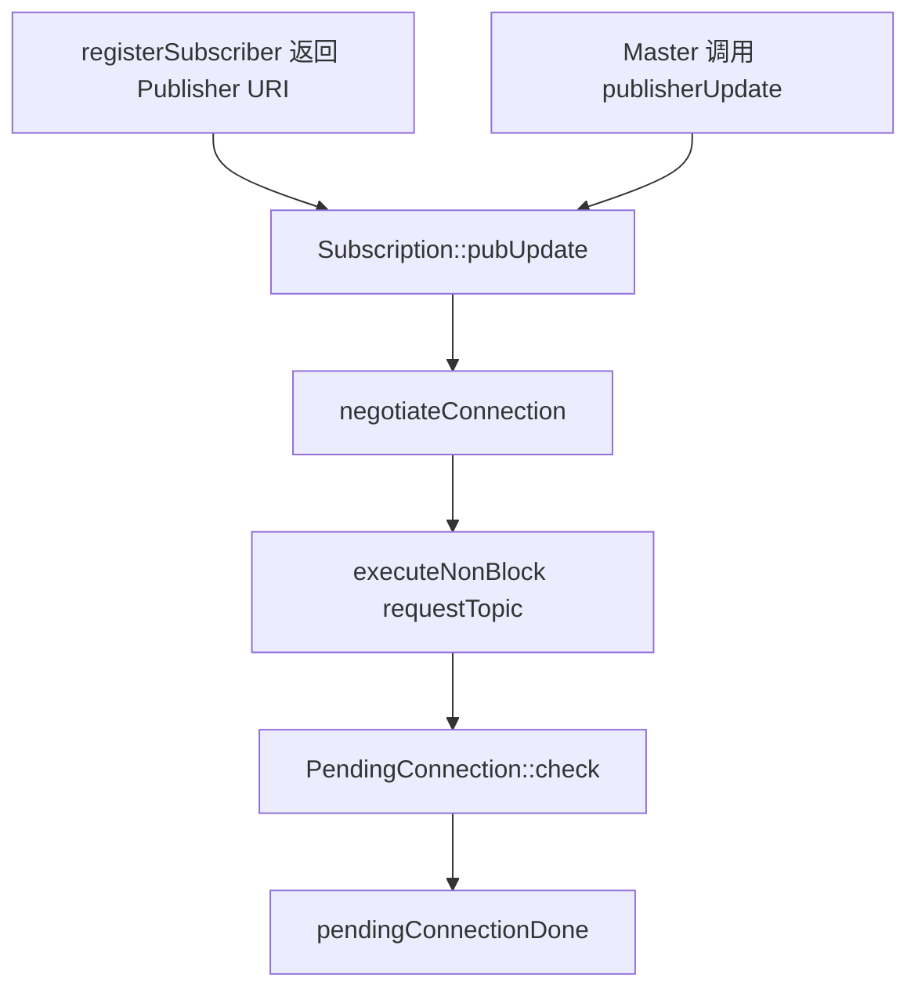

<meta name="referrer" content="no-referrer" />

# ROS教程08：从 TransportTCP::connect() 追到 TCPROS Connection Header、序列化与 Socket 数据传输

> 摘要：沿 ROS1 Noetic roscpp 的 TCPROS 数据面源码，追踪连接握手、Header 校验、消息序列化、发送队列、Socket 收发与接收侧组帧。


@[toc]
第 07 章已经完成 ROS1 Topic 的控制面与发现流程：Publisher/Subscriber 向 Master 注册，Subscriber 通过 `registerSubscriber` 返回值或 `publisherUpdate` 得到 Publisher Node API URI，再通过 `requestTopic` 与 Publisher 协商 TCPROS，最终进入：

```text
Subscription::pendingConnectionDone()
    ↓
TransportTCP::connect(pub_host, pub_port)
```

第 08 章从这里继续。为了避免 `pendingConnectionDone()` 像一个凭空出现的入口，本章先保留第 07 章到 TCPROS 数据面的最小桥接链：`Subscription::pubUpdate()` 怎样汇合两种发现路径、`requestTopic` 为什么是异步完成、以及 `PendingConnection::check()` 怎样最终进入 `pendingConnectionDone()`。Master/XML-RPC 的注册发现细节不再重复展开。随后只回答一个问题：

> **双方已经知道 TCPROS 地址以后，一条 ROS 消息怎样完成 TCP 建链、Connection Header 握手、序列化、Socket 发送、接收组帧，并最终进入 Subscriber 的消息处理链？**

当前实验仍使用：

```text
ros_ws/src/ros1_hello/src/hello_node.cpp
ros_ws/src/ros1_hello/src/hello_listener.cpp
ros_debug_ws/src/ros_comm
```

源码版本固定为 ROS1 Noetic `noetic-devel`。ROS1 Noetic 已于 2025-05-31 EOL，`ros/ros_comm` 上游仓库也已归档；本章讨论的是 Noetic 的实际实现，不把第三方 fork 的行为混入主线。

---

## 1. 从 `Subscription::pubUpdate()` 到 `pendingConnectionDone()`：先补齐 07→08 的异步桥接

第 07 章已经确认，Subscriber 得到 Publisher 的 Node XML-RPC URI 后，会进入：

```text
Subscription::pubUpdate()
    ↓
Subscription::negotiateConnection()
    ↓
requestTopic
```

但这里还需要补清两个问题：

1. `Subscription::pubUpdate()` 是谁调用到的？
2. `requestTopic` 发出以后，为什么最后会进入 `Subscription::pendingConnectionDone()`？

这两个问题决定了第 08 章的 TCPROS 入口是否连续。

### 1.1 `Subscription::pubUpdate()` 有两个入口，但最终汇合到同一个函数

Publisher 与 Subscriber 的启动顺序不同，第一次拿到 Publisher URI 的方式也不同。

**Publisher 已经先存在时**，Subscriber 调用 Master API：

```text
registerSubscriber(/chatter)
```

Master 的返回 payload 中已经包含当前 Publisher 的 **Node XML-RPC URI 列表**。`TopicManager::registerSubscriber()` 解析该列表后直接调用：

```cpp
s->pubUpdate(pub_uris);
```

因此第一条路径是：

```text
registerSubscriber 返回 Publisher URI
    ↓
Subscription::pubUpdate(pub_uris)
```

**Subscriber 已经先存在时**，后启动的 Publisher 执行 `registerPublisher()` 后，Master 会调用 Subscriber Node API：

```text
publisherUpdate
```

Subscriber 进程在 `TopicManager::start()` 阶段已经绑定该 XML-RPC 方法。调用进入：

```text
TopicManager::pubUpdateCallback()
    ↓
TopicManager::pubUpdate()
    ↓
找到 /chatter 对应的 Subscription
    ↓
Subscription::pubUpdate(pubs)
```

所以两种发现路径最终都汇入同一个 `Subscription::pubUpdate()`：



`Subscription::pubUpdate()` 的职责不是“处理 Master 消息”这么简单，而是：

> **把当前已知的 Publisher URI 集合与本地已有连接、待完成连接进行同步，决定哪些远端需要新增连接、哪些旧连接需要删除。**

因此它会得到类似：

```text
additions
subtractions
```

对新增 Publisher URI，再调用：

```cpp
negotiateConnection(xmlrpc_uri);
```

从这里才进入传输协议协商。

### 1.2 Master 返回的是 Publisher Node API URI，不是 TCPROS 数据端口

这一层最容易把三个网络入口混在一起：

| 入口 | 典型形式 | 谁提供 | 作用 |
| --- | --- | --- | --- |
| Master XML-RPC URI | `http://master-host:11311/` | `ROS_MASTER_URI` / Master | `registerPublisher`、`registerSubscriber` 等注册发现 |
| Publisher Node XML-RPC URI | `http://publisher-host:<xmlrpc-port>/` | Publisher `XMLRPCManager` | `requestTopic` 等 Node API |
| Publisher TCPROS host/port | `publisher-host:<tcpros-port>` | Publisher 对 `requestTopic` 的响应 | 真正建立 Topic TCP 数据连接 |

因此实际顺序不是：

```text
Master
    -> 直接把 TCPROS port 告诉 Subscriber
```

而是：

```text
Master
    -> 告诉 Subscriber：Publisher 的 Node XML-RPC URI 在哪里

Subscriber
    -> 直接调用 Publisher Node API.requestTopic

Publisher
    -> 返回 ["TCPROS", pub_host, pub_port]

Subscriber
    -> TransportTCP::connect(pub_host, pub_port)
```

Master 负责发现与联系信息，不进入后续 Topic payload 数据通路。

### 1.3 `requestTopic` 是异步完成的，`pendingConnectionDone()` 不是紧跟着同步调用

`Subscription::negotiateConnection()` 创建 XML-RPC client 后执行：

```cpp
c->executeNonBlock("requestTopic", params);
```

随后创建：

```text
PendingConnection
```

并交给：

```cpp
XMLRPCManager::instance()->addASyncConnection(conn);
```

这一步只是把异步请求加入 `XMLRPCManager` 管理，不会在当前调用栈中等待 Publisher 返回。

`XMLRPCManager::serverThreadFunc()` 后台线程会把异步连接加入自己的 dispatch，并在循环中执行：

```cpp
if ((*it)->check())
{
    removeASyncConnection(*it);
}
```

`PendingConnection::check()` 再检查：

```cpp
XmlRpc::XmlRpcValue result;

if (client_->executeCheckDone(result))
{
    parent->pendingConnectionDone(
        boost::dynamic_pointer_cast<PendingConnection>(shared_from_this()),
        result);
    return true;
}
```

因此真实调用顺序是：

```text
Subscription::pubUpdate()
    ↓
Subscription::negotiateConnection()
    ↓
XmlRpcClient::executeNonBlock("requestTopic")
    ↓
PendingConnection
    ↓
XMLRPCManager::addASyncConnection()
    ↓
XMLRPCManager::serverThreadFunc()
    ↓
PendingConnection::check()
    ↓
XmlRpcClient::executeCheckDone(result)
    ↓ requestTopic 已完成
Subscription::pendingConnectionDone(conn, result)
```

这里还有一个线程边界，而且 `pubUpdate()` 自身的执行线程取决于它从哪条入口到达：

```text
Publisher 已经存在：
registerSubscriber 返回 Publisher URI
    -> Subscription::pubUpdate()
    -> 运行在发起 subscribe/registerSubscriber 的调用线程

Subscriber 已经存在：
Master -> publisherUpdate
    -> TopicManager::pubUpdateCallback()
    -> Subscription::pubUpdate()
    -> 运行在 Subscriber 的 XMLRPCManager server thread

无论前面从哪条路径进入：
requestTopic 异步完成
    -> PendingConnection::check()
    -> Subscription::pendingConnectionDone()
    -> 由 XMLRPCManager server thread 进入
```

所以不能把：

```text
requestTopic
    -> pendingConnectionDone()
```

理解成普通同步函数调用。

### 1.4 `pendingConnectionDone()`：从控制面协商切换到 TCPROS 数据连接

对应源码：

```text
ros_comm/clients/roscpp/src/libros/subscription.cpp
```

`Subscription::pendingConnectionDone()` 首先验证 `requestTopic` 的 XML-RPC 返回值，并取出：

```cpp
std::string pub_host = proto[1];
int pub_port = proto[2];
```

随后才创建 TCPROS 所需对象：

```cpp
TransportTCPPtr transport(
    boost::make_shared<TransportTCP>(
        &PollManager::instance()->getPollSet()));

if (transport->connect(pub_host, pub_port))
{
    ConnectionPtr connection(
        boost::make_shared<Connection>());

    TransportPublisherLinkPtr pub_link(
        boost::make_shared<TransportPublisherLink>(
            shared_from_this(),
            xmlrpc_uri,
            transport_hints_));

    connection->initialize(
        transport,
        false,
        HeaderReceivedFunc());

    pub_link->initialize(connection);

    ConnectionManager::instance()->addConnection(connection);

    boost::mutex::scoped_lock lock(publisher_links_mutex_);
    addPublisherLink(pub_link);
}
```

因此 `pendingConnectionDone()` 可以看成一个明确的阶段边界：

```text
XML-RPC requestTopic 协商完成
    ↓
拿到 Publisher TCPROS host/port
    ↓
创建 TransportTCP / Connection / TransportPublisherLink
    ↓
开始真正的 TCPROS 数据面建链
```

这里第一次同时出现三个关键对象：

```text
TransportTCP
Connection
TransportPublisherLink
```

它们不是同一层。

| 对象 | 当前职责 |
| --- | --- |
| `TransportTCP` | 直接封装 TCP socket、`connect/recv/send`、PollSet 读写事件 |
| `Connection` | 在 Transport 之上提供定长异步 read/write、Connection Header 读写和 drop 生命周期 |
| `TransportPublisherLink` | Subscriber 进程中“指向远端 Publisher”的 Topic 连接对象 |

这里有一个容易读反的命名规则：

```text
Subscriber 进程
    -> TransportPublisherLink
       表示“当前 Link 的远端是 Publisher”

Publisher 进程
    -> TransportSubscriberLink
       表示“当前 Link 的远端是 Subscriber”
```

因此 `TransportPublisherLink` 并不运行在 Publisher 进程里；它运行在 Subscriber 这一侧。

---

## 2. `TransportTCP::connect()`：先建立 non-blocking socket，再交给 PollSet

源码：

```text
ros_comm/clients/roscpp/src/libros/transport/transport_tcp.cpp
```

`TransportTCP::connect()` 的主干可以压缩为：

```cpp
sock_ = socket(..., SOCK_STREAM, 0);

setNonBlocking();

// 解析 host -> sockaddr
...

int ret = ::connect(sock_, (sockaddr*)&sas, sas_len);

if (连接失败且不是 EINPROGRESS/平台等价状态)
{
    close();
    return false;
}

if (!initializeSocket())
{
    return false;
}

return true;
```

### 2.1 为什么 `connect()` 返回 true 时 TCP 可能仍在连接

当前 `TransportTCP` 默认不是同步模式：

```text
SYNCHRONOUS flag 未设置
```

socket 已经被设置成 non-blocking，因此 Linux 上：

```cpp
::connect(...)
```

可能返回：

```text
0
    -> 已立即完成连接

-1 + errno == EINPROGRESS
    -> 异步连接正在进行
```

roscpp 把第二种情况也视为“连接流程已成功启动”。后续第一次 `read()` 或 `write()` 时，`TransportTCP` 会再次检查异步连接是否真正完成。

所以：

```text
TransportTCP::connect() == true
```

不能机械理解成：

```text
TCP 三次握手此刻已经百分之百完成
```

更准确的含义是：

```text
socket 已创建
    +
连接请求已正常发起
    +
该 socket 已进入 roscpp 的异步 I/O 管理
```

### 2.2 `TransportTCP` 为什么要持有 `PollSet*`

创建对象时已经传入：

```cpp
&PollManager::instance()->getPollSet()
```

因此当前 TCP socket 后续可以注册到 roscpp 的 PollSet 中。

上一章已经确认 Poll 线程循环调用：

```text
poll_signal_()
    ↓
poll_set_.update(100)
```

当 socket 变成：

```text
可读
可写
异常
断开
```

PollSet 再通过 `TransportTCP::socketUpdate()` 触发 Transport 层回调。

因此 TCPROS 并不是给每条 Topic TCP 连接创建一个“永久阻塞在 `recv()` 上的独立线程”。Noetic roscpp 的核心网络 I/O 由 `PollManager/PollSet` 驱动。

---

## 3. `Connection::initialize()`：把 Transport 的事件转换成 Connection 的 read/write 状态机

Subscriber 侧创建 `Connection` 后执行：

```cpp
connection->initialize(
    transport,
    false,
    HeaderReceivedFunc());
```

源码：

```text
ros_comm/clients/roscpp/src/libros/connection.cpp
```

核心实现：

```cpp
void Connection::initialize(
    const TransportPtr& transport,
    bool is_server,
    const HeaderReceivedFunc& header_func)
{
    transport_ = transport;
    header_func_ = header_func;
    is_server_ = is_server;

    transport_->setReadCallback(
        boost::bind(&Connection::onReadable, this, _1));

    transport_->setWriteCallback(
        boost::bind(&Connection::onWriteable, this, _1));

    transport_->setDisconnectCallback(
        boost::bind(&Connection::onDisconnect, this, _1));

    if (header_func)
    {
        read(4, ... onHeaderLengthRead ...);
    }
}
```

Subscriber 侧这里传入：

```cpp
is_server = false
header_func = 空
```

因此 `Connection::initialize()` 此时不会立即等待远端 Header。

真正的 Header 握手由下一步：

```cpp
pub_link->initialize(connection);
```

发起。

### `Connection` 解决了 Transport 层没有解决的问题

`TransportTCP::read()` 本质上只是：

```cpp
::recv(sock_, ...)
```

一次 `recv()` 并不能保证把应用层想要的 N 字节一次全部读完。

TCP 是字节流。即使发送端一次 `send()` 了 100 字节，接收端也可能经历：

```text
recv() -> 24 bytes
recv() -> 40 bytes
recv() -> 36 bytes
```

`Connection::read(size, callback)` 在这一层维护：

```text
read_size_
read_filled_
read_buffer_
read_callback_
```

只有累计到目标 `size` 后，才调用上层 callback。

写方向同理：

```text
write_size_
write_sent_
write_buffer_
write_callback_
```

所以 `Connection` 是非常关键的一层：

> `TransportTCP` 面向“socket 本次能读写多少”；`Connection` 面向“上层要求完整读写多少字节”。

---

## 4. `TransportPublisherLink::initialize()`：Subscriber 先发送 TCPROS Connection Header

源码：

```text
ros_comm/clients/roscpp/src/libros/transport_publisher_link.cpp
```

核心代码：

```cpp
bool TransportPublisherLink::initialize(
    const ConnectionPtr& connection)
{
    connection_ = connection;

    dropped_conn_ = connection_->addDropListener(...);

    if (connection_->getTransport()->requiresHeader())
    {
        connection_->setHeaderReceivedCallback(
            boost::bind(
                &TransportPublisherLink::onHeaderReceived,
                this,
                _1,
                _2));

        SubscriptionPtr parent = parent_.lock();
        if (!parent)
        {
            return false;
        }

        M_string header;
        header["topic"] = parent->getName();
        header["md5sum"] = parent->md5sum();
        header["callerid"] = this_node::getName();
        header["type"] = parent->datatype();
        header["tcp_nodelay"] =
            transport_hints_.getTCPNoDelay() ? "1" : "0";

        connection_->writeHeader(header, ...);
    }

    return true;
}
```

Subscriber 发给 Publisher 的 Topic TCPROS Header 至少包含当前这些字段：

| 字段 | 当前 `/chatter` 中的意义 |
| --- | --- |
| `topic` | `/chatter` |
| `md5sum` | Subscriber 期望的消息 MD5 |
| `callerid` | 例如 `/hello_listener` |
| `type` | `std_msgs/String` |
| `tcp_nodelay` | 是否请求 Publisher 对该 TCP socket 设置 `TCP_NODELAY` |

这里需要注意：

```text
requestTopic
```

只完成：

```text
传输协议 + TCP 地址协商
```

真正的数据类型兼容性检查并不靠 Master 完成，而是在 TCP socket 建立以后，通过 Connection Header 再校验。

---

## 5. Connection Header 在 TCP 流中到底长什么样

`Connection::writeHeader()` 先调用：

```cpp
Header::write(key_vals, buffer, len);
```

随后又额外分配：

```cpp
uint32_t msg_len = len + 4;
boost::shared_array<uint8_t> full_msg(new uint8_t[msg_len]);

memcpy(full_msg.get() + 4, buffer.get(), len);
*((uint32_t*)full_msg.get()) = len;
```

因此整个 TCPROS Connection Header 外层是：

```text
+----------------------------+
| uint32 total_header_length |
+----------------------------+
| field 1                    |
+----------------------------+
| field 2                    |
+----------------------------+
| ...                        |
+----------------------------+
```

而 `Header::write()` 内部每个字段又编码成：

```text
+---------------------+
| uint32 field_length |
+---------------------+
| "key=value" bytes   |
+---------------------+
```

所以完整结构是：

```text
uint32 total_header_length

    uint32 field_1_length
    "callerid=/hello_listener"

    uint32 field_2_length
    "md5sum=..."

    uint32 field_3_length
    "tcp_nodelay=0"

    uint32 field_4_length
    "topic=/chatter"

    uint32 field_5_length
    "type=std_msgs/String"
```

字段来自 `M_string`，在 roscpp 中本质是字符串 map。理解协议时不要依赖“某个字段一定排第几个”；应该按 `key=value` 语义解析。

更重要的是，Connection Header 本身还不是 ROS message payload。此时双方只是在确认：

```text
对端 callerid 是什么？
请求的是哪个 Topic？
消息类型/MD5 是否兼容？
连接属性是什么？
```

---

## 6. Publisher 接受 TCP socket：`ConnectionManager` 创建 server-side `Connection`

Publisher 进程早在 `ros::start()` 阶段已经执行：

```text
ConnectionManager::start()
    ↓
TransportTCP::listen(...)
```

当 Subscriber 的 TCP 连接到来后：

```cpp
ConnectionManager::tcprosAcceptConnection(
    const TransportTCPPtr& transport)
{
    ConnectionPtr conn(
        boost::make_shared<Connection>());

    addConnection(conn);

    conn->initialize(
        transport,
        true,
        boost::bind(
            &ConnectionManager::onConnectionHeaderReceived,
            this,
            _1,
            _2));
}
```

这次：

```cpp
is_server = true
header_func = onConnectionHeaderReceived
```

因此 `Connection::initialize()` 会立刻执行：

```cpp
read(4, ... onHeaderLengthRead ...);
```

也就是先读 Subscriber Header 最前面的：

```text
4-byte total_header_length
```

然后：

```text
onHeaderLengthRead()
    ↓
再 read(header_length)
    ↓
onHeaderRead()
    ↓
Header::parse()
```

这已经形成一个很典型的网络协议解析模式：

```text
先读定长帧头
    ↓
得到后续长度
    ↓
再读指定长度 body
    ↓
解析 body
```

这个模式与很多 MCU/UART/TCP 自定义协议的“长度字段 + payload”非常接近，只是这里的 Transport 是 TCP 字节流。

---

## 7. Publisher 收到 Header 后，为什么会创建 `TransportSubscriberLink`

`Connection::onHeaderRead()` 解析成功后执行：

```cpp
transport_->parseHeader(header_);
header_func_(conn, header_);
```

Publisher 侧的 `header_func_` 就是：

```text
ConnectionManager::onConnectionHeaderReceived()
```

它根据 Header 中的字段区分 Topic 与 Service：

```cpp
if (header.getValue("topic", val))
{
    TransportSubscriberLinkPtr sub_link(
        boost::make_shared<TransportSubscriberLink>());

    sub_link->initialize(conn);
    ret = sub_link->handleHeader(header);
}
else if (header.getValue("service", val))
{
    // ServiceClientLink
}
```

因此同一个 TCPROS 监听入口接到 TCP 连接以后，要先看 Connection Header 才知道：

```text
这是 Topic Subscriber 连接
```

还是：

```text
这是 Service TCP 连接
```

本章只继续 Topic 分支。


上图最重要的边界是：

1. `requestTopic` 已经结束，Master 与 XML-RPC 不再参与当前 TCP payload；
2. Subscriber 主动建立 TCP 连接，并先发 Topic Connection Header；
3. Publisher 收到 Header 后才创建 `TransportSubscriberLink`；
4. Publisher 校验成功后再回自己的 Header；
5. Subscriber 收到 Publisher Header 后才进入持续读取消息长度的状态。

---

## 8. `TransportSubscriberLink::handleHeader()`：真正检查 Topic 与消息兼容性

Publisher 侧源码：

```text
ros_comm/clients/roscpp/src/libros/transport_subscriber_link.cpp
```

首先取出：

```cpp
std::string topic;
if (!header.getValue("topic", topic))
{
    connection_->sendHeaderError(...);
    return false;
}
```

再寻找本进程对应的 `Publication`：

```cpp
PublicationPtr pt =
    TopicManager::instance()->lookupPublication(topic);
```

如果 Publisher 已经不再发布该 Topic：

```text
lookupPublication() -> null
```

当前 TCP 连接不能继续。

随后：

```cpp
if (!pt->validateHeader(header, error_msg))
{
    connection_->sendHeaderError(error_msg);
    return false;
}
```

`Publication::validateHeader()` 至少要求：

```text
md5sum
topic
callerid
```

并检查 Publisher 与 Subscriber 的 MD5 是否兼容。普通强类型 Topic 中，如果双方 MD5 不一致，就会拒绝连接，而不是“先收下来再尝试解析”。

这解释了 ROS1 中很常见的一类错误：

```text
Topic 名字相同
    ≠
一定能建立数据连接
```

消息契约还包括：

```text
datatype / md5sum
```

其中真正用于兼容性校验的关键标识是 MD5。

---

## 9. Publisher 回 Header，同时 `tcp_nodelay` 在哪里真正生效

校验通过后，Publisher 构造返回 Header：

```cpp
M_string m;

m["type"] = pt->getDataType();
m["md5sum"] = pt->getMD5Sum();
m["message_definition"] = pt->getMessageDefinition();
m["callerid"] = this_node::getName();
m["latching"] = pt->isLatching() ? "1" : "0";
m["topic"] = topic_;

connection_->writeHeader(m, ...);
pt->addSubscriberLink(shared_from_this());
```

Subscriber 随后收到 Publisher Header，并进入：

```text
TransportPublisherLink::onHeaderReceived()
    ↓
PublisherLink::setHeader()
    ↓
记录 callerid / md5sum / latching
    ↓
Subscription::headerReceived()
    ↓
connection_->read(4, onMessageLength)
```

到这里 Connection Header 握手才真正结束。

### `tcp_nodelay` 为什么是 Subscriber 请求、Publisher socket 执行

Subscriber 发出的 Header 中：

```cpp
header["tcp_nodelay"] =
    transport_hints_.getTCPNoDelay() ? "1" : "0";
```

Publisher 侧 `Connection::onHeaderRead()` 会先执行：

```cpp
transport_->parseHeader(header_);
```

对于 `TransportTCP`：

```cpp
void TransportTCP::parseHeader(const Header& header)
{
    std::string nodelay;

    if (header.getValue("tcp_nodelay", nodelay) &&
        nodelay == "1")
    {
        setNoDelay(true);
    }
}
```

最终：

```cpp
setsockopt(
    sock_,
    IPPROTO_TCP,
    TCP_NODELAY,
    ...);
```

因此：

```text
ros::TransportHints().tcpNoDelay()
```

不是抽象的 ROS 调度参数。它最终会影响对应 TCP socket 的 `TCP_NODELAY` 选项。

Nagle 算法的目标是减少大量小 TCP segment：当连接上已经存在尚未确认的数据时，新的小数据可以被暂存，等待 ACK 或更多数据到来后再发送，从而提高网络利用率。Linux `tcp(7)` 对 `TCP_NODELAY` 的定义则很直接：设置后禁用 Nagle，使少量数据也尽可能及时发送。

两者关系可以压缩成：

```text
默认 TCP 行为
    -> 允许 Nagle
    -> 倾向减少小包
    -> 某些“小消息 + 低延迟”场景可能增加等待

TCP_NODELAY = 1
    -> 禁用 Nagle
    -> 小数据倾向尽快发送
    -> 可能增加小 TCP segment 数量与协议处理开销
```

`TransportHints::tcpNoDelay()` 的形参默认值是 `true`，但一个普通默认构造的 `TransportHints` 并没有设置 `tcp_nodelay` 选项，`getTCPNoDelay()` 会返回 `false`。也就是说：**调用 `.tcpNoDelay()` 时默认请求开启，但 roscpp 并不是默认对所有 Topic 连接开启 `TCP_NODELAY`。**

另外，`TCP_NODELAY` 只改变 TCP 小数据发送策略，不改变 TCP 是字节流协议这一事实，也不保证“一条 ROS message 对应一个 TCP packet”。具体使用场景与工程取舍放在后文单独收敛。

---

## 10. Header 握手完成后，TCPROS 数据帧变成“4 字节消息长度 + 序列化消息”

Subscriber 侧握手完成后：

```cpp
connection_->read(
    4,
    boost::bind(
        &TransportPublisherLink::onMessageLength,
        this,
        _1,
        _2,
        _3,
        _4));
```

`onMessageLength()`：

```cpp
uint32_t len = *((uint32_t*)buffer.get());

connection_->read(
    len,
    boost::bind(
        &TransportPublisherLink::onMessage,
        this,
        _1,
        _2,
        _3,
        _4));
```

消息读取形成固定循环：

```text
read(4)
    ↓
得到 message length = N
    ↓
read(N)
    ↓
onMessage()
    ↓
再次 read(4)
    ↓
下一条消息
```

这里必须把两个“4 字节长度”分开：

| 阶段 | 4 字节长度代表什么 |
| --- | --- |
| TCPROS Connection Header | 后续整个 Header body 的长度 |
| 正常 Topic message | 后续这一条 serialized message body 的长度 |

两者都采用长度前缀，但 body 的内部格式完全不同。

---

## 11. `serializeMessage()`：为什么 `SerializedMessage` 本身已经包含最外层 4 字节长度

第 07 章已经确认：

```text
Publisher::publish()
    ↓
TopicManager::publish()
    ↓
serfunc()
    ↓
Publication::publish()
```

本章继续进入：

```text
roscpp_serialization/serialization.h
```

核心模板：

```cpp
template<typename M>
inline SerializedMessage serializeMessage(const M& message)
{
    SerializedMessage m;

    uint32_t len = serializationLength(message);

    m.num_bytes = len + 4;
    m.buf.reset(new uint8_t[m.num_bytes]);

    OStream s(
        m.buf.get(),
        static_cast<uint32_t>(m.num_bytes));

    serialize(
        s,
        static_cast<uint32_t>(m.num_bytes) - 4);

    m.message_start = s.getData();

    serialize(s, message);

    return m;
}
```

所以跨进程 Topic 发送时，`SerializedMessage::buf` 并不是只包含 `.msg` 字段本身。

它已经是：

```text
+-----------------------+
| uint32 message_length |
+-----------------------+
| serialized message    |
+-----------------------+
```

这也解释了 Publisher 侧 `TransportSubscriberLink` 最终为什么可以直接：

```cpp
connection_->write(m.buf, m.num_bytes, ...);
```

不需要在发送前再额外拼一次消息长度。

---

## 12. `std_msgs/String` 的字节到底怎样排布

当前消息：

```text
std_msgs/String
```

定义只有：

```text
string data
```

生成的 `std_msgs::String` Serializer 最终会：

```text
stream.next(m.data)
```

而 `std::string` 的 roscpp serialization 规则是：

```text
uint32 string_length
string bytes
```

假设为了抓包观察，临时把 Publisher 的消息固定成：

```cpp
std_msgs::String msg;
msg.data = "abc";
publisher.publish(msg);
```

字符串 `abc` 的长度是 3，因此 `.msg` body 的序列化结果是 7 字节：

```text
03 00 00 00  61 62 63
|----------|  |------|
 string len      abc
```

在当前 x86_64 Ubuntu/Noetic 环境中，`uint32_t` 长度字段表现为小端字节序，因此 `3` 为：

```text
03 00 00 00
```

但 TCPROS 外层还要再加一层整条 ROS message body 的长度。

body 长度是：

```text
4 + 3 = 7 bytes
```

因此最终交给 `Connection::write()` 的完整 `SerializedMessage::buf` 是：

```text
07 00 00 00  03 00 00 00  61 62 63
|----------|  |----------|  |------|
 message len    string len      abc
     7               3
```

这 11 个字节非常适合作为本章的抓包锚点。

### 为什么这里会出现两个长度字段

因为它们属于不同层：

```text
TCPROS message framing
    uint32 message_length = 7

std_msgs/String serialization
    uint32 string_length = 3
    "abc"
```

因此以后看到复杂消息时，不要把：

```text
TCPROS frame length
```

和：

```text
数组/string 字段自己的 length
```

混为一谈。

这和嵌入式协议中：

```text
帧长度
    +
payload 内部数组长度
```

是同一个分层思想。

---

## 13. `Publication::publish_queue_` 与 `TransportSubscriberLink::outbox_` 不是同一条队列

第 07 章已经看到：

```text
Publisher::publish()
    ↓
TopicManager::publish()
    ↓
Publication::publish()
    ↓
publish_queue_
```

Poll 线程随后执行：

```text
TopicManager::processPublishQueues()
    ↓
Publication::processPublishQueue()
    ↓
Publication::enqueueMessage()
    ↓
每个 SubscriberLink::enqueueMessage()
```

到了 `TransportSubscriberLink::enqueueMessage()`，又出现第二层队列：

```cpp
boost::mutex::scoped_lock lock(outbox_mutex_);

int max_queue = 0;

if (PublicationPtr parent = parent_.lock())
{
    max_queue = parent->getMaxQueue();
}

if (max_queue > 0 &&
    static_cast<int>(outbox_.size()) >= max_queue)
{
    outbox_.pop();
    queue_full_ = true;
}
else
{
    queue_full_ = false;
}

outbox_.push(m);
```

所以 Publisher 数据面至少要区分：

```text
Publication::publish_queue_
    -> 从 publish 调用侧移交到 Poll 线程的待分发消息

TransportSubscriberLink::outbox_
    -> 针对某一个远端 Subscriber 的待发送消息
```

第二条尤其重要。

如果一个 Publisher 同时连接：

```text
Subscriber A：网络正常
Subscriber B：网络很慢
```

每个远端 Subscriber 都有自己的 `TransportSubscriberLink`，也就有自己的 `outbox_` 状态。

### Publisher 的 `queue_size=10` 在跨进程发送路径中约束什么

当前代码：

```cpp
nh.advertise<std_msgs::String>("chatter", 10);
```

`10` 被存进 `Publication::max_queue_`，`TransportSubscriberLink` 再通过：

```cpp
parent->getMaxQueue()
```

取得它。

当某个 Subscriber 的发送 `outbox_` 已经达到上限时：

```text
丢弃最旧的一条
    ↓
加入最新的一条
```

因此这里的 `queue_size` 不是：

```text
Linux TCP send buffer = 10 bytes
```

也不是：

```text
整个 ROS 系统最多缓存 10 条消息
```

它是 roscpp Publisher 针对 Subscriber 发送积压所使用的消息队列上限。

这与 Subscriber 端：

```cpp
nh.subscribe("chatter", 10, chatterCallback);
```

的 `10` 也不是同一条队列。

Subscriber 的 `queue_size` 对应：

```text
SubscriptionQueue
```

也就是消息已经从网络收到以后，等待业务 callback 消费时的队列容量。

所以至少要区分：

| 位置 | 队列 | 慢在什么地方会积压 |
| --- | --- | --- |
| Publisher 内部 | `Publication::publish_queue_` | publish 侧到 Poll 分发侧 |
| Publisher -> 某 Subscriber | `TransportSubscriberLink::outbox_` | 网络发送/远端接收跟不上 |
| Subscriber 业务侧 | `SubscriptionQueue` | callback 处理跟不上 |

第 09 章会继续专门处理第三条队列与 Spinner/线程模型；本章只需要把网络发送队列边界建立清楚。

---

## 14. `startMessageWrite()`：一条消息怎样从 outbox 交给 `Connection`

`TransportSubscriberLink::enqueueMessage()` 把消息加入 `outbox_` 后会触发发送。

核心函数：

```cpp
void TransportSubscriberLink::startMessageWrite(
    bool immediate_write)
{
    SerializedMessage m;

    {
        boost::mutex::scoped_lock lock(outbox_mutex_);

        if (writing_message_ || !header_written_)
        {
            return;
        }

        if (!outbox_.empty())
        {
            writing_message_ = true;
            m = outbox_.front();
            outbox_.pop();
        }
    }

    if (m.num_bytes > 0)
    {
        connection_->write(
            m.buf,
            m.num_bytes,
            boost::bind(
                &TransportSubscriberLink::onMessageWritten,
                this,
                _1),
            immediate_write);
    }
}
```

这里有两个重要门槛：

```text
header_written_ == true
```

说明 TCPROS Connection Header 还没回给 Subscriber 之前，不会开始正常消息发送。

以及：

```text
writing_message_ == false
```

说明同一个 `Connection` 不会同时挂多次独立 write 操作。

上一条发送完成后：

```text
Connection write finished
    ↓
TransportSubscriberLink::onMessageWritten()
    ↓
writing_message_ = false
    ↓
startMessageWrite(true)
    ↓
继续下一条 outbox message
```

于是每条 TCPROS 连接形成一个串行发送状态机。

---

## 15. `Connection::write()`：为什么一次 `send()` 不完整也不会破坏消息

`Connection::write()` 不是直接假设：

```text
send(buffer, size) 一次就一定写完 size 字节
```

它先保存：

```cpp
write_buffer_ = buffer;
write_size_ = size;
write_sent_ = 0;
has_write_callback_ = 1;
```

然后：

```cpp
transport_->enableWrite();
```

如果允许立即发送，还会先执行一次：

```cpp
writeTransport();
```

`Connection::writeTransport()` 中：

```cpp
uint32_t to_write =
    write_size_ - write_sent_;

int32_t bytes_sent =
    transport_->write(
        write_buffer_.get() + write_sent_,
        to_write);

write_sent_ += bytes_sent;
```

直到：

```text
write_sent_ == write_size_
```

才调用 write finished callback。

而最底层：

```cpp
TransportTCP::write(...)
```

最终就是：

```cpp
::send(sock_, ...)
```

如果 non-blocking socket 当前不能继续写：

```text
EAGAIN / EWOULDBLOCK
```

`TransportTCP::write()` 返回 0，不把这次情况当作永久错误关闭连接。

等 PollSet 再次报告 socket 可写：

```text
TransportTCP callback
    ↓
Connection::onWriteable()
    ↓
Connection::writeTransport()
```

继续从：

```text
write_sent_
```

的位置发送剩余字节。

因此：

> TCP 的 partial write 由 `Connection` 层吸收，上层 `TransportSubscriberLink` 看到的是“整条 SerializedMessage 什么时候写完”。

这和常见 MCU/Linux socket 驱动中维护：

```text
tx_buffer + tx_offset + remaining_length
```

本质完全一致。

---

## 16. Subscriber 接收：也是先读 4 字节，再按长度读完整 message body

Publisher 发送的 `SerializedMessage::buf` 是：

```text
uint32 message_length
serialized message body
```

Subscriber 侧 `TransportPublisherLink` 已经在握手完成时调用：

```cpp
connection_->read(4, onMessageLength);
```

当 4 字节收齐后：

```cpp
void TransportPublisherLink::onMessageLength(...)
{
    uint32_t len = *((uint32_t*)buffer.get());

    connection_->read(
        len,
        boost::bind(
            &TransportPublisherLink::onMessage,
            this,
            _1,
            _2,
            _3,
            _4));
}
```

消息 body 收齐后：

```cpp
void TransportPublisherLink::onMessage(...)
{
    if (success)
    {
        handleMessage(
            SerializedMessage(buffer, size),
            true,
            false);
    }

    connection_->read(4, ... onMessageLength ...);
}
```

这条逻辑有两个值得注意的点。

第一，Subscriber 收到 body 后创建的：

```cpp
SerializedMessage(buffer, size)
```

这里的 `buffer` 已经不再包含最外面的那 4 字节 TCPROS message length，因为那 4 字节在 `onMessageLength()` 阶段已经单独消费掉了。

第二，消息处理完成后立刻再次：

```cpp
read(4, ...)
```

为下一条 TCPROS message 等待长度。

因此 TCP 字节流虽然没有天然“消息边界”，roscpp 通过每条消息前面的 4 字节长度重新建立了 framing。

---

## 17. 从 `onMessage()` 到 `SubscriptionQueue`：反序列化为什么不是网络线程直接调用业务函数

`TransportPublisherLink::onMessage()` 最终进入父类/Subscription 的消息处理链：

```text
TransportPublisherLink::onMessage()
    ↓
PublisherLink::handleMessage()
    ↓
Subscription::handleMessage()
```

第 07 章已经看过 `Subscription::handleMessage()` 的后半段。本章只补上数据面的连接关系：

```text
TCP socket bytes
    ↓
Connection 定长 read
    ↓
TransportPublisherLink
    ↓
SerializedMessage
    ↓
MessageDeserializer
    ↓
SubscriptionQueue
    ↓
CallbackQueue
```

`Subscription::handleMessage()` 会创建或复用：

```text
MessageDeserializer
```

再把它放进：

```text
SubscriptionQueue
```

业务 callback 并不是在 `TransportTCP::read()` 或 `Connection::readTransport()` 里直接执行。

真正的：

```text
反序列化出 std_msgs::String 对象
    +
调用 chatterCallback()
```

会随着 `SubscriptionQueue` 被 Spinner 从 `CallbackQueue` 中取出而发生。

到这里应该明确分开：

```text
Poll/network 执行面
    -> 把完整消息收到并送入 callback 系统

Spinner 执行面
    -> 决定什么时候执行用户 callback
```

这也是下一章 `09：CallbackQueue、Spinner 与 roscpp 并发模型` 的正式入口。本章不继续展开 `MultiThreadedSpinner`、`AsyncSpinner` 和自定义 CallbackQueue。

---

## 18. 把完整数据面重新串起来

完成前面的源码主线后，可以把第 07 章末尾到当前消息入队的位置统一看成两阶段：

```text
阶段 1：TCPROS 建链
    requestTopic 已完成
    -> TCP connect
    -> Subscriber Header
    -> Publisher 校验
    -> Publisher Header
    -> 连接可传消息

阶段 2：持续消息传输
    publish
    -> serializeMessage
    -> Publisher queues
    -> Connection write
    -> TransportTCP::send
    -> TCP
    -> TransportTCP::recv
    -> Connection read
    -> 4-byte length + body
    -> SubscriptionQueue
```


这张图中要特别区分四层：

```text
ROS Topic 层
    Publication / Subscription

Topic 远端链路层
    TransportSubscriberLink / TransportPublisherLink

通用连接层
    Connection

实际传输层
    TransportTCP / socket
```

`Connection` 之所以值得单独理解，是因为它把 Topic 和底层 TCP 解耦：上层不需要自己处理 partial read/write、Connection Header 长度和 transport callback。

---

## 19. 用 tcpdump/Wireshark 把源码与 TCP 字节对应起来

源码已经说明了帧格式，下一步要让网络证据与代码对应。

当前 Docker 使用：

```text
network_mode: host
```

因此 ROS Node 与 Host 共用网络 namespace。抓包最直接的方式是在 Ubuntu Host 执行。

### 19.1 先确认 TCPROS 连接

启动：

```bash
roscore
rosrun ros1_hello hello_node
rosrun ros1_hello hello_listener
```

查看 listener：

```bash
rosnode info /hello_listener
```

再结合 Host：

```bash
ss -tnp
```

找到 `hello_node` 与 `hello_listener` 之间已建立的 TCPROS 连接和端口。

不要把：

```text
11311
```

当成 TCPROS port。`11311` 是 Master XML-RPC；Topic TCPROS 使用的是 `ConnectionManager` 的 TCP 监听端口。

### 19.2 捕获 TCPROS 流

假设已经确认 Publisher TCPROS port 为：

```text
TCPROS_PORT
```

Host 执行：

```bash
sudo tcpdump -i any -nn -s 0 \
    -w /tmp/ros08-tcpros.pcap \
    "tcp port TCPROS_PORT"
```

捕获几条消息后 Ctrl+C。

也可以直接查看十六进制：

```bash
sudo tcpdump -i any -nn -s 0 -X \
    "tcp port TCPROS_PORT"
```

其中 `TCPROS_PORT` 需要替换为实际数字，不能原样执行。

### 19.3 为了逐字节确认，临时把消息固定成 `abc`

在 `hello_node.cpp` 的实验分支中临时改成：

```cpp
std_msgs::String msg;
msg.data = "abc";
publisher.publish(msg);
```

重新构建并运行后，在 Wireshark 中对该 TCP 连接使用：

```text
Follow
-> TCP Stream
```

并切换到十六进制视图。

在 Connection Header 完成之后，正常消息 payload 中应能找到与下面结构一致的连续字节：

```text
07 00 00 00 03 00 00 00 61 62 63
```

对应：

```text
07 00 00 00
    TCPROS message body 长度 = 7

03 00 00 00
    std_msgs/String.data 长度 = 3

61 62 63
    ASCII "abc"
```

需要注意，TCP 是字节流协议：一个 ROS message 不保证对应一个单独 TCP packet。抓包时可能看到：

```text
一个 ROS frame 被 TCP 分段
```

或：

```text
多个小段在抓包显示中组合
```

因此判断 ROS message 边界应该依据 TCP 字节流中的长度字段，而不是依据“Wireshark 一行 packet 就是一条 ROS 消息”。

实验完成后恢复原来的 `hello_node.cpp` 消息构造逻辑并重新构建，避免把临时固定 payload 留在正式示例中。

---

## 20. `TCP_NODELAY` 的使用场景与工程选择

前面已经从源码确认：Subscriber 通过 `TransportHints().tcpNoDelay()` 把 `tcp_nodelay=1` 放入 TCPROS Connection Header，Publisher 收到后最终在对应 socket 上执行：

```text
setsockopt(..., TCP_NODELAY, ...)
```

因此问题不再是“这个选项有没有生效”，而是：**什么 Topic 值得用，什么 Topic 没必要用。**

### 20.1 判断依据不是“频率高不高”，而是延迟与吞吐目标

可以先用下面的工程维度判断：

| ROS Topic 场景 | 倾向 | 原因 |
| --- | --- | --- |
| `cmd_vel`、小型控制命令 | 倾向开启 | 单条消息较小，通常更关心最新命令尽快到达 |
| 控制回路中的 setpoint / 小型 feedback | 可考虑开启 | latency / jitter 往往比减少小包更重要，应结合实际周期测量 |
| 高频、小消息、明确 latency-sensitive | 可考虑开启 | Nagle 的等待可能成为额外延迟来源 |
| `Image`、`PointCloud2` 等大消息 | 通常保持默认 | payload 本身已较大，Nagle 通常不是主要瓶颈 |
| 普通日志、监控、低优先级 telemetry | 通常保持默认 | 没必要为潜在的微小延迟收益增加更多小包 |
| 带宽受限网络或大量小 Topic 并发 | 谨慎开启 | 小 segment 数量增加后，协议头、内核处理和网络负担可能上升 |

因此更实用的原则是：

> **控制链优先考虑 `tcpNoDelay()`；吞吐型数据链默认保持 TCP 默认行为。没有实际延迟问题时，不把 `TCP_NODELAY` 当成全局性能优化开关。**

### 20.2 `TCP_NODELAY` 解决不了 ROS 队列和 callback 阻塞

即使 TCP socket 已经关闭 Nagle，消息仍然可能在其它层产生延迟，例如：

```text
Publication::publish_queue_
TransportSubscriberLink::outbox_
Linux socket buffer
Subscriber SubscriptionQueue
CallbackQueue
业务 callback 阻塞
```

所以看到“Topic 延迟大”时不能直接推导：

```text
打开 TCP_NODELAY 就能解决
```

`TCP_NODELAY` 只针对 TCP 小数据发送策略；`queue_size`、发送积压、Subscriber 消息队列和 Spinner/业务线程属于不同层次。

### 20.3 抓包时不要用 packet 数量判断 ROS message 语义

开启 `TCP_NODELAY` 后，抓包中可能出现更多小 TCP segment，但不能据此建立：

```text
TCP_NODELAY = 1
    -> 一条 ROS message 必定对应一个 TCP packet
```

TCP 始终提供字节流。实际 packet/segment 的边界仍受 MSS、TCP 栈调度、拥塞控制、GSO/TSO/GRO 等因素影响。

分析 ROS message 边界仍应回到 TCPROS framing：

```text
4-byte message length
    +
serialized message body
```

如果要决定某个驱动 Topic 是否开启 `tcpNoDelay()`，真正有价值的指标是端到端 latency / jitter 与系统整体网络负载，而不是抓包中“包看起来更多还是更少”。

---

## 21. 与驱动开发的关系：Topic 数据面问题应该从哪一层开始判断

到了这一章，看到：

```bash
rostopic echo /sensor_data
```

没有输出时，问题已经不能只粗略归类成“ROS Topic 坏了”。

至少可以继续拆成：

```text
发现层是否完成？
    registerPublisher/registerSubscriber
    publisherUpdate/requestTopic

TCP 建链是否完成？
    TransportTCP::connect
    accept

Connection Header 是否通过？
    topic
    md5sum
    type
    callerid

Publisher 是否真的形成 SerializedMessage？
    serializeMessage

发送侧是否积压？
    Publication queue
    TransportSubscriberLink::outbox_

Socket 是否持续发送？
    Connection::writeTransport
    TransportTCP::write

Subscriber 是否成功组帧？
    onMessageLength
    onMessage

消息是否已经进入业务回调队列？
    Subscription::handleMessage
    SubscriptionQueue
```

这对 CAN/UART/Ethernet 驱动 Node 尤其重要。

例如设备线程已经正确读到 CAN 数据，但 ROS 上层偶发“旧数据”或“延迟越来越大”，不能只检查：

```text
CAN RX 是否正常
```

还要继续判断：

```text
驱动 publish 频率
Publisher queue
TCP 发送积压
Subscriber queue
callback 执行延迟
```

第 08 章建立的是网络数据面；第 09 章再继续进入 callback 执行面。两者拼起来后，才能完整分析：

```text
设备数据什么时候被读到
    ↓
什么时候 publish
    ↓
什么时候真正进入 TCP
    ↓
什么时候到达 Subscriber
    ↓
什么时候真正执行 callback
```

---

## 22. 本章源码主线

按下面顺序阅读即可：

```text
Subscription::pubUpdate()
    ↓
Subscription::negotiateConnection()
    ↓
XmlRpcClient::executeNonBlock("requestTopic")
    ↓
XMLRPCManager::serverThreadFunc()
    ↓
PendingConnection::check()
    ↓
Subscription::pendingConnectionDone()
    ↓
TransportTCP::connect()
    ↓
Connection::initialize()
    ↓
TransportPublisherLink::initialize()
    ↓
Connection::writeHeader()
    ↓
Header::write()

Publisher 侧 accept：
ConnectionManager::tcprosAcceptConnection()
    ↓
Connection::initialize(..., true, header_func)
    ↓
Connection::onHeaderLengthRead()
    ↓
Connection::onHeaderRead()
    ↓
ConnectionManager::onConnectionHeaderReceived()
    ↓
TransportSubscriberLink::handleHeader()
    ↓
Publication::validateHeader()
    ↓
Connection::writeHeader()

Subscriber 收 Publisher Header：
TransportPublisherLink::onHeaderReceived()
    ↓
PublisherLink::setHeader()
    ↓
Connection::read(4, onMessageLength)

发送数据：
serializeMessage()
    ↓
Publication / TransportSubscriberLink::outbox_
    ↓
TransportSubscriberLink::startMessageWrite()
    ↓
Connection::write()
    ↓
Connection::writeTransport()
    ↓
TransportTCP::write()
    ↓
send()

接收数据：
recv()
    ↓
TransportTCP::read()
    ↓
Connection::readTransport()
    ↓
TransportPublisherLink::onMessageLength()
    ↓
TransportPublisherLink::onMessage()
    ↓
Subscription::handleMessage()
    ↓
SubscriptionQueue
```

完成这条链以后，ROS1 Topic 已经从：

```text
API
```

一路追到：

```text
真实 TCP socket bytes
```

并重新回到 Subscriber 的消息队列。

下一章进入：

> **09：CallbackQueue、Spinner 与 roscpp 并发模型——从“消息已经入队”继续追到“哪个线程在什么时候真正执行 callback”。**

重点将不再重复 `spin()` 的基本作用，而是比较 `SingleThreadedSpinner`、`MultiThreadedSpinner`、`AsyncSpinner`、自定义 CallbackQueue，以及 callback 阻塞、共享状态、锁和驱动 I/O 线程之间的关系。

---

## 参考源码与资料

本章实现以 ROS1 Noetic `noetic-devel` 源码为主：

- `subscription.cpp`：`https://github.com/ros/ros_comm/blob/noetic-devel/clients/roscpp/src/libros/subscription.cpp`
- `connection_manager.cpp`：`https://github.com/ros/ros_comm/blob/noetic-devel/clients/roscpp/src/libros/connection_manager.cpp`
- `connection.cpp`：`https://github.com/ros/ros_comm/blob/noetic-devel/clients/roscpp/src/libros/connection.cpp`
- `transport_publisher_link.cpp`：`https://github.com/ros/ros_comm/blob/noetic-devel/clients/roscpp/src/libros/transport_publisher_link.cpp`
- `transport_subscriber_link.cpp`：`https://github.com/ros/ros_comm/blob/noetic-devel/clients/roscpp/src/libros/transport_subscriber_link.cpp`
- `transport_tcp.cpp`：`https://github.com/ros/ros_comm/blob/noetic-devel/clients/roscpp/src/libros/transport/transport_tcp.cpp`
- `publication.cpp`：`https://github.com/ros/ros_comm/blob/noetic-devel/clients/roscpp/src/libros/publication.cpp`
- `publisher_link.cpp`：`https://github.com/ros/ros_comm/blob/noetic-devel/clients/roscpp/src/libros/publisher_link.cpp`
- `header.cpp`：`https://github.com/ros/ros_comm/blob/noetic-devel/clients/roscpp/src/libros/header.cpp`
- roscpp_serialization `serialization.h`：`https://github.com/ros/roscpp_core/blob/noetic-devel/roscpp_serialization/include/ros/serialization.h`
- Noetic roscpp API：`https://docs.ros.org/en/noetic/api/roscpp/html/`
- Noetic `ros::TransportHints`：`https://docs.ros.org/en/noetic/api/roscpp/html/classros_1_1TransportHints.html`
- Linux `tcp(7)` / `TCP_NODELAY`：`https://man7.org/linux/man-pages/man7/tcp.7.html`
- RFC 896（Nagle 原始算法背景）：`https://www.rfc-editor.org/info/rfc896/`
- Noetic `std_msgs/String`：`https://docs.ros.org/en/noetic/api/std_msgs/html/msg/String.html`
- ROS1 Noetic EOL：`https://www.ros.org/blog/noetic-eol/`
