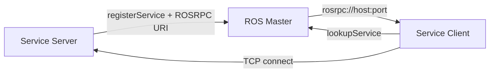
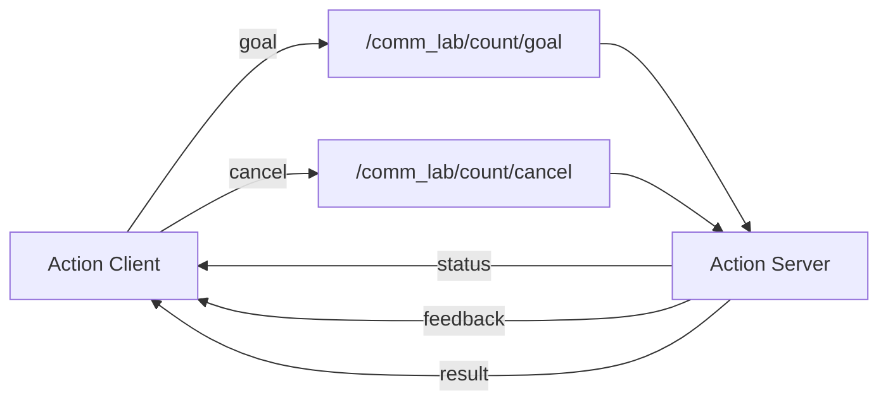
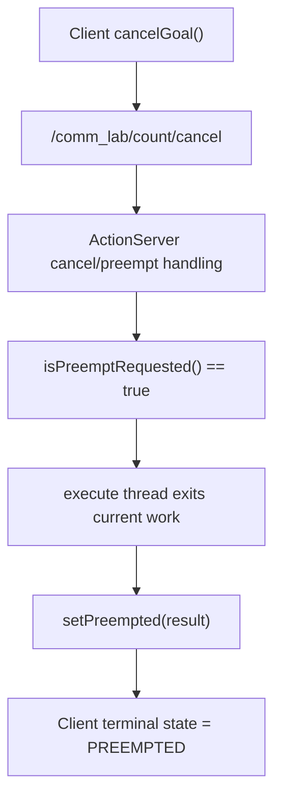

<meta name="referrer" content="no-referrer" />

# ROS教程11：从 Service 到 Action——同步请求响应、长任务、Feedback、Cancel 与 actionlib 状态机

> 摘要：沿 roscpp Service 与 actionlib 源码主线，解释请求响应、CallbackQueue、Action 五个 Topic、Feedback、Result、Cancel 与 Preempt 的真实执行边界。


@[toc]
第 10 章已经把 Topic Node 的运行机制转成了可重复验证证据：纯 C++ 逻辑使用 gtest，ROS Node 组合行为使用 rostest，rqt 用于观察，rosbag 用于固定输入。到这里，Topic 的控制面、TCPROS 数据面、CallbackQueue、Spinner 和测试闭环已经串起来。

阶段 11 不进入 CAN/UART Driver，而是先补齐 ROS1 中另外两种常用通信语义：Service 与 Action。

```text
Topic
    -> 持续数据流
    -> Publisher 不等待某个 Subscriber 给出“一次响应”

Service
    -> 一次 Request / 一次 Response
    -> Client::call() 可以同步阻塞等待结果

Action
    -> 长时间任务
    -> Goal + Feedback + Result + Cancel/Preempt
    -> 底层仍建立在 ROS Topic 之上
```

本章继续使用：

```text
ros_ws/src/ros1_comm_lab
```

新增：

```text
ros1_comm_lab/
├── srv/
│   └── TransformValue.srv
├── action/
│   └── Count.action
├── src/
│   ├── transform_service_server.cpp
│   ├── transform_service_client.cpp
│   ├── count_action_server.cpp
│   └── count_action_client.cpp
├── launch/
│   └── service_action_lab.launch
└── test/
    ├── service_action.test
    └── test_service_action.cpp
```

阶段 10 已有的 `MessageProcessor` 保持不变，并被 Service Server 直接复用。这样 Service 实验不会重新复制“乘法、加法、范围检查”逻辑，而是只负责 ROS 接口层。

> 当前交付环境没有实际连接用户的 `ros1-dev` Noetic Container，因此本文不会伪造 build/test 日志。所有运行命令都给出明确验收点，实际结果应在现有 Docker 环境中执行后回填。

---

## 0. 先把 `.msg`、`.srv`、`.action` 放到同一张接口地图里

第 03 章已经通过 `ros1_hello/msg/HelloStatus.msg` 实际创建过自定义 Topic 消息。阶段 11 再引入 `.srv` 和 `.action` 时，最重要的不是再记两个文件后缀，而是把下面两层概念彻底分开：

```text
接口描述
    -> 数据长什么样？
    -> 生成哪些 C++ / Python 类型？

通信语义
    -> 数据怎样交互？
    -> 单向流、请求响应，还是有生命周期的长任务？
```

### 0.1 `.msg`、`.srv`、`.action` 都可以看成 ROS 的 IDL 式接口描述

三者都承担类似 IDL 的职责：使用语言无关的文本声明跨 Node 交换的数据结构，再由 ROS 的生成工具产生 C++、Python 等语言绑定。

| 文件 | 基本结构 | 主要生成内容 | 上层通信语义 |
| --- | --- | --- | --- |
| `.msg` | 一组字段 | Message 类型 | Topic 的一条 payload |
| `.srv` | `Request --- Response` | Request / Response / Service 类型 | 一次请求、一次响应 |
| `.action` | `Goal --- Result --- Feedback` | Goal / Result / Feedback 以及 Action 包装类型 | 可反馈、可取消的长任务 |

因此 `.srv` 很像 RPC 系统里的 IDL，但这个类比只到“**描述请求/响应数据契约并生成代码**”这一层。它并不意味着 `.srv` 文件本身定义了一个 TCP 端口，也不意味着 Client 把 `.srv` 导入后就直接执行一个普通本地函数。

阶段 11 的 `TransformValue.srv`：

```srv
uint32 input
---
bool success
uint32 output
string message
```

可以先用函数形式帮助建立直觉：

```text
TransformValue(request) -> response
```

但更准确的数据结构是：

```text
Request:
    uint32 input

Response:
    bool success
    uint32 output
    string message
```

`---` 分隔线上方定义 Request，下方定义 Response。可以把它们暂时类比成“输入/输出”，但 ROS Service 更准确的术语是 Request/Response。这里定义的仍然只是**接口数据**。

### 0.2 `.srv` 不负责端口；真正把接口发布成 Service 的是 `advertiseService()`

Server 代码中的：

```cpp
service_ = nh_.advertiseService(
    service_name_,
    &TransformServiceServer::handleRequest,
    this);
```

才把 callback 注册成一个 ROS Service。本项目默认的 Service 名称是：

```text
/comm_lab/transform_value
```

这是 ROS graph 中的 **name**，不是应用手工指定的：

```text
TCP port 12345
```

应用层通常不需要给每个 Service 固定分配端口。可以把调用过程先理解成：

```text
TransformValue.srv
       │
       │ 描述 Request / Response
       ↓
生成 C++ 类型
       │
       ├── TransformValue::Request
       └── TransformValue::Response
                  │
                  ↓
advertiseService("/comm_lab/transform_value", ...)
                  │
                  ↓
           ROS Service Server
                  ↑
                  │
        client.call(service)
```

`client.call(service)` 从调用形式上很像远程函数调用，但运行时仍然要经过 ROS 的发现、连接和序列化传输：

```text
Client 填充 Request
    ↓
序列化 Request
    ↓
网络传输
    ↓
Server callback
    ↓
填充并序列化 Response
    ↓
网络传输
    ↓
Client 得到 Response
```

后面的 ServiceManager 源码分析会继续把这条简化链拆成 Master 注册/查询、ROSRPC 连接和 CallbackQueue。

### 0.3 `ros1_comm_lab::TransformValue` 为什么在源码树里找不到

Client 中有：

```cpp
#include <ros1_comm_lab/TransformValue.h>

ros1_comm_lab::TransformValue service;
```

这里的 `TransformValue` 不是本项目手写的 C++ class，所以在 `src/` 或 `include/` 下搜索不到定义是正常现象。它来自：

```text
srv/TransformValue.srv
```

经过 catkin/message generation 后产生的 C++ 代码。

构建之前，源码树里只有：

```text
ros1_comm_lab/
└── srv/
    └── TransformValue.srv
```

执行：

```bash
catkin build ros1_comm_lab
```

并 source 工作空间后，可以查找生成头文件：

```bash
find /workspace/ros_ws/devel -path '*/ros1_comm_lab/TransformValue.h' -print
```

在当前 merge-devel 配置下通常位于：

```text
/workspace/ros_ws/devel/include/ros1_comm_lab/TransformValue.h
```

如果使用 isolated devel，也可能出现在类似：

```text
devel/.private/ros1_comm_lab/include/ros1_comm_lab/TransformValue.h
```

生成代码的具体模板和辅助类型很多，但从使用者角度可以先把它理解成：

```cpp
TransformValueRequest
TransformValueResponse

TransformValue
{
    using Request = TransformValueRequest;
    using Response = TransformValueResponse;
};
```

上面只是帮助理解的结构化伪代码，不是生成头文件的逐字源码。于是：

```cpp
ros1_comm_lab::TransformValue service;
```

就可以先理解成一个 Service 调用容器：

```text
service
├── request
│   └── input
└── response
    ├── success
    ├── output
    └── message
```

所以 Client 才能写：

```cpp
service.request.input = input;

if (client.call(service))
{
    std::cout << service.response.output << std::endl;
}
```

第 03 章的：

```text
HelloStatus.msg -> ros1_hello/HelloStatus.h
```

和这里的：

```text
TransformValue.srv -> ros1_comm_lab/TransformValue.h
```

本质上是同一套“接口描述 → 代码生成”思路，只是生成对象和上层通信语义不同。

### 0.4 Topic 和 Service 的根本差别不是“有没有 IDL”

容易产生的误解是：

```text
Topic 要自己处理消息
Service 有 .srv，所以更像自动 RPC
```

实际上 Topic 一样有 `.msg`，Service 才有 `.srv`：

```text
Topic   -> .msg
Service -> .srv
Action  -> .action
```

三者都能把接口描述转换成语言类型，并让 ROS 基础设施处理相应的序列化/反序列化与类型协商。真正的区别在**通信语义**。

Topic 更接近异步数据流或事件模型：

```text
Publisher
   │
   ├──── message ────→ Subscriber A
   ├──── message ────→ Subscriber B
   └──── message ────→ Subscriber C
```

它表达的是：

```text
“这里产生了一条数据或事件，订阅者按需接收。”
```

因此很适合：

```text
/camera/image
/imu/data
/scan
/odom
/motor_state
```

从嵌入式视角看，ADC sample、CAN RX frame、IMU sample、encoder position 也更接近 Topic 数据流。

Service 则是一次明确的请求/响应：

```text
Client                         Server
   │                              │
   │ -------- Request ----------> │
   │                              │
   │       执行 callback          │
   │                              │
   │ <------- Response ---------- │
   │                              │
继续执行
```

它表达的是：

```text
“执行一次操作，并返回这次操作的结果。”
```

因此更适合：

```text
/reset
/get_version
/set_mode
/clear_fault
/query_device_info
```

所以 `.srv` 的价值并不是“比订阅发布少写传输代码”。`.msg` 同样让 Topic 用户不必自己维护一套 socket payload 编解码。二者首先是在表达不同的软件交互模型：

```text
Topic   = asynchronous stream / event model
Service = request / response model
```

### 0.5 `.srv` 是两段，`.action` 是三段，但 Action 还不止多一个 Feedback

`.srv` 的语法核心是：

```text
Request
---
Response
```

当前文件：

```srv
uint32 input
---
bool success
uint32 output
string message
```

`.action` 的语法核心是：

```text
Goal
---
Result
---
Feedback
```

本章 `Count.action`：

```action
uint32 target
---
bool completed
uint32 final_count
string message
---
uint32 current_count
float32 progress
```

因此可以先得到：

```text
Service
    Request
    Response

Action
    Goal
    Result
    Feedback
```

但如果只记成“Action = Service + Feedback”，仍然会漏掉 Action 最重要的一部分：

```text
Cancel / Preempt
Goal 生命周期
状态机
```

Service 的典型调用是：

```text
Request -------------------->
                             执行
Response <-------------------
```

Action 则允许：

```text
Goal ------------------------------->

        <------- Feedback 10% --------
        <------- Feedback 40% --------
        <------- Feedback 80% --------

Cancel ----------------------------->

        <------- Preempted -----------
```

也可以正常完成：

```text
Goal ------------------------------->

        <------- Feedback ------------
        <------- Feedback ------------

        <-------- Result -------------
```

所以更准确的关系是：

```text
Action
    = Goal
    + Feedback
    + Result
    + Cancel/Preempt
    + Goal 状态机
```

后文会进一步看到：ROS1 `actionlib` 甚至不是一种独立于 Topic 的底层传输协议，而是在 Topic 机制之上建立的一套长任务协议与状态机。

### 0.6 先用一个工程判断树建立选择直觉

可以先用下面的顺序判断：

```text
数据/事件是否持续产生？
    │
    ├── 是
    │    ↓
    │   Topic
    │   例如：IMU / Camera / CAN RX / 状态上报
    │
    └── 否
         │
         ↓
      是否是一次请求，并且能很快返回结果？
         │
         ├── 是
         │    ↓
         │   Service
         │   例如：reset / get_version / set_mode
         │
         └── 否
              │
              ↓
         是否是长时间任务，并且需要进度或取消？
              │
              ├── 是 → Action
              │        例如：move_to / home / calibrate
              │
              └── 否 → 重新检查是否应该建模成 Topic 或 Service
```

以电机/机械臂接口为例：

```text
电机当前位置
    -> Topic
    -> /motor/position

设置一次控制模式
    -> Service
    -> /motor/set_mode

机械臂移动到目标位置
    -> Action
    -> /arm/move_to
```

`move_to` 可能持续数秒甚至更久，因此任务过程中需要：

```text
Goal:
    target position

Feedback:
    current position / progress

Result:
    reached / failure reason

Cancel:
    中止当前目标
```

到这里先建立接口层心智模型。后续章节再分别深入 Service 的 ROSRPC/CallbackQueue，以及 Action 的五类 Topic 与 actionlib 状态机。

---

## 1. 先定义 Service：为什么业务失败不应该和传输失败混成一个 bool

文件：

```text
srv/TransformValue.srv
```

内容：

```text
uint32 input
---
bool success
uint32 output
string message
```

ROS `.srv` 使用：

```text
Request
---
Response
```

分隔。

当前 Service 的请求只有：

```text
input
```

响应明确区分：

```text
success
    -> 业务处理是否接受输入

output
    -> 业务结果

message
    -> 失败或成功说明
```

这个设计是故意的。

roscpp Service callback 本身也返回一个 `bool`：

```cpp
bool callback(Request& req, Response& res)
```

但这一层 `bool` 更接近“这次 Service 请求是否正常生成了一份 Response”。如果业务输入 `101` 超过 `max_input=100`，当前实验没有让 callback 返回 `false`，而是：

```cpp
response.success = false;
response.output = 0;
response.message = "input violates processor constraints";
return true;
```

这样 Client 可以区分：

```text
client.call(...) == false
    -> Service 连接、调用或服务端处理链没有正常得到 Response

client.call(...) == true
response.success == false
    -> ROS Service 调用本身完成
    -> 业务规则拒绝当前输入
```

以后真正的 Driver Service，例如：

```text
reset_device
set_mode
save_config
clear_fault
```

也经常需要区分：

```text
RPC/Transport 失败
```

和：

```text
设备明确返回“拒绝执行”
```

这两个错误层不要混成一个状态。

---

## 2. `.srv` 和 `.action` 为什么会改变 CMake/package 依赖

阶段 03 已经在 `ros1_hello` 中通过 `HelloStatus.msg` 生成过自定义 Topic 消息。阶段 09、10 的 `ros1_comm_lab` 仍只使用现成的：

```text
std_msgs/UInt32
```

阶段 11 则第一次在 `ros1_comm_lab` 自己生成 Service 与 Action 接口代码。

CMake 需要加入：

```cmake
add_service_files(
  FILES
    TransformValue.srv
)

add_action_files(
  FILES
    Count.action
)

generate_messages(
  DEPENDENCIES
    actionlib_msgs
    std_msgs
)
```

同时 `find_package(catkin REQUIRED COMPONENTS ...)` 增加：

```text
actionlib
actionlib_msgs
message_generation
```

而 `catkin_package(CATKIN_DEPENDS ...)` 需要把生成接口的运行/导出依赖暴露出去：

```text
actionlib
actionlib_msgs
message_runtime
```

对于 package format 2，`package.xml` 中的生成接口依赖至少要对应为：

```xml
<build_depend>message_generation</build_depend>
<build_export_depend>message_runtime</build_export_depend>
<exec_depend>message_runtime</exec_depend>
```

其中 `message_generation` 只在构建时生成代码；`message_runtime` 既要能被依赖本 package 接口的下游 package 在构建导出阶段看到，也要在运行环境中存在。

这条构建链应该理解成：

```text
TransformValue.srv
Count.action
        ↓
message_generation
        ↓
生成 C++ header / traits / message 类型
        ↓
ros1_comm_lab/TransformValue.h
ros1_comm_lab/CountAction.h
        ↓
业务 C++ target 才能 include
```

第 0.3 节已经用 `TransformValue.h` 展示了“接口描述 → 生成 C++ 类型”的结果。这里关注构建系统必须保证的**先后关系**：使用生成头文件的 C++ target 不能抢在 message generation 之前编译。

所以凡是 include 自己生成接口的 executable，都应该显式依赖：

```cmake
${${PROJECT_NAME}_EXPORTED_TARGETS}
${catkin_EXPORTED_TARGETS}
```

否则并行构建中可能出现：

```text
C++ target 已经开始编译
    ↓
生成 header 还没准备好
```

当前项目已经把上述生成接口依赖直接合并到真实 `CMakeLists.txt` 与 `package.xml`，并保留阶段 09/10 现有 target。新增 Service/Action executable 和阶段 11 rostest 都显式依赖 `${${PROJECT_NAME}_EXPORTED_TARGETS}` 与 `${catkin_EXPORTED_TARGETS}`，避免并行构建时生成 header 尚未完成。

---

## 3. Service Server：API 层只有 `advertiseService()`，背后仍然进入 ServiceManager

Server 的主入口：

```cpp
service_ = nh_.advertiseService(
    service_name_,
    &TransformServiceServer::handleRequest,
    this);
```

业务 callback：

```cpp
bool handleRequest(
    TransformValue::Request& request,
    TransformValue::Response& response)
```

当前 Node 最终仍然是：

```cpp
ros::spin();
```

所以第一条关键结论是：

> Service callback 不是一个脱离 CallbackQueue/Spinner 的特殊执行世界。

`AdvertiseServiceOptions` 本身具有：

```text
callback_queue
```

没有指定时使用 global CallbackQueue。

因此当前 Server 的用户 callback 仍然需要：

```text
请求到达
    ↓
ServicePublication 准备 callback 工作
    ↓
global CallbackQueue
    ↓
ros::spin()
    ↓
handleRequest()
```

阶段 09 学过的“Spinner worker 数量”和“callback 阻塞”仍然成立。

---

## 4. `ServiceManager::advertiseService()`：Master 中登记的不是 Node XML-RPC URI

沿 Noetic roscpp 源码继续：

```text
NodeHandle::advertiseService()
    ↓
ServiceManager::advertiseService()
```

源码：

```text
ros_comm/clients/roscpp/src/libros/service_manager.cpp
```

`ServiceManager::advertiseService()` 创建 `ServicePublication` 后，会构造：

```text
rosrpc://<host>:<ConnectionManager TCP port>
```

然后调用 Master：

```text
registerService
```

注册参数中同时存在：

```text
service name
service API: rosrpc://host:port
caller API: 当前 Node 的 XML-RPC URI
```

这和 Topic 注册有一个重要区别。

Topic 注册主要让 Master 记录：

```text
某个 Node XML-RPC URI 发布了某个 Topic
```

Subscriber 后续还要：

```text
Publisher Node XML-RPC requestTopic
    ↓
得到 TCPROS host/port
```

而 Service Server 在 `registerService` 时就直接把：

```text
rosrpc://host:port
```

登记给 Master。

因此 Service Client 后续 `lookupService` 拿到的就是 Service 数据连接入口，而不是先拿 Node XML-RPC URI、再执行一次 `requestTopic`。

可以压缩成：



Master 仍然只负责控制面发现，不转发 Service Request/Response payload。

---

## 5. Service Client：`ServiceClient::call()` 为什么天然是阻塞接口

客户端：

```cpp
ros::ServiceClient client =
    nh.serviceClient<ros1_comm_lab::TransformValue>(service_name);
```

真正发起请求：

```cpp
if (!client.call(service))
{
    ...
}
```

Noetic `ServiceClient` API 明确把 `call()` 定义为同步调用。

源码继续进入：

```text
ServiceClient::call()
    ↓
序列化 Request
    ↓
ServiceManager::createServiceServerLink()
```

如果当前没有可复用连接：

```text
ServiceManager::lookupService()
    ↓
Master.lookupService
    ↓
获得 rosrpc://host:port
    ↓
TransportTCP::connect()
    ↓
创建 ServiceServerLink
```

这里的命名第一次看会比较反直觉：

```text
Client 进程：ServiceServerLink
    -> 表示“我连接的远端是 Service Server”

Server 进程：ServiceClientLink
    -> 表示“这个连接的远端是 Service Client”
```

它和第 08 章：

```text
Subscriber 进程中的 TransportPublisherLink
Publisher 进程中的 TransportSubscriberLink
```

是同一种命名思路：**Link 名称描述远端角色。**

`ServiceServerLink::call()` 会等待当前请求完成。即使已有另一个线程正在同一条 persistent Service 连接上 call，它也会排队并继续阻塞等待自己的结果。

所以：

```text
Service Client 当前线程
    ↓
client.call()
    ↓
Request 发送
    ↓
等待 Response
    ↓
call() 返回
```

这不是 Topic Publisher 的：

```text
publish()
    -> 将消息送入发布链
    -> 不等待某个 Subscriber 返回业务结果
```

---

## 6. `waitForExistence()` 为什么不是多余代码

阶段 11 Client 在调用前：

```cpp
if (!client.waitForExistence(ros::Duration(2.0)))
{
    ...
}
```

这和阶段 10 的集成测试“先等 Topic 连接再发送”是同一类工程问题：不要把发现和网络建立过程假设成瞬时完成。

测试/启动刚开始时可能出现：

```text
Client 已经启动
Server 还没完成 registerService
```

此时立刻 call 会把：

```text
启动竞态
```

和：

```text
业务调用失败
```

混在一起。

`waitForExistence()` 会检查 Service 是否已经 advertise 且实际可联系。

它适合依赖某个 Service 才能继续初始化的场景，但不要无限等待而完全没有 shutdown/timeout 设计。当前实验固定 2 s，只是测试与学习环境中的明确上限，不应被直接解释成未来 Driver 产品超时契约。

---

## 7. Service callback 阻塞时到底会拖住谁

`service_action_lab.launch` 提供：

```text
response_delay
```

默认：

```text
0.0
```

可以实验：

```bash
roslaunch ros1_comm_lab service_action_lab.launch \
    response_delay:=2.0
```

再：

```bash
rosservice call /comm_lab/transform_value "input: 7"
```

Server callback 内：

```cpp
ros::WallDuration(response_delay_).sleep();
```

当前 Server 使用：

```cpp
ros::spin();
```

因此这两秒占住的是当前 global CallbackQueue 的唯一用户 callback worker。

如果同一个 Node 未来还增加：

```text
Subscriber
Timer
其它 Service
```

而它们也使用同一个 global CallbackQueue，就可能被这个 Service callback 推迟。

所以阶段 09 的结论可以直接迁移到 Service：

```text
“Service 是请求响应”
    ≠
“Service callback 自动拥有独立线程”
```

需要并发时，应明确选择：

```text
MultiThreadedSpinner
Custom CallbackQueue
后台 worker
```

而不是把一个长阻塞硬件操作直接塞进单线程 Service callback 后，再假设其它 ROS callback 不受影响。

---

## 8. 先运行 Service 实验

当前项目已完成 CMake/package 合并，构建时执行：

```bash
cd /workspace/ros_ws
catkin build ros1_comm_lab
source devel/setup.bash
```

启动：

```bash
roslaunch ros1_comm_lab service_action_lab.launch
```

查看：

```bash
rosservice list
```

应出现：

```text
/comm_lab/transform_value
```

查看类型：

```bash
rosservice type /comm_lab/transform_value
```

预期：

```text
ros1_comm_lab/TransformValue
```

查看 `.srv`：

```bash
rossrv show ros1_comm_lab/TransformValue
```

直接调用合法输入：

```bash
rosservice call /comm_lab/transform_value "input: 7"
```

预期业务结果：

```text
success: true
output: 17
message: "ok"
```

越界：

```bash
rosservice call /comm_lab/transform_value "input: 101"
```

预期：

```text
success: false
output: 0
message: "input violates processor constraints"
```

再运行 C++ Client：

```bash
rosrun ros1_comm_lab transform_service_client 7
```

这里才真正走到：

```text
ServiceClient::call()
```

后续使用 GDB 可以从这一行继续追 `ServiceManager` 和 `ServiceServerLink`。

---

## 9. Action 为什么存在：Service 不适合表达“运行 20 秒还能汇报进度和取消”

如果一个操作是：

```text
设备复位
读取一次状态
保存一组参数
```

Service 很自然。

但如果任务是：

```text
机械臂执行轨迹 20 s
导航到目标点 45 s
标定流程 30 s
固件升级数分钟
```

只用 Service 会遇到三个问题：

```text
Client 长时间阻塞
    +
中间没有统一 Feedback 语义
    +
中途取消需要自己再设计一套协议
```

Action 就是为这种“有生命周期的任务”设计的。

本章 Action 只做计数，故意不引入设备逻辑：

```text
Goal:
    target

Feedback:
    current_count
    progress

Result:
    completed
    final_count
    message
```

文件：

```text
action/Count.action
```

内容：

```text
uint32 target
---
bool completed
uint32 final_count
string message
---
uint32 current_count
float32 progress
```

三个区段依次是：

```text
Goal
---
Result
---
Feedback
```

---

## 10. Action 不是第四种 ROS 传输协议：它实际上展开成五类 Topic

Service 的核心实现仍在已经准备好的 `ros_comm` 源码树中；Action 的实现位于独立的 `ros/actionlib` 仓库。为了继续使用前面相同的 F12/源码阅读工作流，可以把 Noetic 源码放到 `ros_debug_ws/src`：

```bash
cd /workspace/ros_debug_ws/src

git clone --branch noetic-devel --single-branch \
    https://github.com/ros/actionlib.git

touch actionlib/CATKIN_IGNORE
```

`CATKIN_IGNORE` 用于明确告诉当前 debug workspace：这份 checkout 先只承担源码阅读，不参与后续 `catkin build` 的 package 发现。这样不会因为阶段 11 只是想 F12 阅读 actionlib，就无意中改变现有 Debug overlay 的构建集合。后续如果确实要自己编译 actionlib，再有意识地删除该文件并重新定义 overlay 验证范围。

Clone 后重点源码位于：

```text
ros_debug_ws/src/actionlib/actionlib/include/actionlib/server/simple_action_server.h
ros_debug_ws/src/actionlib/actionlib/include/actionlib/client/simple_action_client.h
ros_debug_ws/src/actionlib/actionlib/include/actionlib/server/action_server.h
ros_debug_ws/src/actionlib/actionlib/include/actionlib/client/action_client.h
```

在当前 VS Code 配置已经递归索引 `ros_debug_ws/src/**` 的前提下，这些文件可以继续作为 F12 和源码阅读目标。

这是阶段 11 最重要的结论之一。

Action 的上层 API 看起来是：

```text
sendGoal()
publishFeedback()
setSucceeded()
cancelGoal()
```

但 `actionlib` 最终使用的是 ROS Topic。

一个 Action 名称：

```text
/comm_lab/count
```

会形成典型接口：

```text
/comm_lab/count/goal
/comm_lab/count/cancel
/comm_lab/count/status
/comm_lab/count/feedback
/comm_lab/count/result
```

关系可以先看成：



所以 Action 数据最终仍然走前面已经掌握的：

```text
Topic 注册发现
    ↓
requestTopic
    ↓
TCPROS
    ↓
SubscriptionQueue
    ↓
CallbackQueue
```

`actionlib` 的价值不是“发明新 Transport”，而是在多个 Topic 之上建立：

```text
Goal ID
状态跟踪
Feedback
Result
Cancel
Preempt
```

等一致语义。

---

## 11. `SimpleActionServer`：为什么长时间 execute callback 不会直接占住 `ros::spin()` 那条线程

Server：

```cpp
actionlib::SimpleActionServer<CountAction> server_;
```

构造：

```cpp
server_(
    nh_,
    "/comm_lab/count",
    boost::bind(&CountActionServer::execute, this, boost::placeholders::_1),
    false)
```

注意最后：

```text
auto_start = false
```

随后构造完成后再：

```cpp
server_.start();
```

Noetic `SimpleActionServer` 官方 API 也明确建议 `auto_start=false`，避免构造过程中的启动竞态。

更关键的是，当使用 `ExecuteCallback` 形式时，`SimpleActionServer` 内部会创建：

```text
execute_thread_
```

它的 `executeLoop()` 在独立线程调用阻塞式 execute callback。

因此当前 Node 存在两个不同执行面：

```text
main thread
    -> ros::spin()
    -> 处理 actionlib 底层 goal/cancel 等 ROS callback

SimpleActionServer execute thread
    -> execute(goal)
    -> 执行长任务
    -> publishFeedback / setSucceeded / setPreempted
```

这解释了为什么示例中的：

```cpp
ros::WallDuration(step_period_).sleep();
```

可以放在 execute callback 里，而不会等同于直接在 main thread 的 `ros::spin()` callback 中 sleep。

但不要把它泛化成：

```text
“所有 Action callback 都自动在独立线程”
```

这里讨论的是 `SimpleActionServer` 的 execute-callback 模式。底层 ActionServer 的 Goal/Cancel Topic callback 仍然依赖 ROS callback 处理。

因此 `main()` 仍然需要：

```cpp
ros::spin();
```

如果完全不 spin，Action Server 并不会因为“有 execute_thread_”就自动收到 Goal/Cancel。

---

## 12. `SimpleActionClient(..., true)`：Client 为什么自己还有一条 spin thread

客户端：

```cpp
actionlib::SimpleActionClient<ros1_comm_lab::CountAction>
    client("/comm_lab/count", true);
```

第二个参数：

```text
spin_thread = true
```

Noetic C++ `SimpleActionClient` 在这个模式下会建立自己的：

```text
CallbackQueue
```

并创建：

```text
spin_thread_
```

线程循环执行：

```cpp
callback_queue.callAvailable(...);
```

这使一个“只想同步等待 Action 结果”的 CLI Client 可以写成：

```cpp
client.sendGoal(...);
client.waitForResult(...);
```

而不需要 main thread 另外执行：

```cpp
ros::spin();
```

因为 Goal 的 status/feedback/result 对应订阅 callback 已经由 `SimpleActionClient` 自己的 spin thread 消费。

如果构造时传：

```text
false
```

则用户必须自己保证 ROS callback 被执行。

这一点和阶段 09 的核心原则完全一致：

> 消息到达进程不等于 callback 自动执行，最终仍然要有某个线程消费 CallbackQueue。

---

## 13. Goal 从 Client 到 Server 后发生什么

正常执行：

```bash
rosrun ros1_comm_lab count_action_client 5
```

Client：

```cpp
CountGoal goal;
goal.target = 5;
client.sendGoal(...);
```

Server 的 execute thread 最终进入：

```cpp
void execute(const CountGoalConstPtr& goal)
```

循环：

```text
count = 1
    -> Feedback 20%
count = 2
    -> Feedback 40%
...
count = 5
    -> Feedback 100%
```

最后：

```cpp
server_.setSucceeded(result);
```

Client 的状态机进入终态：

```text
SUCCEEDED
```

同时：

```cpp
client.getResult()
```

得到：

```text
completed = true
final_count = 5
message = "goal completed"
```

这里 `Feedback` 和 `Result` 语义必须分开：

```text
Feedback
    -> 任务仍然进行中的中间状态
    -> 可以有 0...N 次

Result
    -> 当前 Goal 的终态输出
    -> 和 SUCCEEDED/PREEMPTED/ABORTED 等 terminal state 一起理解
```

不要用高频 Feedback 替代本来应该是普通连续 Topic 的传感器数据。Action Feedback 应该服务于“当前任务进度/阶段”，不是把 Action 当成通用流式数据通道。

---

## 14. Cancel 为什么最终表现为 Preempt

阶段 11 Client 支持第二个参数：

```text
cancel_after_sec
```

例如：

```bash
rosrun ros1_comm_lab count_action_client 100 0.5
```

表示：

```text
发送 target=100 Goal
    ↓
运行 0.5 s
    ↓
client.cancelGoal()
```

`cancelGoal()` 不会跨进程直接调用 Server 的一个 C++ 函数。

它通过 Action 的：

```text
/cancel
```

Topic 发送 GoalID 取消请求。

Server 的 actionlib 层收到后，把当前 Goal 标记为：

```text
preempt requested
```

当前 execute callback 在每个工作步骤前检查一次，并在模拟阻塞步骤返回后再次检查：

```cpp
if (finishIfPreempted(count))
{
    return;
}

ros::WallDuration(step_period_).sleep();

if (finishIfPreempted(count))
{
    return;
}
```

第二次检查不是重复代码。它覆盖“Cancel 恰好在阻塞步骤执行期间到达”的窗口，避免最后一个工作步骤完成后错误地继续进入 `setSucceeded()`。

这里还有一个状态边界：如果取消请求在 Goal 进入 `ACTIVE` 之前就生效，Client 可能观察到 `RECALLED`；如果当前 Goal 已经 `ACTIVE`，本实验的正常取消路径应进入 `PREEMPTED`。命令行 Client 因此把两种“取消已生效”的终态都视为取消演示成功，而自动测试会先等待 `ACTIVE` 再取消，从而只断言 `PREEMPTED`。

所以实际链路是：



这说明 Cancel 不是“杀掉 Server 线程”。

正确的长任务必须具备合作式取消点：

```text
执行一个小步骤
    ↓
检查 cancel/preempt/shutdown
    ↓
继续下一个小步骤
```

如果 execute callback 进入一个无法中断的：

```text
30 s blocking device ioctl/read
```

即使 Cancel Topic 已经到达，任务也可能很久以后才有机会调用：

```cpp
isPreemptRequested()
```

所以 Action 提供的是取消协议和状态机，不会魔法般把任意阻塞 I/O 变成可即时取消操作。

这对未来 Driver 设计非常重要。

---

## 15. Action 新 Goal 与 Preempt 的关系

`SimpleActionServer` 实现的是 single-goal policy：同一时间只把一个 Goal 视为 active。

当新的、更晚 Goal 被接受时，旧 active Goal 会进入 preempt 语义。

因此 Action 更像：

```text
一个有身份的任务状态机
```

而不是：

```text
随便开 N 条后台线程处理 N 个请求
```

如果工程需求本身允许多个独立任务同时执行，就不能只因为 actionlib 有 Goal 就默认 `SimpleActionServer` 满足需求，需要重新选择任务模型或使用更底层的 ActionServer 设计。

---

## 16. 正常运行 Action 实验时观察什么

启动 Server：

```bash
roslaunch ros1_comm_lab service_action_lab.launch \
    step_period:=0.2
```

查看 Action 展开的 Topic：

```bash
rostopic list | grep '^/comm_lab/count'
```

应该能观察到：

```text
/comm_lab/count/cancel
/comm_lab/count/feedback
/comm_lab/count/goal
/comm_lab/count/result
/comm_lab/count/status
```

然后：

```bash
rosrun ros1_comm_lab count_action_client 5
```

客户端应依次打印 Feedback，并最终得到：

```text
state=SUCCEEDED
completed=1
final_count=5
```

取消实验：

```bash
rosrun ros1_comm_lab count_action_client 100 0.5
```

预期最终状态：

```text
PREEMPTED
```

并且：

```text
final_count < 100
```

这两组运行现象分别验证：

```text
Goal -> Feedback -> Result
```

与：

```text
Goal -> Cancel -> Preempted Result
```

---

## 17. 阶段 11 的 rostest 为什么同时覆盖 Service 和 Action

阶段 10 已经建立：

```text
rostest + gtest
```

阶段 11 继续复用，不重新引入测试框架。

`.test` 同时启动：

```text
transform_service_server
count_action_server
```

测试 executable：

```text
test_service_action
```

覆盖四个行为。

### Service 正常输入

```text
input = 7
```

断言：

```text
call() == true
response.success == true
output == 17
```

### Service 业务拒绝

```text
input = 101
```

断言：

```text
call() == true
response.success == false
```

这里专门保护前面定义的“Transport/RPC 成功”和“业务拒绝”边界。

### Action 正常完成 + Feedback

```text
target = 5
```

断言：

```text
terminal state == SUCCEEDED
result.completed == true
result.final_count == 5
至少收到一次 Feedback
已收到 Feedback.current_count 位于 1..target
```

### Action Cancel

发送：

```text
target = 1000
```

测试先等 Client 观察到：

```text
ACTIVE
```

再：

```cpp
cancelGoal();
```

最后断言：

```text
terminal state == PREEMPTED
result.completed == false
result.final_count < target
```

取消测试没有把“睡固定 500 ms 后一定已经 ACTIVE”写成核心前提，而是先轮询 Goal 状态进入 ACTIVE，再发 cancel，减少测试把调度时序偶然性当成业务契约的问题。

---

## 18. 在当前 Docker 环境中完成阶段 11 的真实验证

当前项目已经完成源码、接口定义以及 `CMakeLists.txt` / `package.xml` 集成；在现有 Noetic Container 中执行：

```bash
cd /workspace/ros_ws
catkin build ros1_comm_lab
```

然后：

```bash
source devel/setup.bash
```

先确认生成接口：

```bash
rossrv show ros1_comm_lab/TransformValue
```

以及：

```bash
rosmsg show ros1_comm_lab/CountGoal
rosmsg show ros1_comm_lab/CountFeedback
rosmsg show ros1_comm_lab/CountResult
```

再运行测试：

```bash
catkin run_tests ros1_comm_lab
catkin_test_results
```

测试目录应新增阶段 11 对应的 rostest/gtest XML。

由于当前交付环境没有运行用户的 Noetic Container，本稿的证据状态严格保持为：

```text
阶段 11 源码文件        已生成
Service/Action 接口定义  已生成
rostest 测试代码         已生成
XML launch/test 静态检查  可执行
Noetic catkin build       未在当前环境执行
rostest runtime           未在当前环境执行
rqt/rostopic 实机观察     未在当前环境执行
```

完成用户环境实测后，再把真实日志和截图回填到公开稿，不能把“代码看起来正确”改写成“已经验证通过”。

---

## 19. Topic、Service、Action 到底怎样选

到这里可以确认：三者的差异不是“哪一种更高级”或“哪一种少写代码”，而是它们表达的业务语义不同。

| 需求 | Topic | Service | Action |
| --- | --- | --- | --- |
| 持续传感器流 | 适合 | 不适合 | 通常不适合 |
| 一次命令 + 一次响应 | 可以自建协议，但冗余 | 适合 | 通常过重 |
| 长任务 | 需要自己设计任务状态协议 | Client 长时间阻塞且缺少标准进度/取消 | 适合 |
| 中间进度 | 天然可流式，但没有 Goal 绑定 | 无标准 Feedback | 内建 Feedback |
| 取消当前任务 | 需要自己定义 | 需要另一个接口/协议 | 内建 Cancel/Preempt |
| 多消费者 | 天然适合 | 请求响应语义不是广播 | Action 状态围绕 Goal 生命周期组织 |

工程上可以先按下面的判断链选择：

```text
这是持续数据/事件吗？
    ├── 是 -> Topic
    │        传感器、状态、CAN RX、里程计
    │
    └── 否
         ↓
    这是一次请求，并且可以快速给出结果吗？
         ├── 是 -> Service
         │        reset、set_mode、get_version、clear_fault
         │
         └── 否
              ↓
        这是有生命周期的长任务，并需要 Feedback/Cancel 吗？
              ├── 是 -> Action
              │        calibrate、home、move_to、firmware_update
              └── 否 -> 重新检查接口建模
```

典型 Driver 接口因此可以拆成：

```text
Topic
    /imu/data
    /encoder
    /motor/position
    /diagnostics

Service
    /reset
    /set_mode
    /get_version
    /clear_fault

Action
    /calibrate
    /home
    /move_to
    /firmware_update
```

这套分类同时解释了为什么不能把 `.srv` 只理解成“自动生成传输代码的 IDL”，也不能把 Action 只理解成“Service 多了 Feedback”。

```text
.msg / .srv / .action
    -> 解决接口描述与代码生成

Topic / Service / Action
    -> 解决不同的通信语义与生命周期
```

两层概念需要同时成立，才能在后面的 Driver API 设计里选对抽象。

---

## 20. 阶段 06～11 现在形成了怎样的完整模型

阶段 06：

```text
进程装载
    -> ros::init()
    -> NodeHandle
    -> ros::start()
    -> shutdown
```

阶段 07：

```text
Master
XML-RPC
Topic 注册与发现
```

阶段 08：

```text
TCPROS
Connection Header
序列化
Socket 数据面
```

阶段 09：

```text
SubscriptionQueue
CallbackQueue
Spinner
线程与阻塞边界
```

阶段 10：

```text
gtest
rostest
rqt
rosbag
回归证据
```

阶段 11：

```text
Service
    -> Master register/lookup service
    -> ROSRPC/TCPROS request-response
    -> Service callback queue

Action
    -> Goal/Cancel/Status/Feedback/Result Topics
    -> actionlib 状态机
    -> execute thread
    -> client spin thread
    -> Cancel/Preempt
```

所以阶段 11 结束以后，ROS1 通信机制的基础主线基本闭合。

下一阶段再进入 Driver 工程时，就可以从“ROS API 怎么写”转向更重要的问题：

```text
ROS Interface
    ↓
Driver Core / Protocol
    ↓
Transport
    ↓
真实设备
```

并开始处理：

```text
线程模型
设备生命周期
timeout/reconnect
错误传播
fake transport
测试边界
```

而不是一边写真实 CAN/UART Driver，一边再补 Topic/Service/Action 的基础概念。

---

## 参考源码与官方资料

- roscpp `service_manager.cpp`：https://github.com/ros/ros_comm/blob/noetic-devel/clients/roscpp/src/libros/service_manager.cpp
- roscpp `service_client.cpp`：https://github.com/ros/ros_comm/blob/noetic-devel/clients/roscpp/src/libros/service_client.cpp
- roscpp `service_server_link.cpp`：https://github.com/ros/ros_comm/blob/noetic-devel/clients/roscpp/src/libros/service_server_link.cpp
- roscpp `service_client_link.cpp`：https://github.com/ros/ros_comm/blob/noetic-devel/clients/roscpp/src/libros/service_client_link.cpp
- roscpp `service_publication.cpp`：https://github.com/ros/ros_comm/blob/noetic-devel/clients/roscpp/src/libros/service_publication.cpp
- roscpp Noetic API `ServiceClient`：https://docs.ros.org/en/noetic/api/roscpp/html/classros_1_1ServiceClient.html
- actionlib Noetic `SimpleActionServer`：https://docs.ros.org/en/noetic/api/actionlib/html/classactionlib_1_1SimpleActionServer.html
- actionlib Noetic source：https://github.com/ros/actionlib/tree/noetic-devel/actionlib
- ROS Wiki CreatingMsgAndSrv：https://wiki.ros.org/ROS/Tutorials/CreatingMsgAndSrv
- ROS Wiki DefiningCustomServices：https://wiki.ros.org/ROS/Tutorials/DefiningCustomServices
- ROS Wiki Services：https://wiki.ros.org/Services
- ROS Wiki actionlib：https://wiki.ros.org/actionlib

ROS1 Noetic 已于 2025-05-31 EOL，`ros/ros_comm` 等上游仓库已归档。本系列固定阅读 Noetic 最终实现，不把第三方 fork 行为混入主线。
